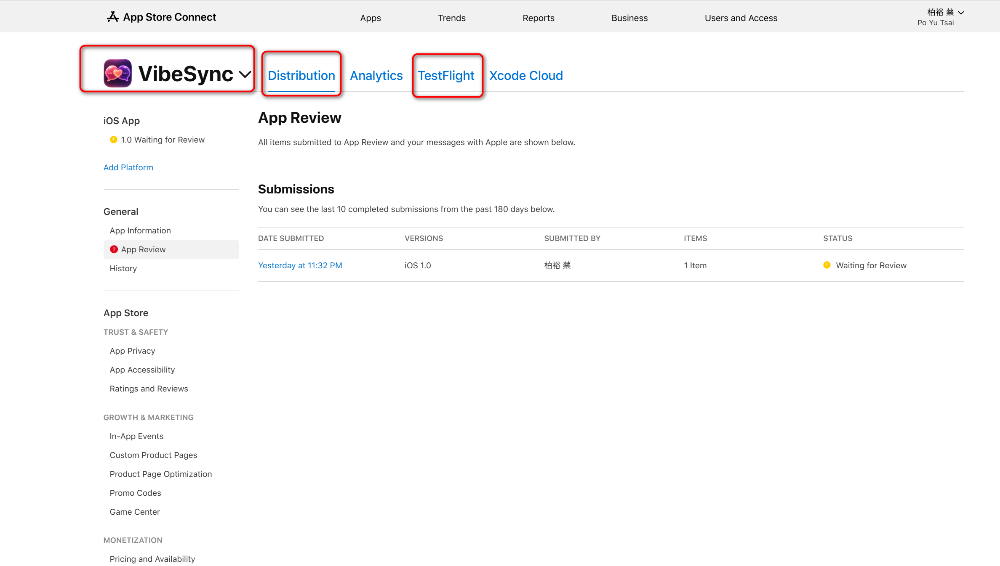

# VibeSync Founder Handover Runbook

Last updated: 2026-05-27

This document is safe to keep in the repository. It explains where VibeSync is operated, who owns each account, and how a trusted successor can keep the product running.

Do not put passwords, full API keys, recovery codes, credit card numbers, bank details, private keys, or passport/ID images in this file. Store those in a password manager emergency vault or an offline sealed handover packet.

Screenshot guide: use `docs/founder-handover-screenshot-checklist.md` to capture and redact the visual proof for each platform. Repo-safe screenshots can live in `docs/handover-screenshots/`; sensitive screenshots must stay in the private handover packet.

## Purpose

If Eric is unavailable, the priority is:

1. Keep the app, backend, billing, and user access stable.
2. Preserve access for Bruce / the designated operator.
3. Avoid accidental data exposure or secret leaks.
4. Decide whether to keep operating VibeSync, pause launches/marketing, or transfer ownership.

## Emergency Access Principles

- Use a password manager for all credentials. Recommended structure:
  - `VibeSync / Apple Developer`
  - `VibeSync / Supabase`
  - `VibeSync / GitHub`
  - `VibeSync / Anthropic Claude`
  - `VibeSync / RevenueCat`
  - `VibeSync / Vercel`
  - `VibeSync / Namecheap DNS`
  - `VibeSync / Google / Firebase`
- Enable emergency access for the trusted successor instead of copying passwords into documents.
- Keep recovery codes in a sealed offline location.
- If a key or password is exposed, rotate it before continuing normal operation.
- If ownership or bank/tax details must change after a legal event, do not improvise. Check the platform rules and get legal/accounting help if needed.

## People And Roles

| Person | Current role | Notes |
| --- | --- | --- |
| Eric | Founder / primary operator | Current App Store seller, Claude billing owner, GitHub owner for app repo, Vercel owner for admin dashboard. |
| Bruce | Partner / collaborator | Helps with operations, domain/DNS, finance review, and can continue operation if granted access. |
| Trusted family contact | Emergency successor | Should receive password manager emergency access and this runbook. |

## Source Code

### Main app repo

| Item | Value |
| --- | --- |
| GitHub repo | `https://github.com/PoYuTsai/VibeSync` |
| Main branch | `main` |
| Local path on Eric machine | `C:\Users\eric1\OneDrive\Desktop\VibeSync` |
| Product | Flutter iOS/Android app + Supabase Edge Functions + admin dashboard |

Key rules:

- Commit and push immediately after important changes.
- Do not commit `.env`, passwords, API keys, certificates, App Store private keys, or service role keys.
- App release builds are controlled through GitHub Actions and/or local Flutter/Xcode workflow.

### Official website repo

| Item | Value |
| --- | --- |
| GitHub repo | `https://github.com/chiang53610-droid/vibesync-web` |
| Owner | Bruce / `chiang53610-droid` |
| Live site | `https://vibesyncai.app` |
| Privacy policy | `https://vibesyncai.app/privacy` |
| Support page | `https://vibesyncai.app/support` |
| Deployment | GitHub Pages |
| DNS | Namecheap, controlled by Bruce unless transferred |

Important: Eric may have push access, but GitHub Pages deployment can require the repo owner to push or fix settings. If website changes do not go live, ask Bruce to run:

```bash
git pull origin main
git commit --allow-empty -m "chore: trigger pages rebuild"
git push origin main
```

## Production Websites

| Surface | URL | Owner/platform | Notes |
| --- | --- | --- | --- |
| Official landing site | `https://vibesyncai.app` | GitHub Pages + Namecheap | Public marketing/legal site. |
| Privacy policy | `https://vibesyncai.app/privacy` | GitHub Pages + Namecheap | App Store review depends on this. |
| Admin dashboard | `https://admin.vibesyncai.app/login` | Vercel project `admin-dashboard` | Eric/Bruce only; Google login + Supabase admin whitelist. |
| Admin fallback URL | `https://admin-dashboard-olive-phi-634niau2ml.vercel.app/login` | Vercel | Use if custom domain breaks. |

## Admin Dashboard

| Item | Value |
| --- | --- |
| Code path | `admin-dashboard/` in the main repo |
| Framework | Next.js |
| Vercel project | `admin-dashboard` |
| Production domain | `admin.vibesyncai.app` |
| Root directory in Vercel | `admin-dashboard` |
| Build command | `npm run build` |
| Install command | `npm install` |

Required Vercel environment variables:

| Variable | Where to get it | Secret? |
| --- | --- | --- |
| `NEXT_PUBLIC_SUPABASE_URL` | Supabase project API settings | Public-ish, but still keep in Vercel only. |
| `NEXT_PUBLIC_SUPABASE_ANON_KEY` | Supabase project API settings | Public anon key; still do not casually paste in docs. |

Admin login requirements:

- User must sign in through Supabase Auth / Google.
- Email must be present in Supabase `public.admin_users`.
- Current intended admin emails:
  - Eric: `eric19921204@gmail.com`
  - Bruce: `chiang688041@gmail.com`

If Google login fails after changing domain, add the callback URL in Supabase:

```text
https://admin.vibesyncai.app/auth/callback
```

Keep the fallback callback too:

```text
https://admin-dashboard-olive-phi-634niau2ml.vercel.app/auth/callback
```

## Supabase

| Item | Value |
| --- | --- |
| Project | `vibesync-sandbox` |
| Project ref | `fcmwrmwdoqiqdnbisdpg` |
| Dashboard | `https://supabase.com/dashboard/project/fcmwrmwdoqiqdnbisdpg` |
| Main use | Auth, Postgres, Edge Functions, admin dashboard data |

Critical Edge Functions:

| Function | Purpose |
| --- | --- |
| `analyze-chat` | Main chat analysis, OCR, usage/quota, Claude calls. Deploy with `--no-verify-jwt`. |
| `coach-chat` | Coach 1:1 Claude calls. |
| `coach-follow-up` | Follow-up coaching and quota logic. |
| `sync-subscription` | Client-triggered RevenueCat subscription sync. |
| `revenuecat-webhook` | RevenueCat webhook receiver. |
| `submit-feedback` | Feedback submission / Discord delivery. |
| `delete-account` | Account deletion. |

Important Supabase secrets:

| Secret | Used by | Notes |
| --- | --- | --- |
| `CLAUDE_API_KEY` | `analyze-chat`, `coach-chat`, `coach-follow-up` | Determines which Anthropic account pays for Claude usage. |
| `SUPABASE_URL` | Edge Functions | Project URL. |
| `SUPABASE_SERVICE_ROLE_KEY` | Edge Functions | Highly sensitive. Never expose to app or browser. |
| `REVENUECAT_IOS_API_KEY` | subscription sync functions | RevenueCat server/API key, not the public app SDK key. |
| `REVENUECAT_WEBHOOK_SECRET` | `revenuecat-webhook` | Verifies RevenueCat webhook calls. |
| `DISCORD_FEEDBACK_WEBHOOK_URL` | `submit-feedback` | Optional feedback delivery. |
| `DISCORD_BOT_TOKEN` | `submit-feedback` | Optional Discord bot delivery. |
| `DISCORD_FEEDBACK_CHANNEL_ID` | `submit-feedback` | Optional feedback channel. |

To rotate Claude billing to Bruce:

1. Bruce creates a new Anthropic API key in his Claude Console.
2. Update Supabase secret `CLAUDE_API_KEY` to Bruce's key.
3. Test one AI request.
4. Confirm Eric's Claude API key `Last used at` stops updating and Bruce's starts updating.

CLI example:

```bash
npx supabase secrets set CLAUDE_API_KEY=sk-ant-xxxxx --project-ref fcmwrmwdoqiqdnbisdpg
```

Do not store the real key in git, docs, chat, screenshots, or issue trackers.

## Anthropic Claude API Billing

| Item | Current known state |
| --- | --- |
| Console | `https://console.anthropic.com/` |
| Billing page | `https://console.anthropic.com/settings/billing` |
| API keys page | `https://console.anthropic.com/settings/keys` |
| Current org owner | Eric organization |
| Current key name seen in console | `vibesync-sandbox` |
| Current key prefix shown | `sk-ant-api03-rw2...uAAA` |
| Last observed monthly API cost | USD `12.65` as of 2026-05-27 screenshot |
| Credit balance seen | USD `33.44` as of 2026-05-27 screenshot |

Billing rule:

- Actual monthly cost should be based on Claude API usage/spend, not credit balance or credit top-up alone.
- Credit card charges can be treated as prepaid credits. For monthly finance, use actual usage where available.
- Whoever owns the active `CLAUDE_API_KEY` organization pays Anthropic billing.

## RevenueCat

| Item | Value |
| --- | --- |
| Dashboard | `https://app.revenuecat.com/` |
| Project | VibeSync |
| Project ID | `projd482586c` |
| iOS app ID | `app73a7f8a72d` |
| Public iOS SDK key | `appl_ZYVwxdvbEIAHxYUEHhdVkVLrkdY` |
| Entitlement | `premium` |
| Webhook target | Supabase `revenuecat-webhook` Edge Function |

RevenueCat is not the official bank account and does not receive App Store money. It observes subscription state and sends entitlement/webhook events.

Current products:

| Product ID | Tier | Period |
| --- | --- | --- |
| `starter_monthly` | Starter | Monthly |
| `starter_quarterly` | Starter | Quarterly |
| `essential_monthly` | Essential | Monthly |
| `essential_quarterly` | Essential | Quarterly |

Critical rule:

- Do not downgrade paid users to Free just because RevenueCat temporarily returns an empty entitlement. Check `docs/integrations/revenuecat.md` and `docs/bug-log.md` before changing subscription logic.

## Apple Developer / App Store Connect

| Item | Value |
| --- | --- |
| App Store Connect | `https://appstoreconnect.apple.com/` |
| Bundle ID | `com.poyutsai.vibesync` |
| Team ID | `TTQHTVG8CC` |
| Vendor Number | `94060817` |
| Paid apps / bank / tax area | Business / Agreements, Tax, and Banking |
| Current owner context | Eric / Po Yu Tsai individual account |

Visual reference:



This screenshot shows the App Store Connect app entry, the current Distribution area, and the TestFlight entry point.

Revenue flow:

1. User buys subscription through Apple In-App Purchase.
2. Apple collects payment.
3. Apple deducts commission, tax, refunds, and adjustments.
4. Apple pays proceeds to the bank account configured in App Store Connect.
5. RevenueCat observes subscription events but does not receive the money.

Critical App Store areas:

- App Store Connect app metadata and screenshots.
- In-App Purchase products and subscription group.
- App Review messages / Resolution Center.
- Agreements, Tax, and Banking.
- Financial reports / proceeds.
- App Store Connect API keys used by CI/release automation.

Do not change bank/tax details casually. If Eric is unavailable, successor should first understand legal ownership and Apple transfer rules.

## Google Play

Google Play is a future or parallel channel if Android goes public. If Android is launched:

- Confirm Google Play Console owner.
- Confirm payment profile / merchant account.
- Confirm RevenueCat Android products and SDK key.
- Confirm privacy policy and data safety form match the app.

## GitHub Actions / Build Secrets

The main repo uses GitHub Actions for distribution and release tasks.

Important GitHub Actions secret names:

| Secret | Purpose |
| --- | --- |
| `SUPABASE_ACCESS_TOKEN` | Deploy Supabase Edge Functions. |
| `SUPABASE_STAGING_URL` | Legacy/unwired; current distribution builds use production backend. |
| `SUPABASE_STAGING_ANON_KEY` | Legacy/unwired; current distribution builds use production backend. |
| `SUPABASE_PROD_URL` | Production app build. |
| `SUPABASE_PROD_ANON_KEY` | Production app build. |
| `FIREBASE_ANDROID_APP_ID` | Firebase App Distribution Android. |
| `FIREBASE_IOS_APP_ID` | Firebase App Distribution iOS. |
| `FIREBASE_SERVICE_ACCOUNT` | Firebase distribution auth. |
| `APP_STORE_CONNECT_KEY_ID` | App Store upload/signing automation. |
| `APP_STORE_CONNECT_ISSUER_ID` | App Store upload/signing automation. |
| `APP_STORE_CONNECT_API_KEY` | App Store API private key content. |
| `SLACK_WEBHOOK_URL` | Release notification, if used. |

Keep these in GitHub repository secrets only. Do not copy them into docs.

## App Runtime Environment Variables

Flutter build-time variables:

| Variable | Purpose |
| --- | --- |
| `ENV` | `dev`, `staging`, or `prod`. |
| `SUPABASE_STAGING_URL` | Reserved; current `AppConfig` does not read it. |
| `SUPABASE_STAGING_ANON_KEY` | Reserved; current `AppConfig` does not read it. |
| `SUPABASE_PROD_URL` | Production Supabase URL. |
| `SUPABASE_PROD_ANON_KEY` | Production Supabase anon key. |
| `REVENUECAT_API_KEY` | Public RevenueCat app SDK key. Must start with `appl_`. |
| `REVENUECAT_SANDBOX_KEY` | Optional sandbox public SDK key. |
| `REVENUECAT_PROD_KEY` | Optional prod public SDK key. |

Claude API key must never be in Flutter build variables. It belongs only in Supabase Edge Function secrets.

Current Firebase distribution artifacts intentionally use `ENV=prod` with the
production Supabase URL/key so the Runner token and hardcoded keyboard endpoint
belong to the same project. Do not label those artifacts as a staging backend.
`KEYBOARD_REPLAY_HMAC_KEY` is also a Supabase Edge secret, not a Flutter or
GitHub build secret; generate at least 32 random bytes and store only its Base64
value in Supabase.

## Domains And DNS

| Domain | Purpose | DNS owner |
| --- | --- | --- |
| `vibesyncai.app` | Public website / legal pages | Namecheap, currently Bruce side |
| `admin.vibesyncai.app` | Admin dashboard | Namecheap CNAME to Vercel |

Current admin DNS:

| Type | Host | Value |
| --- | --- | --- |
| CNAME | `admin` | `e1d10eacad0e8891.vercel-dns-017.com` |

If the admin domain breaks, use the Vercel fallback URL and check:

- Namecheap DNS CNAME still exists.
- Vercel project `admin-dashboard` still has `admin.vibesyncai.app`.
- Supabase Auth redirect URLs include `https://admin.vibesyncai.app/auth/callback`.

## Finance And Settlement

Use the admin dashboard finance page for monthly operating records:

```text
https://admin.vibesyncai.app/finance
```

Principles:

- Official app revenue should use App Store / Google Play proceeds, not RevenueCat estimated revenue.
- Claude cost should use actual API usage when possible.
- Credit card top-up is prepaid credit, not automatically the monthly expense.
- Costs can be entered manually with:
  - date
  - item
  - category
  - currency
  - original amount
  - exchange rate / TWD amount
  - payer: Eric or Bruce
  - whether it is deducted before split
- Eric and Bruce should agree monthly whether a cost is:
  - personal burn / not deducted yet
  - operating cost deducted before split
  - shared cost / reimbursable

Common costs:

| Cost | Current likely payer | Notes |
| --- | --- | --- |
| Claude API | Eric unless `CLAUDE_API_KEY` is rotated | Use Claude Console usage. |
| Apple Developer Program | Eric | Annual cost; amortize monthly if used in finance. |
| Domain | Bruce | Namecheap. |
| Vercel | Eric project currently | Check Vercel billing if usage grows. |
| Supabase | Eric organization currently | Check Supabase billing if project upgrades. |
| RevenueCat | Project billing owner | Confirm before paid scale. |
| Marketing ads | TBD | Record payer and whether deducted before split. |

## Maintenance Checklist

Weekly:

- Check Supabase Edge Function errors.
- Check admin dashboard user/revenue/activity pages.
- Check RevenueCat webhook health and recent events.
- Check Claude billing usage and spend limit.
- Check App Store review / subscription status if a release is pending.

Monthly:

- Download App Store financial reports / proceeds.
- Enter Claude actual usage.
- Enter Apple Developer annual amortization if applicable.
- Enter domain / Vercel / Supabase / RevenueCat / ad costs.
- Lock monthly settlement only after Eric and Bruce review.

Before each App Store submission:

- Verify latest TestFlight build.
- Verify Privacy Policy is live: `https://vibesyncai.app/privacy`.
- Verify App Store Connect privacy disclosure matches actual data flow.
- Verify RevenueCat products and entitlements.
- Verify Supabase secrets exist.
- Verify AI consent flow if any AI data-sharing behavior changed.

## If Eric Is Unavailable

1. Use password manager emergency access or sealed packet.
2. Contact Bruce and decide who will operate.
3. Confirm access to:
   - GitHub `PoYuTsai/VibeSync`
   - Supabase project `fcmwrmwdoqiqdnbisdpg`
   - App Store Connect team `TTQHTVG8CC`
   - RevenueCat project `projd482586c`
   - Anthropic Console billing/API keys
   - Vercel `admin-dashboard`
   - Namecheap DNS for `vibesyncai.app`
4. Do not rotate keys until the operator understands where each key is used.
5. If a credit card or bank account must change, update the relevant platform and record it in the private finance handover notes.
6. If app operation should pause, disable marketing first. Avoid breaking existing paid users unless legally required.

## Private Handover Packet Template

Keep this outside git, preferably in a password manager. Do not fill this section in the repository.

| Item | Owner | Login URL | Username/email | Password location | 2FA/recovery location | Payment method | Notes |
| --- | --- | --- | --- | --- | --- | --- | --- |
| Apple Developer / App Store Connect | Eric | `https://appstoreconnect.apple.com/` | `[private]` | `[vault item]` | `[vault/sealed packet]` | `[private]` | Includes bank/tax. |
| Supabase | Eric | `https://supabase.com/dashboard/project/fcmwrmwdoqiqdnbisdpg` | `[private]` | `[vault item]` | `[vault/sealed packet]` | `[private]` | Edge secrets live here. |
| Anthropic Claude Console | Eric | `https://console.anthropic.com/` | `[private]` | `[vault item]` | `[vault/sealed packet]` | `[private]` | Owns current Claude API billing. |
| RevenueCat | Eric/Bruce | `https://app.revenuecat.com/` | `[private]` | `[vault item]` | `[vault/sealed packet]` | `[private]` | Subscription status source. |
| Vercel | Eric | `https://vercel.com/` | `[private]` | `[vault item]` | `[vault/sealed packet]` | `[private]` | Admin dashboard deployment. |
| GitHub main app | Eric | `https://github.com/PoYuTsai/VibeSync` | `[private]` | `[vault item]` | `[vault/sealed packet]` | n/a | Source code and CI secrets. |
| GitHub website | Bruce | `https://github.com/chiang53610-droid/vibesync-web` | `[private]` | `[vault item]` | `[vault/sealed packet]` | n/a | Public site repo. |
| Namecheap | Bruce | `https://www.namecheap.com/` | `[private]` | `[vault item]` | `[vault/sealed packet]` | `[private]` | DNS for `vibesyncai.app`. |
| Google/Firebase | Eric | `[private]` | `[private]` | `[vault item]` | `[vault/sealed packet]` | `[private]` | Android / distribution if used. |

## What Not To Do

- Do not paste full API keys into ChatGPT, Discord, GitHub issues, Notion pages, or docs.
- Do not commit `.env`, `.env.local`, `.p8`, `.pem`, `.mobileprovision`, bank screenshots, or recovery codes.
- Do not put Claude API key in the Flutter app.
- Do not use Supabase service role key in browser/Vercel public env.
- Do not change App Store bank/tax ownership without understanding legal and payout impact.
- Do not change RevenueCat subscription downgrade logic without reading the bug history.
