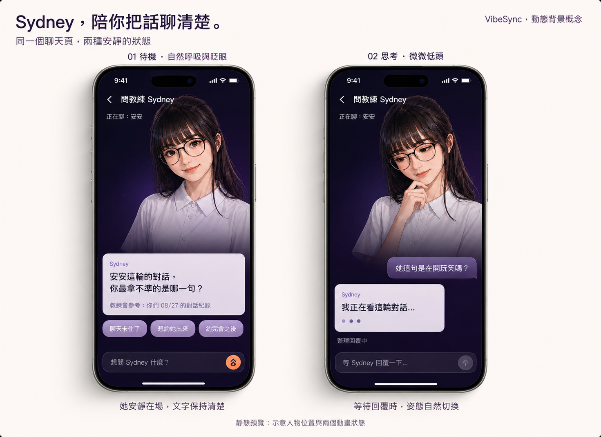
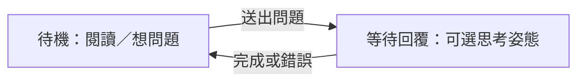

# Sydney 聊天頁動態背景：給 Bruce 的發想

Bruce，這次想探索：點進「問教練 Sydney」後，讓 Sydney 出現在聊天頁背景，用輕微動態增加教練在場的感覺。

**依 Eric 這次的決定，UI、品味、Sydney 動圖怎麼設計，以及採用什麼實作方式，都以你的裁決為最高優先。** 以下是可自由改寫的參考。這張單是發想，沒有必做、期限或排程承諾；你隨時可以丟回來討論或直接關單。

## 先看畫面

兩個預覽都保留在原始圖板：左邊待機，右邊思考。它們是靜態概念圖，並非動圖成果；文字、間距與輸入狀態也不是定稿。

[show-me 視覺交接頁](show-me-sydney.html)：下載此資料夾後用瀏覽器開啟 HTML，可並排或分別看兩個狀態、對照畫面分層。這份提案聚焦現有教練聊天頁；前面討論過的其他概念不在本次範圍。

## 請 Bruce 優先思考：長篇分析回來後，空間怎麼分配？

Eric 特別提醒：**現在把對話窗拉到底部，上方原本有預留空位；真的送出後，一大串高價值分析文字要怎麼放？**

這是本發想尚未解決的核心 UX 問題。兩張預覽只有開場短句與等待狀態，不能拿來代表完整聊天體驗。請把「收到完整長回答」一起納入品味與版面判斷：

- 上方原本留給 Sydney 的空間，是否需要在長文出現後讓給內容？Sydney 可以縮小、淡出、退到背景，或採用你認為更好的方式。
- 長文能否有足夠的可視高度與段落層次？往下讀、回看前文、繼續追問時，人物與玻璃層會不會干擾閱讀？
- 鍵盤打開後，固定輸入列與長篇內容如何共存？收到回答時要從哪裡開始看，如何處理捲動，才不會直接跳過高價值內容？
- 是否值得保留這種人物構圖，要以完整長回答的使用感受一起判斷；不必為了符合預覽而保留大面積人物。

這些是請你評估的開放問題，不是已決定的 UX 規格或必做驗收項目。動圖與版面都由 Bruce 最終裁決。

## 可選的感受與節奏

- **待機**：自然呼吸、偶爾眨眼，鏡頭穩定；人物臉清楚，身體下緣融進深色背景。
- **思考**：等待回覆時，可試微微低頭或手靠下巴，結束等待便回到安靜狀態。
- **閱讀與打字**：我的偏好是讓人物退到背景，文字清楚；動作幅度、節奏與構圖由 Bruce 拿捏。

這兩個狀態只是起點；只做一個循環、改用其他姿勢、維持靜態或放棄方向，都合理。

## 如果想試作，這些線索可能用得上

| 現有位置 | 可選切入點 |
| --- | --- |
| [GlobalCoachScreen](../../../lib/features/coach_chat/presentation/screens/global_coach_screen.dart) | 教練頁已有 BrandScaffold 與 CoachSurface；可以先在這頁局部試人物背景。 |
| [CoachSurface](../../../lib/features/coach_chat/presentation/widgets/coach_surface.dart) | 對話／進度／錯誤的淺色玻璃與底部輸入列已有分工；人物層要和鍵盤、捲動、文字可讀性一起看。 |
| [Coach controller](../../../lib/features/coach_chat/data/providers/coach_chat_providers.dart) | 等待姿態可跟隨既有請求 loading，成功與錯誤都結束等待；來源、對話範圍與額度流程沿用現有責任。 |
| [HomeCoachPresence](../../../lib/features/partner/presentation/widgets/home_coach_presence.dart) | 現有 Sydney 靜態姿勢的尺寸對齊、AnimatedSwitcher、ShaderMask 可作參考；不代表已經有呼吸、眨眼動圖。 |
| [motionDisabled](../../../lib/core/animation/motion_preference.dart) | 已有 reduced motion 與 TickerMode 判斷，可參考頁面離開、減少動態時的呈現。 |

構圖可先想成「深色底 → Sydney 人物與淡化 → 前景對話 → 底部輸入列」。這只是分層思路，實際 widget 與素材管線交給 Bruce。

若進一步做動圖，影片、序列圖或其他方式都可以評估。我的意見是先看角色一致性、循環接點、邊緣品質，再看檔案大小與實機流暢度；本單不指定秒數、套件、格式或驗收清單。

## 這份交接到哪裡

只新增此發想文件、原始圖板與 show-me HTML。尚未實作 App 動畫，也沒有改聊天分析、AI 請求或扣額度行為。是否繼續及下一步怎麼做，由 Bruce 判斷；這個 PR 可以保持 Draft 或直接關閉。
