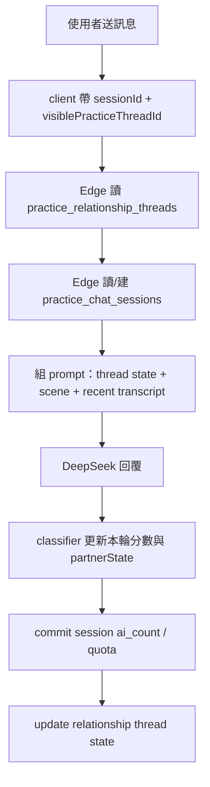

# AI 實戰練習室長期關係與生活時間軸設計

> 狀態：DRAFT，設計先行，不含本次實作。
> 範圍：AI 實戰練習室 `practice-chat` 的時間感、同一位長期續聊、關係狀態、上下文記憶、邀約成熟度與模糊邀約設計。
> 原則：新 billing session 不等於新關係；只有使用者刪除對話或換人，才重置同一位關係。

## 背景

Eric 希望 AI 實戰練習室從「一場短練習」升級成更像情感養成遊戲的長期陪練：

- 女生要有時間觀念：晚上想睡、午餐時間在吃飯、週末可能潛水或跟朋友出去。
- 同一位可以長期聊：除非使用者刪除對話，否則關係要延續。
- 續聊同一位時，身份、溫度、關係度、熟悉度、情緒狀態與上下文記憶都要維持。
- 3 輪上限應退場，改成長期 thread。
- 關係分數要能對應邀約成熟度：50-65 模糊邀約、65+ 可直接低壓邀約、80+ 她會釋出邀約窗口、85+ 類女友感。

現況限制：

- Prompt 全在 server：`supabase/functions/practice-chat/prompt.ts`、`practice_persona.ts`。
- `practice-chat` 現在沒有注入真實時間。
- `deps.now?.()` 已存在於 handler，可做 server 權威時間。
- 目前完整聊天內容只存本地 Hive；server 只存 session ledger、計數、學習狀態與剛加入的 `partner_mood` / `partner_inner_thought`。
- 目前續聊同一位最多 3 輪：client `kMaxPracticeRounds = 3`，server `MAX_PRACTICE_ROUNDS = 3`，validate 只收 `roundIndex` 1..3。
- 目前「約出來」只有 debrief 的 `dateChance: low | medium | high`，沒有數值門檻。
- 模型不會主動推訊息。所有 chat 回覆都由「使用者送出一則」觸發，並扣額度。

## 產品不變量

1. **同一位不是同一輪。**
   `sessionId` 是計費與 20 則 AI 回覆的段落；`visiblePracticeThreadId` 才是同一位長期關係。

2. **新 session 不重置關係。**
   每 20 則可開新 billing session，但 temperature、familiarity、relationshipScore、partnerState 與 memorySummary 都要沿用。

3. **刪除對話才重置。**
   使用者刪除某段同一位對話後，client 刪本地 transcript，server 封存該 `visiblePracticeThreadId` 的關係狀態。再次抽到或點同一位時，建立新的 thread。

4. **server 是關係分數真實來源。**
   client 可以帶 transcript 作 prompt evidence，但不得上傳或覆寫 relationshipScore / mood / inviteStage 等權威狀態。

5. **不存完整逐字稿到 DB。**
   server 可存低敏摘要與狀態，不存完整聊天內容。完整 transcript 繼續留在本地 Hive。

6. **主動約不是主動發訊息。**
   80+ 的「她主動約」在現架構中定義為：使用者送訊息後，她的回覆主動釋出邀約窗口或半邀約，不是 App 自動推播訊息。

## 整體架構

長期方案拆成三個引擎：

1. `scene context`：server 台北時間 + deterministic 生活事件，讓她現在像正在生活。
2. `relationship thread state`：同一位長期狀態，跨 billing session 延續。
3. `invite maturity`：把關係分數映射到模糊邀約、低壓邀約、她釋出窗口與高親密感。

Prompt 組合順序建議：

```text
CHAT_SYSTEM_PROMPT
+ profile/persona/difficulty prompt
+ sceneContextPrompt
+ relationshipStatePrompt
+ temperature/relationship stage prompt (beginner only)
+ partnerStatePrompt
+ recent transcript
```

注意：scene context 與 relationship state 只影響 chat / hint / debrief，不餵給 turn classifier 作為扣分理由。v2 state engine 仍只看使用者是否接住她、穩不穩、小測試與界線。

## Phase 1：時間感與生活事件

目標：讓女生有當下生活狀態，但不改 DB、不改 Flutter UI。

### Server 權威時間

建立純函式模組：

- `supabase/functions/practice-chat/time_context.ts`

輸入：

```ts
interface TaipeiTimeContextInput {
  now: Date;
}
```

輸出：

```ts
interface TaipeiTimeContext {
  isoDate: string; // YYYY-MM-DD
  hour: number;
  minute: number;
  weekday: number; // 0 Sunday
  isWeekend: boolean;
  dayPart:
    | "dawn" // 05-07
    | "morning" // 07-11
    | "noon" // 11-14
    | "afternoon" // 14-17
    | "early_evening" // 17-19
    | "evening" // 19-23
    | "late_night"; // 23-05
}
```

沿用 `draw_decision.ts` 的台北牆鐘思路；不要用 client 時間，避免時區與偽造。

### 生活事件引擎

建立純函式模組：

- `supabase/functions/practice-chat/life_schedule.ts`

Seed：

```text
profileId | Taipei YYYY-MM-DD | dayPart | visiblePracticeThreadId
```

同一時段同一位同一 thread 事件穩定；換時段自然變化；不用 DB 存狀態。

輸出：

```ts
interface PracticeSceneContext {
  id: string;
  statusLine: string; // 給 Phase 2 UI 用，例如「剛跟朋友吃完飯」
  promptLine: string; // 給 prompt，例如「妳剛跟朋友吃完飯，回覆可以比平常鬆一點」
  replyTempo: "short" | "normal" | "engaged";
}
```

事件池分三層：

- 基底池：時段 x 平日/週末。
- 興趣池：依 `interestTags` 加權，例如潛水、爬山、瑜珈、咖啡、追劇。
- 職業覆蓋：護理師大夜、空服外站、研究生趕論文、牙醫診所助理下班累。

Prompt 區塊草稿：

```text
sceneContext（hidden guidance，不要直接說出 sceneContext 或內部設定）：
現在是台北時間：週五晚上 20:40。
妳此刻狀態：剛跟朋友吃完飯，在回家的路上。
行為規則：如果對方問「在幹嘛」，可以自然提到這件事；如果沒問，不要硬塞。回覆節奏可以比白天放鬆，但仍保持妳的人設。
銜接規則：如果前文妳提過不同狀態，優先自然銜接，不要否認自己剛剛說過的事。
```

Debrief 增補一行事實脈絡：

```text
本場生活情境：她當時剛跟朋友吃完飯，回覆變短可能是情境節奏，不一定代表使用者表現差。
```

Hint 增補 evidence：

```text
sceneStatus: 她剛跟朋友吃完飯，在回家的路上。
```

Turn classifier 不增補 sceneStatus，避免模型把「她忙」當成使用者扣分原因。

## Phase 2：無限制續聊同一位與 thread-level 狀態

目標：移除 3 輪上限，但保留每 20 則一段的計費安全模型。

### 新概念：relationship thread

新增 server 權威表，名稱建議：

```sql
practice_relationship_threads
```

概念欄位：

```text
user_id uuid
visible_thread_id text
profile_id text
practice_mode text
relationship_score int
temperature_score int
familiarity_score int
partner_mood text
partner_inner_thought text
invite_stage text
memory_summary text
recent_facts jsonb
last_interaction_at timestamptz
archived_at timestamptz
created_at timestamptz
updated_at timestamptz
```

重要限制：

- `memory_summary` 最多 500-800 字繁中摘要，不存完整逐字稿。
- `recent_facts` 最多 5-8 條低敏事實，例如「她最近在趕論文」「聊過潛水」「他們有咖啡店話題」。
- 不存使用者完整 message text。
- `archived_at` 用於使用者刪除對話後重置。

### Session 與 thread 的關係

現行：

```text
practice_chat_sessions = 一個 sessionId，一輪最多 20 則 AI 回覆
```

長期：

```text
practice_relationship_threads = 同一位長期關係
practice_chat_sessions = 該關係中的單段 billing session
```

續聊流程：



### 移除 3 輪上限

需要改的地方：

- `lib/features/practice_chat/data/providers/practice_chat_providers.dart`
  - 移除 `kMaxPracticeRounds = 3` 對 UI 的續聊限制。
  - `_DebriefActionsBar` 不再因 roundIndex 到頂隱藏續聊。

- `supabase/functions/practice-chat/quota_decision.ts`
  - `MAX_PRACTICE_ROUNDS = 3` 退場或只作 legacy compatibility。
  - Free 續同一位仍可保留付費牆策略，由產品決策：Free 是否只能開新對象、Starter/Essential 才可長期續同一位。

- `supabase/functions/practice-chat/validate.ts`
  - `roundIndex` 不再限制 1..3；更好的方式是把 `roundIndex` 降級成 display/logging 欄位，不再是安全邊界。

- `MAX_TURNS`
  - 不能靠放大 `MAX_TURNS` 解決長期上下文。長期只送最近 N 則，加上 `memory_summary`。

### 上下文記憶策略

每次 chat prompt 使用：

```text
recent transcript: 最近 12-20 則本地訊息
memorySummary: server thread 摘要
recentFacts: server thread 事實片段
sceneContext: 當下生活事件
partnerState: 當下 mood / innerThought
```

不要無限送完整 transcript。

記憶更新策略：

- Phase 2.1：只在每次成功 AI 回覆後，用現有 classifier 的結果與最後幾則 transcript 做簡短 rule-based 摘要更新。
- Phase 2.2：增加低頻 memory summarizer，例如每 10 則或每段 session 結束時用 JSON mode 產出摘要。
- summarizer 不參與扣分，不影響 quota；若失敗，memorySummary 沿用舊值。

## Phase 3：關係分數與邀約成熟度

目標：把 50/65/80/85 門檻變成穩定產品規格，而不是 prompt 隨口描述。

### 分數定義

不要只用 heat。建議建立 `relationship_score`：

```text
relationship_score = 長期親密/信任/互動品質綜合分
temperature_score = 當下熱度
familiarity_score = 熟悉度
partner_mood = 當下情緒
boundary history = 是否近期越界
```

基本規則：

- `relationship_score` 只能慢慢累積，避免一兩句就跳到 85。
- 明顯 overstep 可以快速扣分。
- `temperature_score` 可以波動；`relationship_score` 比較穩。
- 85+ 不是保證約回家，也不是性暗示通行證。它代表高度信任與親密感，可接受更私人、更長時間的相處提案，但仍要保留界線。

### Invite stage

```ts
type InviteStage =
  | "not_ready"
  | "soft_invite_ready"
  | "direct_invite_ready"
  | "partner_window"
  | "high_intimacy";
```

建議門檻：

| relationshipScore | inviteStage | 行為 |
|---:|---|---|
| 0-34 | `not_ready` | 不適合約，先修復安全感 |
| 35-49 | `not_ready` | 可聊天，但先累積熟悉與共同場景 |
| 50-64 | `soft_invite_ready` | 適合模糊邀約，測水溫 |
| 65-79 | `direct_invite_ready` | 可提出具體低壓邀約 |
| 80-84 | `partner_window` | 她可主動釋出窗口或半邀約 |
| 85-100 | `high_intimacy` | 類女友感，高信任高親密，但仍保留界線 |

加上守門條件：

- 最近 3 則內若有 `boundary=overstep`，邀約 stage 至少降一級。
- `partner_mood=guarded|annoyed` 時，不允許 `partner_window`。
- 沒有共同場景或興趣鉤子時，65+ 也只給 soft invite，不硬約。

### 她「主動約」的定義

現架構不做自動訊息。

80+ 時的「主動約」定義為：

- 使用者送訊息後，她的回覆可以主動拋出：
  - 「你上次說那間甜點，我突然有點想去欸」
  - 「那下次你帶路啊」
  - 「你不是說要推薦咖啡？我可以驗收一下」

這些是邀約窗口，不是強制約會。

Phase 4 若要真的推播主動訊息，需另設：

- 使用者 opt-in。
- 頻率上限。
- 不扣費或明確扣費規則。
- 防沉迷與不情勒文案。
- App Review 風險審查。

## 模糊邀約規格

既有定義可沿用：

> 模糊邀約是不綁時間地點的輕邀約，她不用答應任何事；用於溫度升到她有接球、有活動/地點/興趣鉤子，但還沒熟到能定點約。

好例子：

```text
這間咖啡廳感覺你會喜歡，下次有機會一起去踩點。
```

```text
你這個潛水故事聽起來很會玩欸，有機會讓你當一次新手村教練。
```

```text
那間展感覺可以欸，下次如果剛好都有空可以去晃一下。
```

反例：

```text
明天七點信義區吃飯？
```

```text
那你現在出來，我去接你。
```

```text
我們都聊這麼好了，你不出來說不過去吧。
```

模糊邀約的成功/失敗處理：

- 她接球：可以下一輪轉具體低壓邀約。
- 她沒接：不追問、不補償，退回生活話題。
- 她吐槽：用幽默承接，不自證。
- 她明確拒絕：尊重，降壓。

Hint 規則：

- 50-64：升溫 hint 優先給 soft invite 或鋪場景，不給明確時間地點。
- 65-79：若有共同場景，可給具體低壓邀約。
- 80+：可教使用者接住她釋出的窗口，避免太急收割。

Debrief 規則：

- `nextInviteMove` 要根據 inviteStage：
  - not_ready：先補熟悉/共同場景。
  - soft_invite_ready：給一句模糊邀約。
  - direct_invite_ready：給一句具體低壓邀約。
  - partner_window：教他接她丟出的球，順勢定輕行程。
  - high_intimacy：提醒可以更明確，但仍要保留退路。

## Phase 4：UI 狀態列與時間差感知

Phase 1 先不做 UI。Phase 4 可加：

- 圖鑑/對話 header 顯示「她現在：剛下班」「她現在：準備睡了」。
- Dart 端鏡像 scene seed 演算法。
- 用共享測試向量防止 Deno/Dart 漂移。

時間差感知：

- `PracticeSession` Hive 加 `lastInteractionAt`。
- client 只送粗粒度 `hoursSinceLastTurn`，例如 `0-1`、`1-6`、`6-12`、`12-24`、`24+`，不送精準本機時間。
- gap >= 12h 且同 thread 第 2 輪以上，prompt 可自然提：
  - 「昨天突然消失喔」
  - 「你這個人回得很有節奏欸」
- 禁止情勒：
  - 不說「你都不理我」。
  - 不懲罰使用者現實離線。
  - 不因 gap 自動扣分。

## Phase 5：真正主動訊息與推播（另案）

這不是本方案 Phase 1-3 的一部分。

若要做，需另開設計：

- 使用者明確 opt-in。
- 推播頻率上限，例如每 24-48 小時最多一次。
- 不以焦慮、吃醋、冷暴力驅動。
- 不在深夜打擾。
- 不因使用者不回而扣分。
- 是否扣額度需明示。

## 風險

1. **Prompt 風險**
   時間、場景、關係分數都會影響模型行為，屬 high-risk prompt zone。每個階段都需要 Codex review evidence。

2. **Token 成本**
   Scene context 約 +80-150 input tokens。
   Relationship state + memory summary 約 +200-600 input tokens。
   必須限制 memorySummary 長度。

3. **隱私**
   不可把完整 transcript 寫 DB。
   server summary 必須短、低敏、可刪。

4. **Abuse / 偽造**
   relationshipScore 不可由 client 上傳。
   `visiblePracticeThreadId` 必須 server 驗 user ownership。

5. **無限續聊成本**
   每 20 則仍需 billing session 與 quota gate。
   不可因長期 thread 繞過每則 chat 扣費與 model rate limit。

6. **邀約倫理與 App Review**
   避免保證結果、性壓力、操控框架。
   85+ 不應寫成「必約回家」，而是高信任/高親密下可提出更明確但有退路的相處。

## 測試策略

### Deno

- `time_context_test.ts`
  - 04:59 / 05:00 / 06:59 / 07:00 邊界。
  - 22:59 / 23:00 / 04:59 跨午夜。
  - 平日/週末判定。

- `life_schedule_test.ts`
  - 同 seed 同事件。
  - 不同 dayPart 多數情況不同事件。
  - interestTags 加權事件可抽到。
  - 職業覆蓋優先。

- `relationship_thread_test.ts`
  - 新 session 沿用 thread state。
  - 刪除/封存後重建新 thread。
  - relationshipScore clamp 0..100。
  - overstep 近期降 inviteStage。

- `invite_maturity_test.ts`
  - 49 -> not_ready。
  - 50 -> soft_invite_ready。
  - 65 -> direct_invite_ready。
  - 80 -> partner_window。
  - 85 -> high_intimacy。
  - guarded mood 降級。

- `handler_test.ts`
  - chat prompt 包含 scene + thread state。
  - turn classifier 不包含 sceneStatus。
  - session cap 後可以開新 billing session 但 thread state 不重置。

### Flutter

- controller test：
  - 續聊同一位不再因 roundIndex 3 隱藏。
  - 新 billing session 沿用 `visiblePracticeThreadId`。
  - 刪除對話後不再恢復舊 thread。
  - local session 保存 `lastInteractionAt`。

- widget test：
  - Phase 4 才測狀態列；Phase 1 不改 UI。

### Bakeoff

建立 practice long-thread bakeoff：

- 一位女生跑 5 段 session。
- 測 `relationshipScore` 是否逐步累積，不會一輪跳 85。
- 測 soft invite / direct invite / partner window 分布。
- 測 deep night 場景是否自然短回，不誤扣使用者。

## Feature flags

建議分開：

```text
PRACTICE_SCENE_CONTEXT_ENABLED
PRACTICE_RELATIONSHIP_THREAD_ENABLED
PRACTICE_INVITE_MATURITY_ENABLED
PRACTICE_TIME_GAP_ENABLED
```

每個 flag 可獨立關閉。預設 rollout：

1. dev/test accounts。
2. internal dogfood。
3. TestFlight small cohort。
4. 全量。

## 非目標

- Phase 1 不改 DB schema。
- Phase 1 不改 Flutter UI。
- 不把完整 transcript 存到 Supabase。
- 不讓模型自動推播訊息。
- 不保證約會結果。
- 不把 85+ 定義成性進展或必約回家。
- 不讓 scene context 參與 turn classifier 扣分。

## 建議實作切分

### Batch A：Scene Context

只做時間感與生活事件。

觸及：

- `supabase/functions/practice-chat/time_context.ts`
- `supabase/functions/practice-chat/life_schedule.ts`
- `supabase/functions/practice-chat/prompt.ts`
- `supabase/functions/practice-chat/handler.ts`
- 對應 Deno tests

不改 DB，不改 Flutter。

### Batch B：Relationship Thread DB

新增 thread state，保留每 20 則 session billing。

觸及：

- migration 新增 `practice_relationship_threads`
- `handler.ts` 讀寫 thread state
- `quota_decision.ts` / `validate.ts` 移除 3 輪限制
- Flutter controller 移除 `kMaxPracticeRounds`
- delete conversation 時呼 archive RPC

### Batch C：Memory Summary

把長期上下文從「全量 transcript」改成「recent turns + summary」。

觸及：

- `memory_summary.ts`
- `handler.ts`
- Flutter 發送 recent turns 上限
- Deno + Flutter tests

### Batch D：Invite Maturity

新增 `relationshipScore` / `inviteStage` prompt 與 debrief/hint 對齊。

觸及：

- `invite_maturity.ts`
- `temperature.ts` 或新 `relationship_score.ts`
- `hint.ts`
- `prompt.ts`
- `debrief_card.ts` 若要新增欄位；若不新增，先用既有 `dateChance/nextInviteMove`

### Batch E：Phase 4 UI 與 Time Gap

觸及：

- Flutter catalog/chat header 狀態列
- Dart scene mirror
- 共享 test vectors
- Hive `lastInteractionAt`

## 推薦拍板

建議先拍板以下決策：

1. Free 是否能長期續聊同一位，或仍需 Starter/Essential。
2. `relationship_score` 是否只在 beginner 顯示，還是 standard 也隱性存在。
3. 85+ 文案是否統一為「高親密/類女友感」，避免「約回家」成為 prompt 字眼。
4. 刪除對話是否同步 server archive thread。建議是：必須同步。
5. Phase 1 是否先單獨上線，觀察時間感體感後再做 thread DB。

我的建議：

- 先做 Batch A，因為價值高、風險相對低、無 DB。
- 再做 Batch B/C，因為這才真正支撐「除非刪除對話才重新」。
- 最後做 Batch D，避免關係分數門檻在記憶不穩時誤導模型。
