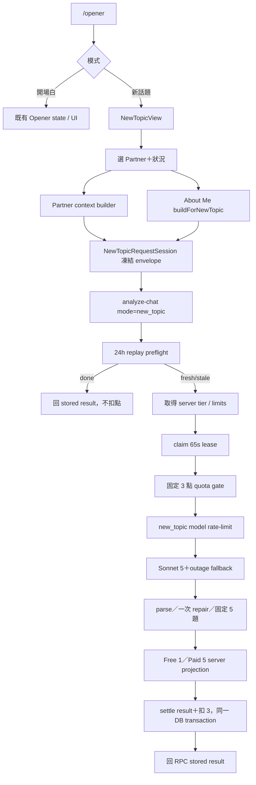
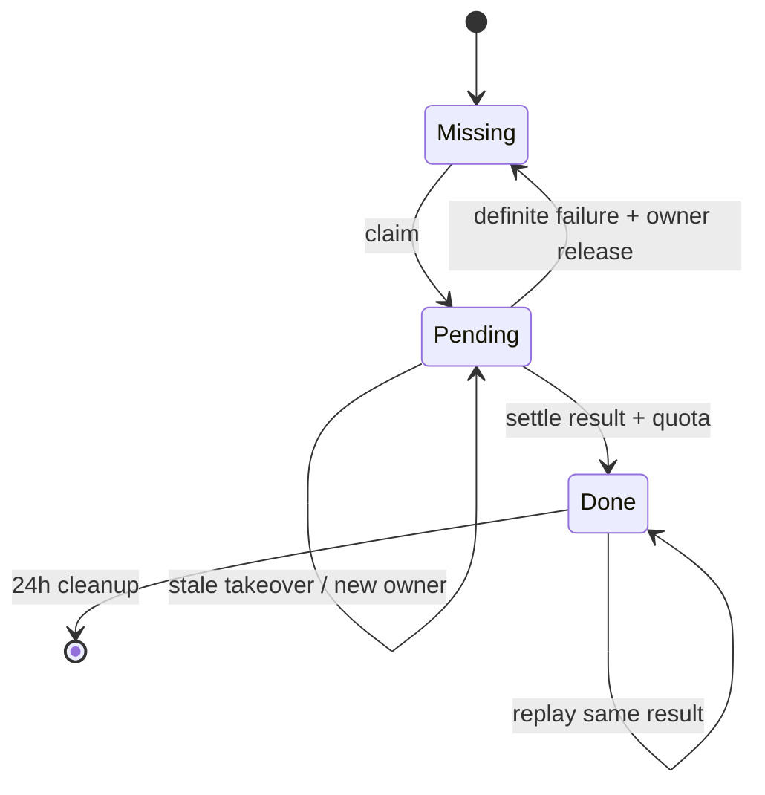

# Opener Free 3＋New Topic 破冰腦力 — 詳細實作計畫

> - 日期：2026-07-24
> - 狀態：READY FOR CC IMPLEMENTATION
> - 產品決策者：Eric
> - 預定執行者：Claude Code（CC）
> - 高風險範圍：Opener、`analyze-chat`、AI prompt、quota、429、paywall、Edge response schema、Postgres exactly-once ledger
> - 審查要求：完成實作與測試後，由 Eric 把 Review Packet 路由到獨立 Codex task；Codex APPROVED 前不得宣稱 dogfood safe

## 0. 這份文件的用途

這份文件是本功能的施工規格與驗收契約，不是概念提案。

若實作者發現本文與目前程式碼衝突：

1. 先以 `docs/snapshot.md`、`docs/shared-agent-rules.md`、最新 commit 與實際程式碼為準。
2. 不得自行改動下列「已鎖定產品規格」。
3. 若需要改動產品規格、計費、Free／Paid 分界或資料保留承諾，停止實作並請 Eric 決定。

本文中的檔案與 symbol 名稱是預定落點；行號會隨實作移動，review 時應以 symbol 搜尋，不應只依賴行號。

---

## 1. 已鎖定產品規格

### 1.1 開場救星

|項目|鎖定規格|
|---|---|
|模型生成量|仍然固定生成五種，不增加既有模型呼叫次數|
|Free 可用種類|恰好三種：`extend`、`humor`、`tease`|
|Free 鎖定種類|`resonate`、`coldRead`|
|Starter／Essential|完整五種|
|有效生成成本|固定 3 點|
|舊 App 相容|舊 contract 仍只收到 `extend`；新 App 用 contract v2 啟用 Free 3|
|推薦|推薦一定指向實際可見的 opener；不得指向鎖定或被 sanitizer 移除的內容|
|模型成本|現況本來就要求五種，因此 Free 1→3 不應增加主要 token 成本|

Free 畫面的展示順序固定為：

1. 延展 `extend`
2. 幽默 `humor`
3. 微調侃 `tease`
4. 鎖定：共鳴 `resonate`
5. 鎖定：冷讀 `coldRead`

付費畫面保留目前 canonical 順序，避免無必要地改變既有付費 UX：

1. `extend`
2. `resonate`
3. `tease`
4. `humor`
5. `coldRead`

### 1.2 新話題

|項目|鎖定規格|
|---|---|
|入口|既有 `/opener` 頁最上方增加「開場白／新話題」切換|
|必要條件|必須選定一個 owner-scoped Partner|
|輸入脈絡|對象作戰板＋使用者「關於我」＋選填目前狀況|
|目前狀況|冷掉了／剛約完／聊著但卡住／想升溫；四選一或不選|
|模型成功契約|固定五個完整、互不重複的新話題|
|Free|只收到模型最推薦的一個完整話題|
|Starter／Essential|收到完整五個話題|
|每個話題|話題方向、可直接傳的第一句、為什麼有效、接下來怎麼延續|
|推薦|五個中恰好一個「最推薦先試」|
|成本|固定 3 點|
|本地保存|v1 不新增 Hive 歷史、收藏或跨頁保存|
|模式切換|不得清除兩邊已生成結果，也不得 dispose 正在生成的工作|

一個新話題的四個可見欄位固定命名為：

- `direction`：聊什麼。
- `openingLine`：可直接複製送出的第一句。
- `whyItWorks`：為什麼現在這樣開有效。
- `nextMove`：對方回覆後怎麼延續。

### 1.3 Free 核心可用規則

新話題不能因為使用者是 Free 就先擋住；只要 server 判定月額度與日額度都足以支付本次 3 點，就必須允許生成。

「剩餘 1–2 點」代表付不起一個固定 3 點的新話題請求，因此屬於真正 quota insufficient，不是 tier hard gate。回應必須是 quota 429，並清楚帶 `quotaNeeded: 3`。

### 1.4 沒有實質資料時的規則

下列三類素材全部為空時：

1. 對象作戰板沒有實質訊號。
2. 「關於我」沒有可用風格／興趣／備註。
3. 沒選目前狀況。

必須在 client 先提示補資料，server 再以 422 `NEW_TOPIC_CONTEXT_REQUIRED` 防守。

這個情境：

- 不計模型 rate limit。
- 不呼叫 Claude。
- 不 claim replay ledger。
- 不扣 quota。

只要三類中至少一類有實質內容即可生成。例如作戰板很空，但使用者有 About Me 且選了「聊著但卡住」，仍可生成；UI 應提醒「作戰板資料較少，建議會偏通用」，不能直接硬擋。

### 1.5 Data quality 規則

若 `dataQualityFlagProvider(partnerId)` 顯示該 Partner 可能混到兩個人：

- 整個 New Topic 生成必須阻擋。
- 不得只拿 About Me／situation 繞過。
- 不得把可疑 Partner override 或摘要送給 AI。
- UI 顯示既有資料品質警告與修復入口。

這是身份資料可信度問題，不是單純「資料較少」。

這項規則位於 Flutter 本地資料邊界。v1 request 不傳 `partnerId`，server 也沒有本地 Partner／flag 資料可查，因此：

- owner-scoped lookup、Partner 必選與 data-quality block 必須在 client 建立 request 前完成。
- server 仍獨立檢查三類 normalized material 不可全空，但不假裝能驗證 Partner ownership／flag provenance。
- `NewTopicRequestSession` 必須把選取的 local partnerId 納入 session identity；即使兩個 Partner 最後產出相同摘要，切換 Partner 仍要 rotate requestId。
- 不把 unverifiable 的 `partnerId` 放入 v1 wire contract，避免形成「server 已驗證 Partner」的錯誤安全印象。

---

## 2. 現況與為什麼不能只改一行

### 2.1 Free Opener 現況

目前主要相關位置：

- `supabase/functions/analyze-chat/index.ts`
  - `OPENER_PROMPT` 已要求五種 opener。
  - Free allowlist 在 opener branch 被裁成 `["extend"]`。
- `supabase/functions/analyze-chat/opener_payload.ts`
  - 負責 normalize 與 tier filter。
  - 目前 filtered fallback 寫入頂層 `recommendedPick`，但 live client 主要讀 nested `recommendation.pick`，存在推薦契約裂縫。
- `lib/features/opener/data/services/opener_service.dart`
  - `bestOpenerTypeForAccess()` 與 `visibleForAccess()` 都把 Free 寫死為 `extend`。
- `lib/features/opener/presentation/screens/opening_rescue_screen.dart`
  - 非 `extend` 一律當鎖卡。
  - `resultHasPaidStyles()` 以「出現任何 non-extend」推測為付費結果。
- `lib/features/opener/data/services/opener_result_cache_service.dart`
  - draft preview／handoff 依賴 access-aware opener selection。
- `lib/features/conversation/presentation/screens/new_conversation_screen.dart`
  - 從 opener cache 取可見推薦作為下一段對話 seed。

如果只把 server allowlist 改成三種，舊的 `resultHasPaidStyles()` 會把 Free 三卡誤判成 paid；推薦理由、draft、handoff、鎖卡與 stale subscription 行為也會出錯。

### 2.2 現有 opener requestId 不是「回原結果」

目前 `opener_request_charges` 只做到扣點去重：

- ledger 不存生成結果。
- 同 requestId replay 仍可能再呼叫模型。
- 第二次只是在結算階段發現已扣過，不再扣第二次。
- 因此同 requestId 可能看到不同答案。

New Topic 規格要求真正的 lost-response recovery，所以不能偷用 `increment_usage_idempotent` 或 `opener_request_charges`。

### 2.3 `PartnerSummaryBuilder.build()` 不能直接重用

既有 `lib/features/partner/domain/services/partner_summary_builder.dart` 是 analyze-chat 專用：

- 無 conversation 或無 parsed snapshot 時仍會輸出名稱／header，可能把空資料誤判成實質內容。
- 某些 early return 會漏掉 `partner.customNote`。
- 尾端帶有「當前對話優先」語意，不適合 New Topic。

New Topic 必須新增專用 builder，既有 `build()` 保持 byte-for-byte 行為不變。

### 2.4 最新 exactly-once 範式

Repo 最新的 Keyboard／Coach 已採：

`preflight replay → claim lease → model → settle result＋quota → replay stored result`

New Topic 應沿用這個成熟範式，而不是較舊的「生成完才 insert ledger」：

- 同 requestId 的併發請求不會全部打模型。
- stale lease 可被接手。
- 晚到 settlement 不得覆蓋先完成者。
- handler 最後永遠回 settlement RPC 的權威 stored result。
- settlement transport 結果不明時不 release，retry 會從 ledger 找回結果。

---

## 3. 不變量與明確不做

### 3.1 必守不變量

1. Free Opener v2 恰好三個可複製 opener，不是「最多三個」。
2. Paid Opener 恰好五個可複製 opener。
3. New Topic 模型結果清理後必須恰好五個完整 topic 才可結算。
4. Free New Topic response body 只含一個真實 topic；其餘四個內容不能傳到 client。
5. Starter／Essential New Topic response body 含五個 topic。
6. New Topic requestId 必填 canonical UUID，沒有 legacy fail-open。
7. 同一 user＋requestId＋input HMAC 在 24 小時內只扣一次，且 replay 回資料庫中的同一份結果。
8. 同一 user＋requestId 但輸入不同，回 409；不打模型、不扣點。
9. 格式失敗、provider 失敗、deadline 前失敗都不 settle quota。
10. `MODEL_RATE_LIMITED` 永遠不開 paywall。
11. 只有真正 quota 429 才開 paywall。
12. settlement transport 結果不明時不能聲稱「一定沒扣」，必須保留 requestId 並要求同 ID retry。
13. 模式切換不得讓已扣 3 點的結果消失。
14. 不虛構對方興趣，不把使用者自己的興趣說成共同興趣。
15. OCR、Practice、Coach、一般 analyze、Optimize Message 零行為回歸。

### 3.2 本輪不做

- 不新增 `new-topic` Edge Function。
- 不改 Postgres subscription schema 或既有 `increment_usage`。
- 不把 New Topic 塞進 `opener_request_charges`。
- 不讓 client 下載付費 topic 再用 UI 隱藏。
- 不新增 New Topic Hive box、typeId、draft cache、outcome event。
- 不接受 screenshot、messages、userDraft、recognizeOnly。
- 不新增自由文字 situation；v1 只有四個 enum chip。
- 不新增 Partner detail 額外 CTA；既有「新增對話」sheet 改成 umbrella 文案即可。
- 不改 opener prompt 的產品內容；只修 completeness、tier projection 與 recommendation contract。

---

## 4. 整體架構



### 4.1 模式 state 所有權

- `OpeningRescueScreen` 保有既有 Opener state。
- `NewTopicView` 自己保有 New Topic state。
- 外層使用 `IndexedStack` 或等價 keep-mounted 結構。
- UI toggle 只改 active index，不 navigation／replace route。
- route query `mode=new_topic` 只決定初始模式，避免切換時重建整頁。

### 4.2 權益所有權

- 新鮮 response：server `access` 是權威。
- New Topic client 不根據本機 subscription 刪 topic。
- Opener draft/cache 重新開啟時仍需按「目前 subscription」重做可見性過濾，避免付費結果在降級後洩漏。

---

## 5. Wire contract

### 5.1 Opener contract v2 request

新 App 在既有 opener body 增加：

```json
{
  "mode": "opener",
  "openerContractVersion": 2
}
```

規則：

- 缺席／`null`／整數 `1`：視為 v1，Free 維持 legacy `extend` only。
- 整數 `>= 2`：以目前支援的 v2 處理，Free 使用 exact three。
- 字串、浮點、`0`、負數：在 rate limit、模型與扣費前回 400。
- Paid 不因 contract version 改變五卡權益。
- `openerContractVersion` 只影響同一份五型結果的權益投影，不加入既有 opener input hash。
- 只在 opener mode 解析此欄位，不能影響其他 mode。

### 5.2 Opener contract v2 response access

```json
{
  "openers": {
    "extend": "...",
    "humor": "...",
    "tease": "..."
  },
  "recommendation": {
    "pick": "humor",
    "reason": "..."
  },
  "access": {
    "contractVersion": 2,
    "servedTier": "free",
    "visibleTypes": ["extend", "humor", "tease"],
    "lockedTypes": ["resonate", "coldRead"]
  },
  "usage": {
    "cost": 3
  }
}
```

若模型原推薦為鎖定類型：

- server 從目前 tier 的 visible order 找第一個完整 opener 作 fallback。
- nested `recommendation.pick` 必須被改寫。
- `recommendation.reason` 若只適用原本被鎖內容，應省略，不可硬套到 fallback。
- 不得只寫頂層 legacy `recommendedPick` 卻留下舊 nested pick。

### 5.3 New Topic request

允許欄位：

```json
{
  "mode": "new_topic",
  "requestId": "canonical-uuid",
  "partnerSummary": "optional compact text",
  "effectiveStyleContext": "optional compact text",
  "situation": "went_cold | after_date | stuck | warm_up",
  "expectedTier": "optional subscription hint",
  "revenueCatAppUserId": "optional RevenueCat hint"
}
```

限制：

|欄位|規格|
|---|---|
|`requestId`|必填 canonical UUID|
|`partnerSummary`|trim 後選填；最多 2,000 UTF-16 code units|
|`effectiveStyleContext`|trim 後選填；最多 1,200 UTF-16 code units|
|`situation`|選填；只允許四個 enum|
|`expectedTier`|只作 server tier refresh hint，不決定權益|
|`revenueCatAppUserId`|沿用現有安全驗證|

New Topic mode 必須拒絕：

- `images`
- 非空 `messages`
- `profileInfo`
- `userDraft`
- `recognizeOnly: true`
- `sessionContext`
- `conversationSummary`
- 非預設／非相容 response mode
- 未列入 allowlist 的業務欄位

### 5.4 模型內部輸出

模型不負責產生 ID，只回：

```json
{
  "topics": [
    {
      "direction": "...",
      "openingLine": "...",
      "whyItWorks": "...",
      "nextMove": "..."
    }
  ],
  "recommendation": {
    "index": 0,
    "reason": "..."
  }
}
```

成功條件：

- `topics.length == 5`。
- 四欄都是非空字串。
- `recommendation.index` 是 0–4 整數。
- direction 與 openingLine 經 normalize 後不得重複。
- 不含 raw JSON、code fence、system prompt、schema 說明或不可見技巧標籤。

欄位 hard cap：

|欄位|上限|
|---|---:|
|`direction`|80|
|`openingLine`|180|
|`whyItWorks`|400|
|`nextMove`|300|
|`recommendation.reason`|300|

Server normalize 後依最終陣列順序配置 `nt_1`～`nt_5`，再把 recommendation index 轉成 topicId。

### 5.5 對 client 的 New Topic 成功 response

Free：

```json
{
  "topics": [
    {
      "id": "nt_3",
      "direction": "...",
      "openingLine": "...",
      "whyItWorks": "...",
      "nextMove": "..."
    }
  ],
  "recommendation": {
    "topicId": "nt_3",
    "reason": "..."
  },
  "access": {
    "servedTier": "free",
    "limited": true,
    "totalCount": 5,
    "unlockedCount": 1,
    "lockedCount": 4
  },
  "usage": {
    "cost": 3
  }
}
```

Starter／Essential：

- `topics.length == 5`
- `unlockedCount == 5`
- `lockedCount == 0`
- `limited == false`
- recommendation topicId 必須存在於五個可見 topics。

Server 先把推薦 topic 排到 client response 第一位；topicId 不因排序被重算。

### 5.6 Ledger stored result

`result_json` 只存：

- `topics`
- `recommendation`
- `access`

不存：

- partnerSummary
- effectiveStyleContext
- situation
- expectedTier／RevenueCat ID
- usage counter
- telemetry
- provider raw response
- 付費鎖定內容（Free row 只存一個已投影 topic）

Replay 時 Edge 以 stored result 加上當下 usage metadata；生成內容與 access servedTier 保持第一次成功版本。

Client body 的 `usage.cost` 永遠是常數 3；是否為 replay、是否真的新增扣點只記 server telemetry，不放進 client body。如此 fresh 與 replay 的成功 body 可以完全一致，且不會把 `cost: 3` 誤讀成「這次 transport 又扣 3」。

---

## 6. Error contract 與失敗矩陣

|情境|HTTP／code|模型 rate|模型|Quota|Claim 行為|
|---|---|---:|---:|---:|---|
|requestId 非 UUID、欄位錯型、超長、帶禁用欄位|400 `NEW_TOPIC_REQUEST_INVALID`|0|不呼叫|0|不 claim|
|三類素材皆空|422 `NEW_TOPIC_CONTEXT_REQUIRED`|0|不呼叫|0|不 claim|
|同 ID、不同 HMAC|409 `NEW_TOPIC_REQUEST_REPLAY_MISMATCH`|0|不呼叫|0|不改 row|
|同 ID 已完成|200 replay stored result|0|不呼叫|不再扣|不 claim|
|同 ID 正在有效 lease|409 `NEW_TOPIC_REQUEST_IN_PROGRESS`|0|不呼叫|0|回 `retryAfterMs`|
|Replay DB read 失敗|503 `NEW_TOPIC_REPLAY_UNAVAILABLE`|0|不呼叫|0|fail closed|
|HMAC secret 缺失／太弱|503 `NEW_TOPIC_REPLAY_NOT_CONFIGURED`|0|不呼叫|0|只擋 new_topic|
|額度不足，含剩 1–2 點|429 quota payload|0|不呼叫|0|owner-bound release 後返回|
|Claim DB 失敗|503 `NEW_TOPIC_CLAIM_UNAVAILABLE`|0|不呼叫|0|無模型|
|模型限流|429 `MODEL_RATE_LIMITED`|命中|不呼叫|0|owner-bound release|
|Provider 全鏈失敗|503 `NEW_TOPIC_PROVIDER_UNAVAILABLE`|已計|已嘗試|0|確定未 settle 才 release|
|JSON 一次 repair 後仍不完整|502 `NEW_TOPIC_RESPONSE_INVALID`|已計|已呼叫|0|release|
|總 deadline 到期、尚未 settle|504 `NEW_TOPIC_DEADLINE_EXCEEDED`|可能已計|可能已呼叫|0|release 成功才回 504|
|settle 時 quota 競態不足|429 quota payload|已計|已呼叫|0|transaction rollback 後 release|
|settle 明確 validation／DB error|500/503 settlement error|已計|已呼叫|0|只有能證明未 commit 才 release|
|settle transport／timeout 結果不明|503 `NEW_TOPIC_SETTLEMENT_PENDING`|已計|已呼叫|可能已扣一次|絕不 release；同 ID retry|
|stale owner 晚到 settle|200 stored winner result 或 retryable|已計|可能已呼叫|總共只扣一次|本地候選丟棄|
|測試帳號成功|200|bypass|已呼叫|0|仍可 settle/replay|

### 6.1 429 分流

`MODEL_RATE_LIMITED` payload 不得包含下列 quota keys：

- `monthlyRemaining`
- `dailyRemaining`
- `quotaNeeded`
- `monthlyLimit`
- `dailyLimit`

Client 看到 `code == MODEL_RATE_LIMITED`：

- 顯示一般中文錯誤。
- 保留 requestId。
- 不開 paywall。

真正 quota 429：

- 建立 `NewTopicQuotaExceededException`。
- 顯示 server message。
- 開既有 paywall。
- paywall 返回後 refresh subscription。
- 使用者重試時沿用相同 frozen requestId／context。

### 6.2 Settlement 不確定狀態

如果 RPC request timeout，Edge 無法知道 DB transaction 是 committed 還是未執行：

- 不得回「生成失敗，不扣點」。
- 不得 release owner claim。
- 回 `NEW_TOPIC_SETTLEMENT_PENDING` 與可讀中文：「結果正在確認，請用同一筆請求重試」。
- Client 保留 pending attempt。
- retry 先讀 ledger；若 committed，直接 replay 原結果。

---

## 7. Workstream A — Free Opener 3 後端

### 7.1 修改檔案

- `supabase/functions/analyze-chat/index.ts`
- `supabase/functions/analyze-chat/opener_payload.ts`
- `supabase/functions/analyze-chat/opener_payload_test.ts`
- `supabase/functions/analyze-chat/index_test.ts`
- `supabase/functions/analyze-chat/opener_prompt_test.ts`（只補 completeness／prompt scan 回歸，不改產品 prompt）

### 7.2 實作步驟

1. 定義 server constants：
   - canonical 五種。
   - Free v2 三種。
   - Free v2 顯示順序。
2. 解析 `openerContractVersion`。
3. 保留 legacy Free allowlist。
4. v2 Free allowlist 改成 exact three。
5. 在 tier filter 前先驗證模型五種都完整。
6. primary partial response 進一次既有 format repair。
7. repair 後仍不足五種，502 且不 charge。
8. 改寫 `filterOpenerPayloadForAllowedFeatures()`：
   - nested recommendation 與可見 openers 一起 canonicalize。
   - recommendation pick 一定存在。
   - fallback 時清除不相容 reason。
9. 加 `access` metadata。
10. 確認 locked opener content 不在 Free response。

### 7.3 後端 acceptance

- v1 Free response 只有 `extend`。
- v2 Free response 恰好 `extend/humor/tease`。
- Paid response 恰好五種。
- primary 缺 humor、repair 補齊後可成功。
- repair 後仍缺任一種，502、不扣。
- 模型推薦 `coldRead` 給 Free v2 時，final nested pick 落在三個 visible types，reason 不誤用。
- 既有 analyze-chat Free `extend + tease` 契約完全不變。

---

## 8. Workstream B — Free Opener 3 Flutter

### 8.1 修改檔案

- `lib/features/opener/data/services/opener_service.dart`
- `lib/features/opener/data/services/opener_result_cache_service.dart`
- `lib/features/opener/presentation/screens/opening_rescue_screen.dart`
- `lib/features/conversation/presentation/screens/new_conversation_screen.dart`
- `test/unit/features/opener/data/services/opener_service_test.dart`
- `test/unit/features/opener/data/services/opener_result_cache_service_test.dart`
- `test/unit/features/opener/presentation/opening_rescue_locked_cards_test.dart`
- `test/unit/features/opener/presentation/opening_rescue_handoff_location_test.dart`
- 其他因 result serialization 受影響的 opener tests

### 8.2 Dart access contract

在 opener domain/service 附近集中定義：

- canonical paid order。
- Free v2 unlocked set。
- Free UI order。
- paid-only set。
- `OpenerAccess`：
  - contractVersion
  - servedTier
  - visibleTypes
  - lockedTypes

不得在 screen、cache、handoff 各自重複手寫不同集合。

### 8.3 Fresh result 與 cached result

Fresh response：

- 優先採 server access。
- 即使本機 subscription 還 stale-free，只要 server served paid 就顯示五種。
- 即使本機 stale-paid，server 只 served free 也不能幻想出未傳內容。

Cached／draft：

- 重新依目前 subscription 過濾。
- Free 目前可見集合是 `extend/humor/tease`。
- Paid 可見所有實際存下來的 opener。
- 舊 Free 單卡 JSON 沒 access 也能讀。
- 舊 Paid 五卡 JSON 在降級 Free 後只留三種，不洩漏 resonate/coldRead。
- 不需要 Hive migration。

### 8.4 移除 paid-shape 誤判

`resultHasPaidStyles()` 不能再用「任何 non-extend」判 paid。

處理方式：

- fresh result 直接用 `access.servedTier`。
- legacy cache fallback 最多只能以 paid-only keys 判斷，但實際顯示仍受 current access filter。
- `_resultGeneratedPaid` 若保留，只能代表「本次 server served paid」，不能從 opener map 猜。

### 8.5 UI 與 handoff

- Free 三個實卡在前，兩個鎖卡在後。
- recommendation badge 可落在三種任一。
- reason 只在 pick 可見且 reason 非空時顯示。
- Copy、outcome bar 只對 unlocked content 建立。
- draft preview 與 New Conversation handoff：
  - 先用可見 recommendation。
  - recommendation 不可用時依 access order fallback。
  - 不得選 resonate/coldRead 給 Free。

---

## 9. Workstream C — New Topic Partner／About Me context

### 9.1 新增檔案

- `lib/features/new_topic/domain/services/new_topic_partner_context_builder.dart`
- `test/unit/features/new_topic/domain/new_topic_partner_context_builder_test.dart`

### 9.2 `NewTopicPartnerContext`

建議欄位：

- `promptText`
- `hasActionableSignals`
- `hasHeatSignal`
- `hasInterestSignals`
- `hasTraitSignals`
- `hasNoteSignals`

輸入：

- owner-scoped `Partner`
- 該 Partner 的 owner-scoped conversations

輸出內容只包含實際存在的欄位：

- Partner 顯示名稱。
- conversation count。
- last interaction。
- latest heat。
- interests。
- traits。
- `partner.customNote`。
- 沒有 customNote 時才使用近期 aggregate notes。
- 最後加「只可使用以上明確紀錄，不得猜補對方興趣」。

`hasActionableSignals` 為 true 的條件：

- heat 有實質值；或
- interests 非空；或
- traits 非空；或
- customNote 非空；或
- aggregate notes 非空。

只有名稱、conversation count、日期或 placeholder 不算。

若沒有 actionable signal：

- `promptText` 回 null／空。
- 不得輸出「尚無紀錄」header 讓 server 誤判。

### 9.3 安全與上限

- owner mismatch 回 blocked／empty。
- grapheme cap 1,500。
- UTF-16 code-unit cap 2,000。
- 不改既有 `PartnerSummaryBuilder`。
- customNote-only 必須成功輸出。
- 不出現「當前對話優先」。

### 9.4 `buildForNewTopic`

修改：

- `lib/features/user_profile/domain/services/effective_style_prompt_builder.dart`
- `test/unit/features/user_profile/domain/effective_style_prompt_builder_test.dart`

新增 `newTopicMaxChars = 900` 與 `buildForNewTopic()`。

可用素材：

- 主／副互動風格。
- practice goals。
- topic seeds。
- custom topics。
- notes。
- unflagged partner override。

契約文字必須明確說：

- topic seeds 是使用者自己的興趣。
- 可以自然分享自身生活畫面。
- 不得聲稱對方也喜歡。
- 不得為了配合對方假裝身份、經歷或興趣。
- 使用者風格只調整說法，不覆蓋 consent／低壓互動要求。

禁止在 visible prompt／output contract 使用 `DHV` 字面；統一寫「自然展現生活感、品味或行動力」。

既有三個 builder 方法 snapshot 必須保持不變。

### 9.5 Context readiness provider

新增 provider state，至少區分：

- `missingPartner`
- `dataQualityBlocked`
- `readyWithPartnerSignals`
- `readyWithoutPartnerSignals`

有效 route partnerId 必須存在 owner-scoped partner list，不能只用未驗證 lookup。

Generation readiness：

```text
partner 存在
AND data quality 未 flagged
AND (
  partnerContext.hasActionableSignals
  OR effectiveStyleContext 非空
  OR situation 已選
)
```

---

## 10. Workstream D — New Topic backend helpers

### 10.1 新增檔案

- `supabase/functions/analyze-chat/new_topic_prompt.ts`
- `supabase/functions/analyze-chat/new_topic_prompt_test.ts`
- `supabase/functions/analyze-chat/new_topic_payload.ts`
- `supabase/functions/analyze-chat/new_topic_payload_test.ts`
- `supabase/functions/analyze-chat/new_topic_billing.ts`
- `supabase/functions/analyze-chat/new_topic_billing_test.ts`
- 視 integration 需要新增 `new_topic_source_test.ts`

修改：

- `supabase/functions/analyze-chat/index.ts`
- `supabase/functions/analyze-chat/index_test.ts`
- `supabase/functions/analyze-chat/opener_prompt_test.ts`
- `supabase/functions/_shared/model_rate_limit.ts`
- `supabase/functions/_shared/model_rate_limit_test.ts`

### 10.2 `new_topic_payload.ts`

職責：

- strict request sanitize。
- situation enum normalize。
- model JSON parse／normalize。
- 欄位長度與 visible-text guard。
- topic dedupe。
- recommendation index validation。
- server topicId 配置。
- Free／Paid projection。
- ledger result validation。
- client response access validation。

純 helper 不應 import／啟動 Edge server，以便 behavior tests。

### 10.3 `new_topic_prompt.ts`

至少包含：

- `NEW_TOPIC_PROMPT`
- `NEW_TOPIC_REPAIR_PROMPT`
- `buildNewTopicUserPrompt()`
- `buildNewTopicRepairPrompt()`

Prompt 要求：

1. 固定五題。
2. 優先使用作戰板的明確線索。
3. 若某線索沒有出現在作戰板，不得寫成對方興趣。
4. About Me 興趣只能作使用者自我揭露。
5. situation 影響節奏：
   - 冷掉：低壓、不要責問消失。
   - 剛約完：承接共享經驗，不急著再次邀約。
   - 卡住：換角度，不像面試。
   - 想升溫：增加個人感與互動，但不突然推進。
6. openingLine 必須可直接傳，不能是教練說明。
7. whyItWorks 與 nextMove 不得出現露骨 PUA／操控術語。
8. 不性化、不歧視、不施壓、不假裝共同經驗。

`NEW_TOPIC_PROMPT` 與 repair prompt 必須加入 production prompt blocking scan。

### 10.4 模型與 repair

- primary：`claude-sonnet-5`
- max output：3,000 tokens
- absolute request deadline：50 秒
- generation deadline：45 秒
- settlement reserve：5 秒
- client timeout：70 秒
- outage fallback：Sonnet 5 → 4.6 → Haiku，僅 retryable provider／network／timeout。
- refusal、max_tokens、格式錯誤不走 outage fallback。
- schema 不完整只用「剛才成功輸出 invalid payload 的同一 model」做一次 format repair。
- repair 禁止 model fallback，且共享同一 absolute deadline。

檢查點：

- provider 前。
- provider 後。
- repair 前後。
- tier projection 後。
- claim settle 前。

### 10.5 New mode integration

在 `index.ts` 增加 `isNewTopicMode`。

必須同步處理：

- optimize shape validation 排除 new_topic。
- generic analyze monthly／daily gate 排除 new_topic。
- generic message sanitizer／OCR／analysis input safety 不接管 new_topic。
- new_topic 使用自己的 fixed cost 3 gate。
- `requestType`／telemetry 支援 `new_topic`。
- 一般 analyze、opener、optimize branch order 不變。

New Topic branch 的順序固定為：

1. 驗證 request allowlist、型別、長度與 material readiness。
2. 檢查 `CLAUDE_API_KEY` 與 new-topic-only HMAC secret。
3. 計算 HMAC，做 24h replay preflight：
   - done 回 stored result。
   - mismatch／active pending／DB failure依契約返回。
4. 取得／self-heal subscription，必要時做 RevenueCat refresh；此時只算出 server tier 與 limits，尚不打模型。
5. 建立 owner token 並 claim 65 秒 lease。
6. 用 server limits 做固定 cost 3 quota gate：
   - 不足時 owner-bound release 後回真正 quota 429。
7. 執行 `new_topic` model rate limit：
   - 命中時 owner-bound release，回 `MODEL_RATE_LIMITED`。
8. 模型 dispatch 前 renew／re-claim lease；若已 replay、pending 或被 takeover，停止本地生成。
9. 在 45 秒 generation deadline 內完成 primary／outage fallback／最多一次 same-model repair。
10. 驗證完整五題，再依 server tier 做 1／5 投影。
11. 在剩餘 5 秒 settlement reserve 內重新確認 deadline／subscription limits，atomic settle quota＋result。
12. 只以 settlement RPC 回傳的 stored result 組出 200；永遠丟棄非權威 local candidate。

claim 必須發生在 quota 429 的終局回應之前。否則兩個相同 identity 的併發 invocation 可能各自做不同決策，無法保證同一請求的收斂語意。

---

## 11. Workstream E — 24h claim／lease／settle ledger

### 11.1 Migration

新增：

- `supabase/migrations/20260724120000_new_topic_exactly_once.sql`

不得使用 `supabase db push`；部署時只可用目標式 `apply_migration`。

### 11.2 Secret

新增 Supabase Edge secret：

- `NEW_TOPIC_REPLAY_HMAC_KEY`

要求：

- 至少 32 random bytes。
- 用 base64／既有 strong-key helper 可接受的格式。
- 不寫入 repo、log、review packet 或 terminal transcript。
- 只有 new_topic mode 在缺 secret 時 fail closed；其他 analyze-chat modes 不受影響。
- Secret 至少穩定保留 24 小時。若要 rotation，先讓舊 ledger 走完 24h retention，或另案支援 previous key。

### 11.3 HMAC

`new_topic_billing.ts` 新增：

- strong key validation。
- server-keyed HMAC-SHA256。
- 24h replay cutoff。
- claim／release／settle RPC mapping。
- DB error classification。

HMAC 必須綁定：

- server auth userId。
- normalized partnerSummary。
- normalized effectiveStyleContext。
- normalized situation。
- contract namespace/version，例如 `vibesync-new-topic-replay-v1`。

Canonical serialization 固定為 length-safe JSON array，例如：

```text
["vibesync-new-topic-replay-v1", userId,
 partnerSummaryOrNull, effectiveStyleContextOrNull, situationOrNull]
```

先對三個輸入做相同 normalize，再 UTF-8 encode 後做 HMAC-SHA256；不得用字串串接分隔符，避免邊界碰撞。

不納入：

- expectedTier。
- RevenueCat hint。
- 當下 quota counter。
- owner token。

### 11.4 Table

`new_topic_requests` 建議欄位：

|欄位|用途|
|---|---|
|`user_id uuid`|FK auth.users，delete cascade|
|`request_id uuid`|client durable identity|
|`input_hash text`|64 hex server-keyed HMAC|
|`state text`|`pending`／`done`|
|`owner_token uuid`|本次 claim owner|
|`lease_expires_at timestamptz`|stale takeover|
|`result_json jsonb null`|done 才能非空|
|`quota_charged boolean`|本次是否實扣|
|`created_at timestamptz`|retention|
|`updated_at timestamptz`|lease／settle|

主鍵：

- `(user_id, request_id)`

約束：

- pending：result 必須 null、quotaCharged false。
- done：result 必須符合 New Topic ledger result shape。
- result top-level 只能有 topics／recommendation／access。
- Free result topics=1、locked=4。
- Paid result topics=5、locked=0。
- recommendation topicId 必須存在於 stored topics。

權限：

- 啟用 RLS。
- anon／authenticated 無 table access。
- service role 只需 preflight SELECT。
- INSERT／UPDATE 只能透過 SECURITY DEFINER RPC。

Retention：

- 功能 replay window 24 小時。
- created_at index。
- cleanup function 刪除 24 小時前 rows。
- pg_cron 每小時執行。
- claim RPC 也應清理同 identity／過期 row，避免 cron 延遲造成 PK 卡住。

### 11.5 RPC

#### `claim_new_topic_request`

參數：

- userId
- requestId
- inputHash
- ownerToken

65 秒 lease。

回傳：

- `claimed`
- `replay`＋stored result
- `pending`＋retryAfterMs

行為：

- 無 row：insert pending，ownerToken 取得 lease。
- done＋hash 相同：replay。
- hash 不同：raise mismatch。
- pending lease 未過：pending。
- pending lease 已過：更新 ownerToken，stale takeover。

#### `release_new_topic_claim`

- 只有 userId＋requestId＋inputHash＋ownerToken 全部相符才可刪／釋放 pending row。
- 不能釋放別人的新 owner。
- done row 永不 release。
- release 失敗時 handler 不得假裝 claim 已清除。

#### `settle_new_topic_request`

參數至少包含：

- identity＋inputHash＋ownerToken
- validated projected resultJson
- monthlyLimit
- dailyLimit
- chargeQuota

同一 transaction：

1. lock row。
2. 驗證 inputHash／ownerToken／lease。
3. 若已 done，回 stored winner result。
4. 若本 owner 有效，lock subscription row。
5. `chargeQuota=true` 時呼叫既有 `increment_usage(..., 3, ...)`。
6. 寫 state=done、resultJson、quotaCharged。
7. 回 `{charged, result, monthlyUsed, dailyUsed}`。

最重要規則：

- Handler 只能回 `settlement.result`。
- 不得回本 invocation 的 local candidate。
- stale owner 或同 ID race 若已有人先 settle，晚到者丟棄本地生成並回先完成者 result。

### 11.6 Claim lifecycle



Owner-bound release 時機：

- claim 後確認 quota 不足。
- model rate limited。
- provider definite failure。
- format repair definite failure。
- deadline reached before settlement。
- settle-time quota race且 DB 明確 rollback。

絕不 release：

- settlement RPC transport timeout。
- settlement response parse failure。
- 任一無法證明「transaction 沒 commit」的狀況。

---

## 12. Workstream F — Flutter New Topic data/domain

### 12.1 新增檔案

```text
lib/features/new_topic/
├─ domain/entities/new_topic_result.dart
├─ domain/services/new_topic_partner_context_builder.dart
├─ data/services/new_topic_service.dart
├─ data/services/new_topic_request_session.dart
├─ data/providers/new_topic_providers.dart
├─ presentation/widgets/new_topic_view.dart
└─ presentation/widgets/new_topic_idea_card.dart
```

### 12.2 Entities

`NewTopicIdea`：

- id
- direction
- openingLine
- whyItWorks
- nextMove

`NewTopicRecommendation`：

- topicId
- reason

`NewTopicAccess`：

- servedTier
- limited
- totalCount
- unlockedCount
- lockedCount

`NewTopicResult`：

- topics
- recommendation
- access
- costUsed
- requestId

不要把 `charged`／`replayed` 放進 client entity；兩者只屬於 server telemetry。Fresh 與 replay 對 client 都解析成同一份成功結果。

Client strict validation：

- Free：1＋4=5。
- Paid：5＋0=5。
- totalCount 永遠 5。
- recommendation 指向可見 topic。
- ID 唯一。
- 四欄完整且在 cap 內。
- raw JSON／code fence 防禦。
- 非 Map 200、半套 response 全部視為失敗。

### 12.3 Service

`NewTopicService`：

- injectable invoker。
- invoke `analyze-chat`。
- timeout 70 秒。
- blank optional fields 不送。
- 必送 requestId。
- 解析 server access，不自行推 tier。
- 只回完整 `NewTopicResult`。

Exception：

- `NewTopicQuotaExceededException`
- `NewTopicRequestInProgressException(retryAfterMs)`
- 一般 localized `NewTopicException`

錯誤 body 不得把 raw JSON、SQL、RPC、network 英文直接顯示給使用者。

### 12.4 Request session

`NewTopicRequestSession` 不重用 opener image fingerprint。

一次 attempt 凍結：

- requestId
- partnerId
- partnerSummary
- effectiveStyleContext
- situation

Visible fingerprint：

- partnerId
- situation

行為：

- 同 Partner＋同 situation 的 failure retry 沿用同一 frozen envelope。
- 背景 provider 更新不能用同 requestId 偷換 summary／style。
- Partner 或 situation 改變時 rotate。
- 完整成功後 `markSuccess()`。
- quota、model limit、timeout、settlement pending 都不清 pending。
- v1 僅 in-memory；不承諾 app 被 kill 後仍保留 requestId。

---

## 13. Workstream G — Flutter UI 與 route

### 13.1 `OpeningRescueScreen`

新增：

```text
OpeningRescueMode.opener
OpeningRescueMode.newTopic
```

Constructor：

- `partnerId`
- `initialMode`，預設 opener

結構：

```text
BrandScaffold
└─ mode segmented control
   └─ IndexedStack
      ├─ existing opener body
      └─ NewTopicView
```

實作限制：

- 只把既有 opener body 抽成 private build method，不大規模拆 1,600 行 screen。
- 不改 opener controllers、request session、draft、outcome lifecycle。
- 兩個 child 各自 scroll controller。
- 切換時不 clear result/error/requestId。
- local toggle 不改 route，避免 GoRouter replace 重建。
- in-flight 時仍允許切換模式，但 NewTopicView 保持 mounted。

### 13.2 Route

修改 `lib/app/routes.dart`：

- `/opener` → opener。
- `/opener?mode=new_topic` → initial New Topic。
- `partnerId` 與 `mode` 可同時存在。
- unknown mode fallback opener。

修改 `lib/features/conversation/presentation/widgets/new_conversation_sheet.dart`：

- tile title：「開場白／新話題」
- subtitle：同時說明陌生第一句與聊天卡住換話題。
- route 仍進 `/opener`，使用者在頁內切換。

### 13.3 NewTopicView initial state

若 constructor partnerId：

- 必須先驗證存在 owner-scoped partner list。
- 合法才預選。
- missing／deleted 顯示重新選擇。

沒有 partner：

- 顯示「選擇對象」卡。
- 使用既有 `PartnerPickerSheet`。
- 沒任何 Partner 時 CTA 到 `/partner/new`。

對象摘要卡顯示：

- 名稱。
- heat（若有）。
- 最多三個 interests／traits chip。
- 是否有備註。
- 資料少時提示建議可能較通用。

### 13.4 Situation

四個可 deselect choice chips：

|顯示|payload|
|---|---|
|冷掉了|`went_cold`|
|剛約完|`after_date`|
|聊著但卡住|`stuck`|
|想升溫|`warm_up`|

不新增自由文字欄。

### 13.5 Generate 流程

1. 驗證 Partner 存在且未 flagged。
2. await partner context 與 style context。
3. 檢查三類素材至少一類非空。
4. `AiDataSharingConsent.ensure(featureLabel: "新話題")`。
5. 使用 loaded subscription snapshot 做 3 點提示性 preflight；狀態未載入時交給 server，不可誤擋首次使用。
6. 取得 RevenueCat expected tier hint。
7. `beginAttempt()` 凍結 envelope。
8. 呼叫 injected service。
9. 完整成功才 `markSuccess()`。
10. 顯示 result。
11. best-effort refresh subscription usage。

生成期間：

- disable Partner picker。
- disable situation chips。
- mode toggle 仍可用。
- 使用 New Topic 專用 progress phrases。

建議 phrases：

1. 正在整理她的作戰板…
2. 從你們的互動找新切入點…
3. 把你的風格放進話題裡…
4. 打磨可以直接送出的第一句…
5. 還在整理最適合先試的方向，請保持連線…

### 13.6 Result UI

縱向卡片，不沿用 opener 220px 橫向固定高度。

每張卡：

- 話題方向。
- 「可直接傳」opening line。
- copy button。
- 為什麼現在有效。
- 接下來怎麼延續。
- 推薦題 badge。

Free：

- 一張完整推薦卡。
- 一個 compact upsell：
  - 「免費版先看最推薦的 1 個完整方案」
  - 「升級可再解鎖另外 4 個話題」
- 不建立四張空白大卡。
- upsell CTA 走既有 paywall＋refresh。

Paid：

- 五張完整卡。
- 推薦題排第一。
- 不顯示 upsell。

### 13.7 已生成結果保護

- Mode toggle 永不清結果。
- 若使用者要換 Partner／situation：
  - 已有付費結果時先顯示確認：「更換條件會清除目前結果」。
  - 使用者確認後才清 New Topic result 並 rotate visible fingerprint。
  - 不影響 Opener result。
- 生成中不允許換 Partner／situation。
- 離開整個頁面後 v1 不保證保留，UI 不得暗示已收藏。

---

## 14. Telemetry、privacy 與成本

### 14.1 建議事件

- `new_topic_request_received`
- `new_topic_replay_hit`
- `new_topic_request_pending`
- `new_topic_claim_acquired`
- `new_topic_model_rate_limited`
- `new_topic_response_repaired`
- `new_topic_response_invalid`
- `new_topic_claim_released`
- `new_topic_settlement_succeeded`
- `new_topic_settlement_replayed`
- `new_topic_settlement_pending`
- `new_topic_success`

### 14.2 可記錄欄位

- summarized user ID。
- served tier。
- situation enum。
- hasPartnerContext／hasStyleContext。
- model／fallbackUsed／repaired。
- input/output tokens。
- output topic count。
- latency。
- charged／replayed。
- error code。

### 14.3 禁止記錄

- raw partnerSummary。
- raw About Me。
- customNote。
- topic openingLine／why／nextMove。
- HMAC secret。
- owner token。
- RevenueCat secret。

### 14.4 模型成本

- Opener Free 1→3：模型本來就生成五種，主要 token 成本不增加。
- New Topic：所有 tier 都生成五題，Free server 投影為一題；這是為了讓 Free 拿到真正推薦題並保持付費五題品質一致。
- rate-limit scope：`new_topic` 每分鐘 3、每日 30，與 opener 分開計數。

---

## 15. 測試計畫

### 15.1 Backend unit／contract tests

`new_topic_payload_test.ts`：

- request allowlist。
- 四種 situation。
- 超長／錯型／未知欄位。
- 全空 context。
- 五題完整 parse。
- 少一題／缺一欄。
- duplicate direction。
- duplicate openingLine。
- invalid recommendation index。
- raw JSON／code fence。
- field caps。
- server IDs。
- Free recommended projection。
- Paid five projection。
- access count invariants。
- ledger stored result strict validation。

`new_topic_prompt_test.ts`：

- 五題 schema anchors。
- 不虛構興趣 contract。
- About Me 興趣歸屬。
- 四種 situation 指令。
- openingLine 可直接傳。
- 禁止 DHV／PUA／歧視／露骨字面。
- NEW_TOPIC_PROMPT 納入全 production prompt scan。
- repair prompt 只回 JSON。

`new_topic_billing_test.ts`：

- strong HMAC key。
- userId／summary／style／situation 任一變動 hash 改變。
- expectedTier 變動不改 hash。
- 24h cutoff。
- replay／pending／stale／mismatch preflight。
- claim RPC args。
- owner-bound release。
- settle RPC args固定 cost 3。
- settle charged。
- settle replay 回 stored result。
- stale owner 本地 candidate 被丟棄。
- quota race。
- transport ambiguous 不 release。
- migration source contract。

Integration/source tests：

- new mode 排除 generic optimize shape。
- new mode 排除 generic 1-point quota gate。
- replay 在 quota／rate／model 前。
- claim 在 model 前。
- model rate limited 有 release。
- known provider／format failure有 release。
- settlement ambiguous branch 無 release。
- handler 回 settlement result，不回 local parsed。
- model rate payload 無 quota keys。
- Opener v1／v2／paid access。

### 15.2 SQL contract

Migration test 至少掃描：

- table／PK／RLS。
- state constraints。
- result exact keys。
- service role grants。
- 24h cleanup。
- pg_cron job。
- claim／release／settle signatures。
- owner token predicate。
- stale lease takeover。
- `increment_usage(..., 3, ...)` 位於 settle transaction。
- anon／authenticated revoke。

### 15.3 Flutter unit tests

新增：

```text
test/unit/features/new_topic/domain/new_topic_result_test.dart
test/unit/features/new_topic/domain/new_topic_partner_context_builder_test.dart
test/unit/features/new_topic/data/services/new_topic_service_test.dart
test/unit/features/new_topic/data/services/new_topic_request_session_test.dart
test/unit/features/new_topic/data/providers/new_topic_providers_test.dart
```

重點：

- Free 1／Paid 5。
- strict response shape。
- server access authoritative。
- customNote-only。
- heat/interests/traits/notes。
- owner mismatch。
- grapheme/code-unit cap。
- flagged Partner。
- missing Partner。
- all material empty。
- same visible input retry frozen context。
- Partner／situation 變更 rotate。
- partnerId 改變時，即使 normalized summary 相同也必須 rotate。
- success rotate。
- quota／timeout／pending 不 rotate。
- MODEL_RATE_LIMITED 不轉 quota exception。
- true quota 轉專用 exception。
- settlement pending 保留 request ID。

擴充 opener tests：

- Free v2 exact three。
- 三 unlocked＋兩 locked。
- recommendation／reason 可落三者。
- Paid exact five。
- fresh Free 三卡不再被判 paid。
- stale local tier 由 fresh server access 校正。
- cached downgrade 不洩漏 paid-only。
- legacy Free one-card cache。
- draft preview／handoff access。

### 15.4 Flutter widget tests

新增：

```text
test/widget/features/new_topic/new_topic_view_test.dart
test/widget/features/opener/opening_rescue_mode_switch_test.dart
```

涵蓋：

- `/opener` 預設 opener。
- `mode=new_topic` deep link。
- unknown mode fallback。
- Partner route prefill。
- global entry Partner picker。
- no Partner CTA。
- flagged block。
- no partner signals但有 About Me／situation仍可生成。
- 三類全空不能 call service。
- consent cancel不 call service。
- generating input disabled。
- mode switch保留兩邊 result／loading／error。
- Free完整一卡＋compact lockedCount=4。
- Paid五卡。
- recommendation badge。
- openingLine copy。
- MODEL_RATE_LIMITED 不開 paywall。
- quota 429 開 paywall。
- paywall refresh 後同 request ID retry。
- 換 Partner／situation 前確認。
- umbrella NewConversationSheet 文案。
- 既有 opener screenshot／manual／draft／outcome UI 不變。

### 15.5 Commands

Backend：

```powershell
deno test --allow-read --allow-env supabase/functions/analyze-chat/
deno check supabase/functions/analyze-chat/index.ts
deno fmt --check <changed-ts-files>
deno lint <changed-ts-files>
```

Flutter targeted：

```powershell
flutter test test/unit/features/new_topic
flutter test test/widget/features/new_topic
flutter test test/unit/features/opener
flutter test test/widget/features/opener/opening_rescue_mode_switch_test.dart
flutter test test/unit/features/user_profile/domain/effective_style_prompt_builder_test.dart
```

Full：

```powershell
flutter analyze
flutter test --concurrency=1
git diff --check
```

所有報告必須分清：

- targeted tests。
- full Deno suite。
- full Flutter suite。
- manual／live smoke。

不能把 targeted green 寫成「完整 regression 通過」。

---

## 16. 建議 commit 切法

### Commit 1 — Free Opener entitlement

建議訊息：

`開場救星免費版解鎖延展幽默微調侃三種`

包含：

- opener contract v2。
- server exact-three filter。
- recommendation canonicalization。
- Flutter access model／lock cards。
- cache／handoff compatibility。
- 對應測試。

### Commit 2 — New Topic backend＋exactly-once

建議訊息：

`新增新話題後端契約與原結果重播帳本`

包含：

- migration。
- prompt／payload／billing helpers。
- new mode integration。
- model rate scope。
- Deno／SQL contract tests。

### Commit 3 — New Topic Flutter data/context

建議訊息：

`新增新話題脈絡建構與前端資料層`

包含：

- entities。
- Partner context builder。
- `buildForNewTopic`。
- providers／service／request session。
- unit tests。

### Commit 4 — New Topic UI

建議訊息：

`開場救星加入新話題切換與結果介面`

包含：

- route。
- IndexedStack mode shell。
- NewTopicView／card。
- Partner picker／situation／paywall。
- NewConversationSheet 文案。
- widget tests。

### Commit 5 — Durable docs／Review Packet

建議訊息：

`更新新話題定價決策與審查文件`

包含：

- `docs/pricing-final.md`
- `docs/decisions.md` 新增 superseding ADR
- README 過時 opener cost 文案
- Review Packet／測試證據

每顆 commit 完成後確認：

- `git diff --name-only` 無 Practice／OCR／Coach 無關檔。
- commit 作者符合 repo／Vercel 規則。
- push 到 `origin/claude/new-topic-brainstorm-feature-ibh6tz`。

---

## 17. Codex Review Packet

### 17.1 Range

實作前記錄：

```text
BASE_SHA=<第一個功能 commit 的前一顆>
```

Review 使用：

```text
BASE_SHA..HEAD
```

不得使用 `latest`，因本功能預計跨五顆 commit。

### 17.2 Packet 必填

- branch。
- exact base／head SHA。
- commit list。
- changed files。
- migration 名稱。
- Edge secret 名稱；不得附值。
- targeted／full test 結果。
- 尚未執行的 live steps。
- risk focus。
- open concerns；沒有就寫 none。

### 17.3 Adversarial focus

1. Free Opener v2 是否恰好三種且無付費洩漏。
2. 舊 App contract 是否維持單卡。
3. recommendation nested contract 是否正確。
4. New Topic 是否只有完整五題才 settle。
5. Free response／ledger 是否只存一題。
6. HMAC／claim／lease／stale takeover 是否正確。
7. settlement RPC 是否回權威 stored result。
8. settlement ambiguous 是否錯誤 release。
9. quota race 是否原子 rollback。
10. MODEL_RATE_LIMITED 是否誤開 paywall。
11. data-quality flagged 是否可能繞過。
12. About Me 興趣是否被誤說成對方興趣。
13. prompt visible output 是否含 DHV／PUA／性／歧視字面。
14. opener／analyze／OCR 是否回歸。

### 17.4 Workflow

- CC 不在同一 workflow 自己觸發 Codex。
- CC 實作、測試、commit、push、準備 packet 後停止。
- Eric 路由到獨立 Codex task。
- `REVISE_REQUIRED` 才回 CC 修，最多兩輪。
- `APPROVED` 前不能說 safe to test／dogfood safe。

---

## 18. Deploy runbook

### 18.1 前置

- Codex APPROVED。
- Full Deno／Flutter green。
- branch／commit／migration SHA 已記錄。
- 有受控真 Free 與付費 smoke 帳號。
- 不只使用 `vibesync.test@gmail.com`；test account 會 bypass quota／視為高 tier。

### 18.2 順序

1. 目標式 `apply_migration` 套用 `20260724120000_new_topic_exactly_once.sql`。
2. 驗證 table、RPC、RLS、cron。
3. 若 MCP 產生 migration version 與本地檔名不同，對齊 `supabase_migrations.schema_migrations`。
4. 設定 `NEW_TOPIC_REPLAY_HMAC_KEY`。
5. 驗證 secret 名稱存在，不讀／印 value。
6. 部署單一 `analyze-chat --no-verify-jwt`。
7. 禁止 `supabase db push`。
8. 禁止 deploy `--all`。
9. 先跑 old Opener v1 compatibility smoke。
10. 再跑 Opener v2 與 New Topic。
11. 後端 smoke green 後才建立 TestFlight build。

### 18.3 Live smoke

Opener：

- Free v1 → 1。
- Free v2 → exact 3：extend/humor/tease。
- Paid → exact 5。
- cost 3。
- locked content 不在 Free network body。

New Topic：

- 真 Free → 1 topic、lockedCount=4、扣 3。
- Starter／Essential → 5 topics、lockedCount=0、扣 3。
- 同 requestId replay → 完全相同 stored content、usage 不再增加。
- 同 requestId 改 situation → 409。
- 真 quota 不足 → paywall payload。
- model rate test 以安全、受控方式進行，不能用 production spam 影響真使用者。

資料庫：

- ledger Free row 只含一個 topic。
- 不含 partnerSummary／About Me。
- owner token／HMAC 不出現在 log。
- quota counter fresh＋replay 差值只有 3。
- 測試列依既定清理規則處理。

### 18.4 TestFlight human dogfood

Eric／Bruce 至少覆蓋：

- 作戰板資料豐富。
- 只有 customNote。
- 作戰板少但 About Me 有資料。
- 四種 situation。
- Free／Paid。
- flagged Partner。
- 模式切換。

人工品質問題：

1. 有沒有真的用到作戰板？
2. 有沒有硬掰她沒說過的興趣？
3. openingLine 能不能直接送？
4. 為什麼有效的說明會不會像硬推銷／PUA？
5. nextMove 是否真的接得下去？
6. 冷掉時是否太用力？
7. 剛約完是否自然承接？
8. 五題是否真的有不同方向？
9. 「最推薦」是否合理？

---

## 19. Rollback

### 19.1 Edge rollback

- 重新部署上一個已知良好的 `analyze-chat` commit/version。
- v1 舊 App 因 contract gate 不受 Free3 新契約影響。
- New App 的 New Topic 會得到可讀錯誤，但一般 analyze/opener 應恢復。

### 19.2 Client rollback

- TestFlight 指示測試者退回前一 build。
- 不宣稱 App Store 可即時遠端移除 UI；本階段是 TestFlight dogfood。

### 19.3 DB rollback

- 不 DROP `new_topic_requests`。
- 不破壞性 rollback migration。
- 停止 Edge 使用後讓 24h cleanup 清空內容。
- 若 RPC 有安全問題，先撤 execute／回退 Edge，再另做精準 migration。

### 19.4 Secret rollback

- 不在事故訊息貼 secret。
- 若懷疑 secret 洩漏，先停用 new_topic path，再依 24h replay window 安排 rotation。
- Rotation 後既有 HMAC row 無法匹配時，必須在公告中明說 replay window 被中斷。

---

## 20. Definition of Done

### Product

- [ ] Free Opener v2 實際看到三個可複製選項。
- [ ] Paid Opener 保持五個。
- [ ] Free New Topic 實際看到一個完整推薦。
- [ ] Paid New Topic 實際看到五個完整題目。
- [ ] 模式切換不丟結果。

### Billing／correctness

- [ ] 成功固定扣 3。
- [ ] response invalid 不扣。
- [ ] deadline 前失敗不扣。
- [ ] replay 不再扣。
- [ ] settlement ambiguity 可由同 ID 找回。
- [ ] quota 429 與 model-rate 429 分流。
- [ ] concurrent／stale owner 回 stored winner。

### Quality／privacy

- [ ] 不虛構對方興趣。
- [ ] About Me 興趣歸屬正確。
- [ ] Free response／ledger 不含四個鎖定 topic。
- [ ] Ledger 不存 raw context。
- [ ] Prompt blocking scan 包含 New Topic。

### Regression

- [ ] Existing opener screenshot/manual/draft/handoff/outcome green。
- [ ] Existing analyze-chat green。
- [ ] OCR 零改動。
- [ ] Practice／Coach 零改動。
- [ ] Flutter analyze green。
- [ ] Full Flutter tests green。
- [ ] Full analyze-chat Deno tests green。

### Workflow

- [ ] 一件事一 commit。
- [ ] 繁中 commit message。
- [ ] branch push 完成。
- [ ] Review Packet 有 exact range。
- [ ] 獨立 Codex APPROVED。
- [ ] Targeted migration＋Edge smoke 完成。
- [ ] TestFlight dogfood 結果記錄。

---

## 21. 預期 changed-file manifest

### Backend／DB

```text
supabase/functions/analyze-chat/index.ts
supabase/functions/analyze-chat/index_test.ts
supabase/functions/analyze-chat/opener_payload.ts
supabase/functions/analyze-chat/opener_payload_test.ts
supabase/functions/analyze-chat/opener_prompt_test.ts
supabase/functions/analyze-chat/new_topic_prompt.ts
supabase/functions/analyze-chat/new_topic_prompt_test.ts
supabase/functions/analyze-chat/new_topic_payload.ts
supabase/functions/analyze-chat/new_topic_payload_test.ts
supabase/functions/analyze-chat/new_topic_billing.ts
supabase/functions/analyze-chat/new_topic_billing_test.ts
supabase/functions/_shared/model_rate_limit.ts
supabase/functions/_shared/model_rate_limit_test.ts
supabase/migrations/20260724120000_new_topic_exactly_once.sql
```

### Flutter

```text
lib/features/new_topic/domain/entities/new_topic_result.dart
lib/features/new_topic/domain/services/new_topic_partner_context_builder.dart
lib/features/new_topic/data/services/new_topic_service.dart
lib/features/new_topic/data/services/new_topic_request_session.dart
lib/features/new_topic/data/providers/new_topic_providers.dart
lib/features/new_topic/presentation/widgets/new_topic_view.dart
lib/features/new_topic/presentation/widgets/new_topic_idea_card.dart
lib/features/user_profile/domain/services/effective_style_prompt_builder.dart
lib/features/opener/data/services/opener_service.dart
lib/features/opener/data/services/opener_result_cache_service.dart
lib/features/opener/presentation/screens/opening_rescue_screen.dart
lib/features/conversation/presentation/widgets/new_conversation_sheet.dart
lib/features/conversation/presentation/screens/new_conversation_screen.dart
lib/app/routes.dart
```

### Tests／docs

```text
test/unit/features/new_topic/**
test/widget/features/new_topic/**
test/widget/features/opener/opening_rescue_mode_switch_test.dart
test/unit/features/opener/**
test/unit/features/user_profile/domain/effective_style_prompt_builder_test.dart
docs/pricing-final.md
docs/decisions.md
README.md
docs/reviews/<new-topic-codex-review-packet>.md
```

實際 diff 可以因抽取 helper 而略有不同，但超出上述 feature slice、subscription access helper、route tests 或 review docs 的變動，都必須在 Review Packet 解釋原因。

---

## 22. 已關閉的決策

- Free Opener：`extend + humor + tease`。
- New Topic：Free 1／Paid 5。
- 模型成功量：固定五題，不接受 4–5 浮動。
- 成本：固定 3。
- Exact replay：採 migration，不接受只防雙扣的弱語意。
- Exactly-once：採 24h HMAC＋claim／lease／settle。
- Free projection：server authoritative。
- New Topic cache：v1 不做。
- Situation：四個 enum，無自由文字。
- 模式切換：保留 state。
- Data-quality flagged：阻擋。
- Review：CC 準備 packet，Eric 路由獨立 Codex。

沒有待 CC 自行拍板的產品問題。
