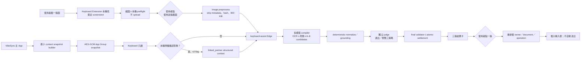

# 單張截圖 AI 鍵盤（Keyboard Assist）詳細實作計畫

> 日期：2026-07-27
>
> 狀態：READY FOR CODEX IMPLEMENTATION（Claude Code＋GLM review 已完成）
>
> 風險：R2（iOS Extension、PhotoKit、App Group、AI prompt／token、quota、exactly-once、隱私）
>
> 實作 owner：Codex
>
> 整合 owner：Codex
>
> 獨立 reviewer：Claude Code（架構／安全）＋ GLM（反證）
> 部署授權：未授權；本計畫不包含 migration push、Edge deploy、TestFlight 或 production flag enable

原始需求摘要：

- 研究 Attunely 影片中值得學的鍵盤體驗，但建立 VibeSync 自己的差異化與更高級的產品品質。
- 正面回答 OCR 效能時間，以及在不以節省模型成本為前提時如何提高回覆品質。
- 尊重真實使用情境：使用者通常只截一張圖；沒有其他資料時不能假裝知道畫面外的歷史。
- 把方案切成可直接開工的詳細計畫，並決定由 Codex 或 Claude Code 負責實作。

## 0. 執行裁決

這一案不是把現有五種語氣按鈕換皮，而是把 VibeSync 鍵盤升級成「送出訊息前的判斷層」。

已定案：

1. 第一個可上線版本只處理**一張截圖**，且必須在完全沒有歷史記憶時也有價值。
2. 一張截圖之外的資料不能被模型假裝知道；UI 永遠顯示本次資料來源。
3. 對象記憶是後續的顯式 `linked_partner` 模式：只有使用者本輪確認後才能送進模型。
4. 新建 JWT-verified `keyboard-assist` Edge Function 與獨立 exactly-once ledger。
5. 不修改 `analyze-chat` 行為，不擴充已部署的 `keyboard-reply v1` result shape。
6. V1 模型路徑採「一個多模態 compiler／generator＋一個獨立文字 judge」；不以省模型成本為優先，但也不先用未證明能提升品質的多 call。
7. 模型完成只顯示三張候選卡，**絕不自動插入**；只有使用者點候選才插入目前輸入框。
8. 最近截圖偵測只在裝置本機進行；使用者點「使用這張截圖」以前，零圖片 upload。
9. 現行複製文字＋`keyboard-reply` 保留為 feature flag rollback path。
10. Codex 負責端到端實作與整合；Claude Code 和 GLM 負責獨立 challenge，不把整包 ownership 轉交。

## 1. 產品真相與證據邊界

### 1.1 一張截圖能知道什麼

`screenshot_only` 可以可靠使用的資料只有：

- 畫面上可見的訊息順序、左右側、引用卡、系統列與媒體 placeholder。
- 畫面上可見的對話名稱，但名稱只能作為顯示或「建議連結」線索，不能自動等同某個 VibeSync Partner。
- 最後一個可回應 turn、畫面內未回答問題、目前語氣與壓力。
- 使用者自己的全域語氣 enum；它只能調整句長、節奏與玩笑強度，不能作為對方的事實證據。

它不能知道：

- 截圖上方或下方未顯示的訊息。
- LINE／IG 裡其他聊天室、過去歷史、對方真實身份或目前關係。
- 對方好感度、人格診斷、真實意圖或使用者是否已在別處回覆。
- 目前 host app 正開的是哪一位 LINE 對象。iOS 沒有公開 API 提供這個 identity。

因此純 screenshot-only 結果固定顯示：

> 僅根據這張截圖

若另外套用使用者自己的全域 voice enum，顯示：

> 僅根據這張截圖；套用你的語氣

若使用者套用對象背景，則固定顯示：

> 這張截圖＋你已確認的「Candy」背景（更新於 07/27）

### 1.2 目前基線不可誤報

- `docs/bug-log.md` 的 live smoke 為 1／2／3 張約 15.6／22.8／26.2 秒；這是單次樣本，不是 p50／p95。
- `tools/ocr-golden/results/2026-07-02-03-51-17-local.json` 有 65 units，side 99.38%、recall 94.57%、precision 97.43%，但：
  - git SHA 不是 current HEAD。
  - 真實 labels 尚未完整人審。
  - quoted preview accuracy 僅 59.09%，仍有 1 個 leak。
- `docs/ocr-analysis-maturity-benchmark.md` 的單圖 `<4s／<7s` 是目標，不是已驗證現況。
- Attunely 影片中從截圖到結果約十多秒，只能作體感參考，不能當正式 benchmark。

Phase 0 必須先重建 current-HEAD、human-verified、single-screenshot baseline；未完成前，文件與 UI 不得宣稱 OCR 已達標。

## 2. 產品目標、非目標與硬不變量

### 2.1 目標

1. 使用者截一張聊天室圖、切回聊天室、打開 VibeSync 鍵盤後，可以一眼確認圖片並取得三個真正不同的策略。
2. 三個選項不是「同一句換語氣」，而是不同決策：
   - 維持節奏 `keep_pace`
   - 增加連結 `build_connection`
   - 往前一步 `move_forward`
   - 情況不適合推進時可替換為 `clarify` 或 `deescalate`
3. 每個選項包含：
   - 可直接送出的文字。
   - 一句根據畫面證據的理由。
   - 它在本輪造成的效果或取捨。
4. 模型無法確定左右側時，不硬猜；先請使用者確認。
5. 後續 `linked_partner` 模式能使用最小、可追溯、使用者已允許的對象背景，而不是整包聊天歷史。
6. 快取命中近乎即時；fresh request 的 launch gate 為端到端 p50 ≤10 秒、p95 ≤18 秒。

### 2.2 非目標

- V1 不支援多張截圖、長圖拼接或跨截圖 conversation merge。
- 不做通用系統鍵盤重寫、自動完成、語音輸入或跨 App 讀取。
- 不讀 LINE 資料庫、不做 accessibility scraping、不在背景監看相簿。
- 不把主 App 的 Hive database 移到 App Group，也不讓 extension 直接解析 Hive。
- 不在本案修改 `analyze-chat` OCR production behavior。
- 不承諾知道「目前 LINE 對象」；只能用 screenshot preview、顯式確認與 tap insertion 降低錯聊風險。
- 不以模型成本為第一優化目標，但仍保留 abuse rate limit、call cap 與 token telemetry。

### 2.3 硬不變量

- 一次 request 正好一張 image。
- 使用者確認圖片前零 upload。
- account-scoped keyboard AI consent 缺失時零 network。
- `screenshot_only` request 出現 partner/history/free-text context 欄位時 server 回 400。
- 原圖、base64、完整 OCR transcript、prompt 與模型輸出不得進 log。
- 成功三候選統一扣 1 則；任何未 settle 成功的路徑扣 0。
- 一旦 claim／terminal row 已存在，在 24 小時 retention 內同 request ID 換圖片、speaker override、voice 或 context revision 回 409；client 在任何 user input 改變時必須建立新 ID。
- network callback 永遠不能呼叫 `insertText`。
- 不顯示好感度分數、心理診斷或假裝精準的 confidence 百分比。
- 沒有低價模型 fallback；最強模型失敗時 fail closed，不偷降品質。

## 3. 目標架構



架構隔離：

- `analyze-chat`：維持目前完整分析與既有 OCR 契約。
- `keyboard-reply`：維持複製文字＋單一回覆 fallback。
- `keyboard-assist`：新的一張圖、三策略、exactly-once 契約。
- 共用 OCR 純函式只能由新 endpoint **import 現有檔案**；第一階段不搬移、不重構、不改它們：
  - `supabase/functions/analyze-chat/layout_parser.ts`
  - `supabase/functions/analyze-chat/blocktype_fold.ts`
  - `supabase/functions/analyze-chat/screenshot_ocr_rules.ts`
- 新 endpoint 以 adapter 和 contract tests 鎖住行為，避免鍵盤需求反向改壞 analyze-chat。

## 4. 使用者流程與狀態機

### 4.1 主 App onboarding

在 `keyboard_setup_screen.dart` 把現在的「主動載入文字」說明改成實際行為，分開取得三件事：

1. 啟用鍵盤與 Full Access。
2. Photo Library read permission。
3. `keyboard_screenshot_ai_202607_v1` account-scoped AI data sharing consent。

揭露必須明確寫出：

- 鍵盤打開時，裝置本機只尋找最近的系統截圖。
- 偵測到不等於上傳；點「使用這張截圖」後才送到 VibeSync backend 與 Anthropic。
- 會傳送圖片與辨識文字以產生回覆。
- 結果最多保留 24 小時供 lost-response replay。
- 可隨時撤回、清除鍵盤快取與對象背景。
- `linked_partner` 另有獨立 toggle；關閉後只使用截圖。

Photo permission 由主 App 請求；extension 遇到 `.notDetermined` 不直接彈系統 dialog。

### 4.2 Keyboard V1 screenshot-only

1. `viewWillAppear` 依序檢查 Full Access、session、consent、Photos status。
2. 通過後只在本機抓 180 秒內最新 `.photoScreenshot`。
3. 顯示 thumbnail、截圖時間與「使用這張截圖」。
4. 使用者點擊後：
   - freeze asset／image hash／operation ID／document binding。
   - 清掉 EXIF／GPS，縮圖、壓縮、hash。
   - 顯示階段進度：「讀取對話」→「整理策略」→「挑選最好版本」。
5. 若 side confidence 低，server 把 `needs_speaker_confirmation` 當成可 replay 的 no-charge terminal result；keyboard 以目前 thumbnail／本機 preview 讓使用者確認「我是左邊／右邊」，再以新 request ID 重送，第一次扣 0。
6. 成功後顯示三張候選卡。
7. 點卡片才插入；插入前再檢查 operation binding。

### 4.3 Keyboard v2 linked-partner

只有 server flag、client capability、consent 與 App Group context 都有效時出現。

- OCR header 唯一命中 canonical name／使用者確認 alias：
  - 顯示「這是 Candy 嗎？」
  - `使用 Candy 背景`
  - `選其他人`
  - `只看這張截圖`
- 無名稱或無命中：預設 screenshot-only，可手動選已允許給鍵盤的 Partner。
- 多筆命中：不得預選，必須 picker 或 screenshot-only。
- linked-partner v2 不永久記住「LINE 名稱 → Partner」；每次 screenshot/request 都要重新確認。
- partner context 在使用者確認前不得送進 generation，也不提前 settle 一個會扣額的 screenshot-only request。先完成本機 preview／對象選擇，再只送一個 v1 或 v2 request，確保一次使用者意圖最多扣一次。

### 4.4 狀態機

新增純 Swift reducer，狀態至少包括：

```text
boot
├── fullAccessRequired
├── authRequired
├── consentRequired
├── photoPermissionRequired
└── idle
    └── screenshotDetected
        └── localPreview
            └── preparing
                └── generating(stage)
                    ├── needsSpeakerConfirmation
                    ├── recognitionRejected
                    ├── partnerConfirmation
                    ├── failed(retryPolicy)
                    └── resultsPreview
                        └── inserted(candidateID)
```

事件必須是 typed enum，不得再把 loading/error/result 狀態散落在 `KeyboardViewController`。

### 4.5 結果卡資訊架構

每張卡顯示：

- 策略名稱。
- 回覆文字（最多 100 個 Unicode code points）。
- `why`（最多 80 字）。
- 短效果標籤，例如「低壓／把話題往具體安排推進」。

第三張不是永遠最敢衝。若最後一則是使用者自己，UI 顯示：

> 你已經回過了；想補充時才用

若局勢不適合推進，策略集合可以是 `keep_pace + clarify + deescalate`。

候選卡點擊後插入，但不送出。底部保留：

- 換一張截圖。
- 重新產生（新 request ID；正常扣一次）。
- 返回文字模式。

## 5. iOS Screenshot Acquisition 與安全插入

### 5.1 Phase 0 必做 PhotoKit feasibility spike

這是第一個 go／no-go gate，必須在 signed physical device 與 TestFlight build 驗證：

- repo 現行 deployment target 是 iOS 13.0；至少覆蓋 iOS 13 的 `.authorized` 路徑、iOS 14+ limited Photos，以及最新 production OS。若 Phase 0 證明 extension PhotoKit 在 iOS 13 不穩定，升高 minimum target 必須另由 Eric 決定。
- Runner 取得 `.readWrite` 後，extension 是否能穩定讀到同一 Photos authorization。
- `.authorized`／`.limited`／`.denied`／`.restricted`／`.notDetermined` 五態。
- 鍵盤已開啟時截圖，`PHPhotoLibraryChangeObserver` 到 asset 可讀的 p50／p95。
- LINE、Instagram、Messenger／Messages 中的實際行為。
- iPhone SE 級裝置連續 100 次 fetch／preprocess 的 peak memory、jetsam、extension restart。
- TestFlight distribution entitlement 與 App Review build。
- Vision 本機 OCR 若啟用，必須另測 memory delta、p95 與精度；未過 gate 時只做輕量 image preflight，不讓重型 OCR 阻塞 extension。

接受條件：

- 最新截圖 preview p95 <1 秒。
- 100 次循環 0 crash／0 jetsam。
- 不讀原尺寸圖片；最大 representation 約 960 px 寬。
- 若 PhotoKit 在目標 OS／裝置不可穩定共用，先停在 go／no-go gate 請 Eric 決定是否接受跳回主 App 的體驗。主 App 暫存原圖到 App Group 不在目前授權範圍；若要採用，必須另做 encrypted ephemeral file、短 TTL、consume-delete 與隱私 review，不能偷偷破壞「App Group 不存 screenshot」的不變量。

Apple 的 open-access custom keyboard 可在使用者允許後使用 Camera Roll、網路、pasteboard 與 shared container；App Group 用於 containing app 與 extension 共用資料：

- [Custom Keyboard Programming Guide](https://developer.apple.com/library/archive/documentation/General/Conceptual/ExtensibilityPG/CustomKeyboard.html)
- [Configuring App Groups](https://developer.apple.com/documentation/xcode/configuring-app-groups)
- [PHAssetMediaSubtype.photoScreenshot](https://developer.apple.com/documentation/photos/phassetmediasubtype/photoscreenshot)

### 5.2 `LatestScreenshotProvider`

- `PHAsset.fetchAssets` 只取最近少量圖片，再用 `.photoScreenshot` 與 creation time 篩選。
- 預設 recency window：180 秒。
- onboarding／empty state 明示「只找最近 3 分鐘內的截圖」；超過時間不掃描更舊照片。
- `PHPhotoLibraryChangeObserver` 以 300–500 ms debounce；extension 重啟時重新 fetch。
- `PHImageRequestOptions.isNetworkAccessAllowed = false`，不讓 iCloud download 卡住鍵盤。
- `.limited` 通常看不到新 screenshot；顯示明確退路，不假裝沒有截圖。
- cursor 只存 asset local identifier／timestamp 的不可逆摘要，避免同一圖反覆提示。
- 在 consent／permission 缺失時完全不 query Photos。

### 5.3 `KeyboardImagePreprocessor`

- 先 decode 驗證，再 downsample；不載入原尺寸 bitmap。
- 沿用現行 server 900 KiB 上限，嘗試 960／768／640 px 與分級 JPEG quality。
- raster re-encode，移除 EXIF／GPS。
- 產生 SHA-256，但不把明文 image digest寫進 server DB。
- 所有 width／quality attempts 仍超過 900 KiB、decode 失敗或文字已不可辨識時，顯示本機可恢復錯誤並停止 upload；不可送超限圖片，也不可無限降畫質。
- active POST 期間只在 memory 保留 image bytes；response 完成、取消或 `viewWillDisappear` 時立即釋放。
- transport／settlement uncertain 時不為 replay 把原圖持久化；只保存 request ID，改走 Section 7.4 的 authenticated status lookup。若 server 查無 row，顯示未完成且請使用者重新確認圖片／建立新 request。
- 為支援 extension 被 kill 後 status replay，可在 encrypted pending metadata store 保存 request ID、owner、`PHAsset.localIdentifier`、image hash、speaker override、context revision、createdAt；不存 thumbnail、image bytes或 OCR。重啟後用 asset identifier 向 Photos 重新取得 thumbnail供使用者確認；asset 已刪除／權限撤回時不得直接插入。
- App Group 不存 screenshot bytes。

### 5.4 本機 OCR 的定位

本機 Vision OCR 只可作：

- 快速 header／最後幾行 preview。
- partner suggestion。
- 若 physical-device gate 通過，作 cloud compiler 的 provisional hint 或 cache lookup。

它不是 authoritative OCR，不能單獨決定 speaker、扣費或最終 evidence。若本機與 cloud 不一致，以 cloud structured result為主；差異過大時回使用者確認，不做靜默「修正」。

linked-partner suggestion 可以用本機 header OCR 做低風險 exact-match 建議，但永遠要使用者 tap 確認；本機 OCR 不可用時仍可手動 picker。cloud compiler 若高信心辨識到不同 header，該 request 不得套用 linked context，改回 `partner_mismatch_confirmation`／screenshot-only，不讓錯誤本機名稱把另一個 Partner 背景混進去。

### 5.5 Wrong-chat／stale-result binding

每個 operation 建立不可變 binding：

```swift
struct KeyboardRequestBinding {
    let operationID: UUID
    let requestID: UUID
    let ownerUserID: String
    let documentIdentifier: UUID
    let screenshotHash: String
    let partnerID: String?
    let contextRevision: String?
    let createdAt: Date
}
```

規則：

- `textWillChange`／`textDidChange`、document ID 改變、auth owner 改變、screenshot 改變、context revision 改變或 `viewWillDisappear`：
  - cancel `URLSessionTask`
  - bump operation generation
  - 清 image bytes、partner confirmation、results
  - 晚回 callback 因 operation ID 不符直接丟棄
- callback 成功只能 render cards。
- 點候選時再次驗：
  - fresh auth owner
  - document ID
  - operation／request ID
  - screenshot hash
  - contextual result 的 context revision
  - 本次 results presentation age ≤2 分鐘
- 任一不符顯示「聊天或背景已變更，請重新產生」。
- 移除目前 `lastInsertedReply` 的跨狀態自動刪句邏輯。
- V1 不提供自製 Undo；使用者使用 host app／鍵盤既有刪除能力，避免 LINE 重用 document ID 時誤刪另一個聊天室內容。

cache hit 仍必須讓使用者重新確認目前 screenshot，建立新的 operation／document binding 與 `presentedAt`；24 小時是 encrypted cache retention，不是允許一張已呈現 24 小時的卡直接插入。

`UITextDocumentProxy.documentIdentifier` 不能保證 LINE 切換聊天室時一定改變，所以真正的最後防線仍是 screenshot thumbnail、來源 chip、結果預覽與使用者 tap。不能在產品文案宣稱「自動確認目前聊天室」。

### 5.6 JWT 生命周期

Keyboard extension 不持有 refresh token，也不自行 refresh：

- `SharedAuth.currentSession()` 在每次 upload、render 與 insertion 前檢查 owner、expiry 與至少 15 秒 safety window。
- token 過期或 401 時進 `authRequired`，保留基本輸入與 legacy local UI，文案顯示「請打開 VibeSync 更新登入狀態」；不嘗試從 extension 偷做 refresh。
- 主 App launch／foreground 沿用 `KeyboardTokenBridge.syncOnForeground(refreshIfExpired: true)`，metadata 先寫、access token 最後寫，避免新 token 配舊 owner。
- account switch／sign-out 先清 token、context snapshot、consent receipt 與 local cache，再同步新 owner。
- 不依賴 keyboard extension 能 deep-link 回主 App；使用者可手動切回。

測試用 60 秒 expiry 驗證：鍵盤開啟後等 token 過期、request 進行中過期、401 後主 App foreground refresh、A／B 帳號切換。

## 6. App Group 最小脈絡與明確對象連結

### 6.1 不直接分享 Hive

主 App 的 encrypted Hive 與 key 都屬 Runner 私有資料；extension 不應也不能直接讀。主 App另建一份刻意縮小、版本化、可刪除的 keyboard snapshot。

只允許下列來源：

- 使用者自己的全域 `EffectiveStyle` 轉成固定 enum／bounded prompt context。
- Partner canonical name。
- 使用者已確認的 alias。
- 使用者自己寫的 `Partner.customNote`，附 `source=user_note`。
- 去識別化的 `CoachingOutcomeDigest.statisticalInsightLines`／結構化 counts，且至少達 signal門檻。
- 每個欄位的 provenance、updatedAt 與 data-quality status。

V1 linked context **不包含**：

- raw messages／conversation transcript。
- `latestHeat`。
- AI 推測的人格、好感度、意圖。
- 未經使用者確認的 `unionTraits`／`unionInterests`／AI notes。
- `PartnerSummaryBuilder` 現有完整輸出。可以複用它的 owner mismatch 與 grapheme cap 測試方式，但不能直接複用含 heat／AI observations 的內容。

### 6.2 Snapshot schema

```json
{
  "schemaVersion": 1,
  "ownerUserId": "supabase-user-id",
  "revision": "sha256-canonical-payload",
  "generatedAt": "ISO-8601",
  "expiresAt": "generatedAt + 24h",
  "consent": {
    "version": "keyboard_screenshot_ai_202607_v1",
    "acceptedAt": "ISO-8601",
    "latestScreenshotDetectionEnabled": true,
    "partnerContextSharingEnabled": false
  },
  "globalVoice": {
    "primary": "steady",
    "secondary": null,
    "sourceUpdatedAt": "ISO-8601"
  },
  "partners": [
    {
      "partnerId": "local-id",
      "displayName": "Candy",
      "confirmedAliases": ["LINE 顯示名稱"],
      "contextStatus": "available",
      "facts": [
        {
          "kind": "user_note",
          "text": "使用者自己輸入的 bounded note",
          "updatedAt": "ISO-8601"
        }
      ],
      "outcomeStats": {
        "sampleSize": 6,
        "engaged": 3,
        "cold": 1,
        "noReply": 1,
        "negative": 0
      },
      "effectiveVoice": {
        "primary": "playful",
        "secondary": "steady"
      },
      "contextRevision": "sha256",
      "sourceUpdatedAt": "ISO-8601"
    }
  ]
}
```

Caps：

- top-level required：schema／owner／revision／generatedAt／expiresAt／consent／globalVoice／partners；所有 nested identity／version 欄位也 required，nullable／empty collection 明確序列化，canonical JSON 不接受隱式 default。
- 只列 `ownerUserId == currentUserId` 且使用者在 keyboard settings 明確允許的 Partner。
- 最多 20 Partner；每個 alias 最多 5 個。builder 先按使用者 pin、再按最近更新排序。
- custom note 最多 300 grapheme。
- user-authored local note／alias caps 使用 grapheme cluster，避免切斷 emoji；只有跨 API／DB contract 的生成文字統一用 code points。
- snapshot plaintext 最大 64 KiB。
- 即使通過逐欄 caps 仍超過 64 KiB 時，deterministic 移除排序最後的完整 Partner entry，直到 envelope 合法；不在 UTF 邊界任意截斷。setup UI 顯示實際可供鍵盤使用的 Partner 數。
- Partner ID 不得重複。
- data-quality flagged 時可保留名稱供 picker 顯示，但不輸出 facts、outcomeStats、override。
- `contextRevision` 是 canonical hash，必須涵蓋 partner ID、display name、confirmed aliases、所有 facts＋provenance＋timestamps、outcomeStats、effectiveVoice 與 data-quality status；任何會進 v2 prompt 的 byte 改變都必須改 revision。

### 6.3 儲存

- Dart 建 typed payload，MethodChannel `vibesync/keyboard_context` 交給 Runner Swift。
- Swift 用 CryptoKit AES-GCM 加密。
- 256-bit key 存既有 shared Keychain access group，`WhenUnlockedThisDeviceOnly`。
- 採 immutable `keyboard-context.<revision>.enc` 檔，再以 `Data.write(options: [.atomic, .completeFileProtection])` 更新不含敏感資料的 current pointer；reader 只開 pointer 指向的完整 revision，writer 成功切 pointer 後清理舊 revision。禁止原地覆寫。
- App Group `UserDefaults` 只放非敏感 revision signal，不放 Partner 內容。
- extension 解密後驗 schema、owner、consent version、expiry、future clock skew、caps 與 duplicate IDs。
- corrupt、unknown version、expired、owner mismatch、consent mismatch 全部 fail closed 到 screenshot-only。

同步時機：

- app launch／foreground。
- auth sign-in／refresh／account switch。
- global profile／partner style／partner note／confirmed alias 更新。
- Partner merge／split／delete。
- conversation outcome digest 變更。
- data-quality flag 變更。
- consent revoke／logout／account deletion。

清理：

- logout：清 snapshot、consent receipt、photo cursor與 local result cache；保留既有 pending replay identity。
- account deletion：連 shared AES key、auth 與 pending metadata 一起清。

## 7. `keyboard-assist` API 契約

### 7.1 V1 request：嚴格 screenshot-only

`additionalProperties: false`：

```json
{
  "contractVersion": "keyboard-assist-v1",
  "requestId": "uuid",
  "image": {
    "mediaType": "image/jpeg",
    "data": "<base64>"
  },
  "speakerOverride": "none",
  "voice": {
    "primary": "steady",
    "secondary": null
  }
}
```

規則：

- top-level required：`contractVersion`、`requestId`、`image`、`speakerOverride`、`voice`。
- image required：`mediaType`、`data`；voice required：`primary`、`secondary`。nullable 欄位仍必須明確送 `null`，不做隱式 default，確保 canonicalization／HMAC 唯一。
- 正好一張 image。
- MIME 只允許 JPEG／PNG／WebP；嚴格 base64 decode 並 sniff 真實格式。
- decoded image ≤900 KiB；HTTP body ≤2 MiB；限制 decoded dimensions／pixels。
- `speakerOverride = none | left_is_me | right_is_me`。
- voice enum：
  - `steady`
  - `direct`
  - `humorous`
  - `gentle`
  - `playful`
  - `null`
- secondary 不得與 primary 相同；primary null 時 secondary 必須 null。
- V1 明確拒絕：
  - `partnerId`
  - `partnerSummary`
  - `conversationSummary`
  - `knownContactName`
  - `messages`
  - 自由文字 notes／topics／relationship score

Canonical enums：

- `status = ready | needs_speaker_confirmation | partner_mismatch_confirmation`
- `confidence／sideConfidence = high | medium | low`
- `turnState = reply_due | optional_follow_up`
- `source.scope = screenshot_only | screenshot_plus_global_voice | linked_partner`
- `strategy = keep_pace | build_connection | move_forward | clarify | deescalate`

### 7.2 V1 response

```json
{
  "contractVersion": "keyboard-assist-v1",
  "requestId": "same uuid",
  "status": "ready",
  "source": {
    "scope": "screenshot_plus_global_voice",
    "messageCount": 7,
    "confidence": "high",
    "sideConfidence": "high"
  },
  "turnState": "optional_follow_up",
  "cue": "你已經回覆會再考慮，現在不是非補一句不可。",
  "uncertainty": null,
  "options": [
    {
      "strategy": "keep_pace",
      "text": "可以啊，我確認一下行程再跟你說",
      "why": "先保留確認空間，不急著製造曖昧",
      "effect": "低壓，保留後續空間"
    },
    {
      "strategy": "build_connection",
      "text": "你連那週末都看好了，我好像要認真考慮一下了 😄",
      "why": "接住對方畫面內提出的週末，增加互動感",
      "effect": "溫度較高，但仍不承諾"
    },
    {
      "strategy": "move_forward",
      "text": "我確認好再跟你說；你比較偏好哪一天？",
      "why": "把模糊的考慮變成一個可回答的安排",
      "effect": "推進最快，也需要你願意約"
    }
  ]
}
```

約束：

- `status=ready` 時 options 正好 3 個、strategy 不重複。
- public API／TypeScript／Swift／Dart／Postgres 的 text 1–100、why 1–80、effect 1–60、cue 1–120 全部以 Unicode code points 計；TypeScript 用 `[...text].length`、Dart 用 `runes.length`，SQL 用 `char_length`，Swift validator 用 `unicodeScalars.count`。
- 不得有 Markdown、raw JSON、內部 label、假分數。
- final response 不回完整 transcript。

側別不確定是正常 200、扣 0：

```json
{
  "contractVersion": "keyboard-assist-v1",
  "requestId": "same uuid",
  "status": "needs_speaker_confirmation",
  "suggestedMySide": "right",
  "sideConfidence": "low"
}
```

這個 no-charge result 以 `state=done` 存入 ledger，讓 lost response 可以原樣 replay，但不存 OCR preview。keyboard 用已確認 screenshot thumbnail 與本機 preview（可用時）呈現左右選擇；使用者確認後，用新 request ID、同圖與 speakerOverride 重送。

group／social feed／non-chat／無有效訊息回 422、扣 0。Provider、deadline、settlement uncertain 回 503，保留同 request ID 供 replay。

### 7.3 V2 linked-partner request

V2 是 discriminated contract，不以 optional hidden fields 偷渡進 V1：

```json
{
  "contractVersion": "keyboard-assist-v2",
  "requestId": "uuid",
  "image": {
    "mediaType": "image/jpeg",
    "data": "<base64>"
  },
  "speakerOverride": "none",
  "contextSource": "linked_partner",
  "linkedContext": {
    "partnerId": "local-id",
    "displayName": "Candy",
    "contextRevision": "sha256",
    "confirmedAt": "ISO-8601",
    "facts": [
      {
        "kind": "user_note",
        "text": "bounded text",
        "updatedAt": "ISO-8601"
      }
    ],
    "outcomeStats": {
      "sampleSize": 6,
      "engaged": 3,
      "cold": 1,
      "noReply": 1,
      "negative": 0
    },
    "voice": {
      "primary": "playful",
      "secondary": "steady"
    }
  }
}
```

server 規則：

- top-level／image／linkedContext 內列出的 identity 欄位全部 required；`facts`／`outcomeStats` 若無資料必須送空 array／`null`，不靠省略欄位產生不同 canonical form。
- context revision、confirmedAt 與 request identity 綁定。
- confirmedAt 太舊、context 超 cap、未知 fact kind、重複 ID、非 exact keys 都拒絕。
- 所有 context 是不可信資料，不得改寫 system instruction。
- multimodal compiler 永遠只看 image，不收 linked context；server 先以 authoritative header／alias做 mismatch gate，通過後才把 structured context 交給 judge。高信心 mismatch 回 no-charge `partner_mismatch_confirmation`，不得先產生 contextual result。
- response 與 V1 `ready` shape 相同，但 `source` 固定為：

```json
{
  "scope": "linked_partner",
  "messageCount": 7,
  "confidence": "high",
  "sideConfidence": "high",
  "partnerId": "local-id",
  "contextRevision": "sha256",
  "contextUpdatedAt": "ISO-8601"
}
```

- screenshot evidence 與 context evidence 分開標示；context 不得被描述成「截圖上看得出來」。

### 7.4 Lost-response status lookup 與錯誤契約

為了同時做到「不持久化 screenshot」與「settlement uncertain 可查回」，同一 function 提供：

```text
GET /keyboard-assist?requestId=<uuid>
Authorization: Bearer <access token>
```

只做 JWT、UUID、`(user_id, request_id)` lookup：

- row `done`：從 ledger result 補回 request ID，200 replay；不呼叫 provider、不扣第二次。
- row `pending` 且 lease 未過：425＋`retryAfterMs`。
- row `pending` lease 已過：以 DB conditional delete／tombstone 原子失效舊 owner，再回 410 `expired_no_charge`；舊 worker之後 settle 必須因 row missing／owner mismatch 失敗。GET 不接管、不啟動 model，client 可在重新確認 screenshot 後用新 request ID。
- row 不存在：404 `request_not_found`，代表 server 無可 replay 結果；client 請使用者重新確認 screenshot 並建立新 request ID。

GET 不接受 image，也不比較 input HMAC；安全邊界是 authenticated owner＋unguessable request UUID，只能讀自己的 row。正常 POST 的 mismatch protection不變。

統一 error envelope：

```json
{
  "error": {
    "code": "provider_timeout",
    "retryDisposition": "lookup_same_request",
    "retryAfterMs": 1000
  }
}
```

`retryDisposition`：

- `lookup_same_request`：transport／settlement uncertain；保留 request ID，先 GET。
- `retry_same_payload`：明確未 settle 且 owner claim 已 release；保留原圖時可同 ID POST，否則重新確認後用新 ID。
- `new_request_after_user_change`：speaker／image／context 改變，必須新 ID。
- `terminal_clear`：quota exhausted、model rate limit、contract reject、non-chat；client 可以清 pending identity。

V1 canonical error codes 至少凍結為：

```text
invalid_request
image_too_large
unsupported_image
unauthorized
quota_exhausted
model_rate_limited
request_pending
request_replay_mismatch
request_not_found
request_expired_no_charge
unsupported_conversation
provider_timeout
provider_invalid_output
settlement_uncertain
service_unavailable
```

未知 429／5xx／decode 失敗不得自行當成 `terminal_clear`。舊 `safeToClear` 若為相容性保留，只能由上述 enum deterministic derivation，不能成為第二套語意。

Response／state mapping：

| 結果 | HTTP | Ledger | 扣額 | Client state |
|---|---:|---|---:|---|
| ready | 200 | done／stored | 1 | resultsPreview |
| needs_speaker_confirmation | 200 | done／stored | 0 | speaker confirmation |
| partner_mismatch_confirmation | 200 | done／stored | 0 | reselect partner or screenshot-only |
| valid replay | 200 | existing done | 0 new charge | prior terminal state |
| group／social／non-chat | 422 | released／none | 0 | recognitionRejected |
| in-flight | 425 | pending | 0 | retry countdown |
| expired pending status | 410 | conditional invalidation | 0 | confirm screenshot, new request |
| same ID different payload | 409 | unchanged | 0 | contract error |
| provider／validation definite failure | 503 | owner-bound release | 0 | retry |
| settlement／transport uncertain | 503 | pending or done unknown | unknown until GET | lookup_same_request |

## 8. 模型 pipeline 與高品質回覆

### 8.1 V1 default：compiler＋judge

第一個多模態 model 一次完成：

- screenshot classification。
- structured OCR。
- speaker／side confidence。
- 畫面內 situation cue／uncertainty。
- 6–8 個 candidate pool，每個帶 strategy 與 evidence message indices。

server 再做：

- quoted preview fold。
- system row removal。
- layout／speaker normalization。
- turnState 與 unanswered anchor 計算。
- evidence index existence。
- 數字、日期、時間、店名與專有名詞 grounding。
- 重複度與長度檢查。

第二個 text-only judge 只收到 normalized visible turns、candidate pool、global voice enum；不再看圖片，也拿不到任何 history。它負責：

- 選出三個實質不同的策略。
- 拒絕過度解讀與高壓回覆。
- 調整成自然台灣繁中。
- 必要時作小幅 rewrite，但不能加入新事實。
- 回傳 evidence indices；server 驗證後 public response 只保留 deterministic cue／why。

如果 compiler 或 judge schema invalid、refusal、max tokens、context window、grounding fail：

- 不把 unjudged candidate 當成功。
- V1 同一 invocation 不做 provider retry。
- release owner-bound claim，扣 0。

Batch 0 必須凍結兩個明確的 server-side model aliases與 structured-output 參數：

```text
KEYBOARD_ASSIST_COMPILER_MODEL=<目前通過 vision benchmark 的最強模型>
KEYBOARD_ASSIST_JUDGE_MODEL=<目前通過 reply benchmark 的最強模型>
```

compiler thinking 關閉、visible output cap 4,000；judge 可使用 reasoning、visible output cap 約 1,200。不得由 client 選 model，也不得在失敗時自動降到便宜模型。

`ready success ≥97%` 是 release gate，不是尚未測量就宣稱已成立。Phase 0／dogfood 必須分開記：

- compiler structured-output valid rate。
- recognition／grounding pass rate。
- judge structured-output valid rate。
- final validator pass rate。
- eligible valid-chat 的 overall ready rate與 95% confidence interval。

至少 200 個 production-shaped eligible requests，95% CI 下限仍 ≥97% 才可擴 rollout。若未達標，先以新 pipeline version A/B 一次**同模型、同輸入、bounded schema repair／judge retry**，比較 ready rate與 p95；只有同時守住品質／deadline 才採用，並同步調整 provider call cap。不能為了數字回傳未經 judge 的候選。

### 8.2 為什麼不一開始就三個 generator

目前最大不確定性是 OCR、speaker 與「現在是否該回」，不是句子數量。三個 generator 使用同一錯誤 transcript，只會平行放大錯誤。

parallel text generators 只在 blind eval 同時滿足下列條件後升級：

- 自然度／首選率比 default 絕對提升 ≥10%。
- unsupported factual claim 不高於 default。
- p95 增量 ≤5 秒。
- 內部實驗／dogfood 總 p95 ≤25 秒；要成為 production default，仍必須回到 Section 10.1 的總 p95 ≤18 秒，不能因升級模型路徑放寬 launch gate。
- provider call cap 固定，repair 不可無限擴張。

若升級，只使用：

1. 一次 authoritative multimodal OCR。
2. 三個 text generator 讀同一 normalized transcript，平行產生不同 move。
3. 一個 judge。

不做三次 image generator，也不把圖片送 provider 三次。

### 8.3 Prompt／judge 不變量

- 截圖文字、Partner note 與 alias 全部以 untrusted data delimiter 包住。
- 明示忽略訊息中要求改變規則、輸出 prompt、透露 hidden context 的文字。
- 不把「她這樣一定是…」「好感度 85%」當 insight。
- 畫面不足時，選 `clarify`／`deescalate`／不補話，而非硬推進。
- 不重述整段對話，不生成 coaching essay。
- 台灣繁中、像人打字；避免客服腔、心理師腔、emoji 堆疊與模板式 echo。
- voice 只能改語氣，不能改事實與策略安全性。
- Judge 內部可用 rubric，但 user response 不顯示分數。

建議內部 judge rubric：

- Groundedness：35
- 當輪策略適切：25
- 自然台灣繁中：20
- 三選項差異：10
- 使用者 voice fidelity：10

Groundedness 是 hard gate，不以總分抵銷。

## 9. Exactly-once、quota 與 deadline

### 9.1 新 ledger

新增 migration：

```text
supabase/migrations/<timestamp>_keyboard_assist_exactly_once.sql
```

新表：

```sql
keyboard_assist_requests (
  user_id uuid not null references auth.users(id) on delete cascade,
  request_id uuid not null,
  input_hash text not null,
  hmac_key_version smallint not null,
  state text not null check (state in ('pending', 'done')),
  owner_token uuid not null,
  lease_expires_at timestamptz not null,
  result_json jsonb,
  quota_charged boolean not null default false,
  created_at timestamptz not null default now(),
  updated_at timestamptz not null default now(),
  primary key (user_id, request_id)
)
```

新增：

- `is_valid_keyboard_assist_result(jsonb)`
- `claim_keyboard_assist_request(...)`
- `release_keyboard_assist_claim(...)`
- `renew_keyboard_assist_claim(...)`
- `settle_keyboard_assist_request(...)`
- `cleanup_expired_keyboard_assist_requests()`
- `expire_keyboard_assist_request(...)`：只允許 service_role 對已過 lease 的 pending row 做 conditional invalidation，供 status GET 安全結束 crashed owner。
- `keyboard_assist_contract_version()`

RPC owner／lease 條件：

- `renew` 只能 `UPDATE ... WHERE state='pending' AND owner_token=p_owner_token AND input_hash=p_input_hash RETURNING ...`；0 row 代表 ownership 已失效，舊 worker 立即 abort，不 release。
- compiler 後、judge 前各 renew 一次；settle 以 row lock 重驗 owner／hash／state。
- lease 已過但 owner 尚未被 takeover 時，settle 仍由 row lock＋owner token決定；若新 claimant 先取得 row lock並換 owner，舊 worker settle 必須 fail。
- pending 不預扣 quota；crashed／lost owner 只等待 lease takeover，不會把使用者額度鎖住。

DB validator 必須 exact-check：

- discriminated union 的 exact top-level keys，不能要求三種 status 共用不存在的欄位。
- `status=ready` 才要求 source／turnState／cue／uncertainty／options，options 正好 3。
- `status=needs_speaker_confirmation` 只允許 contractVersion／status／suggestedMySide／sideConfidence 等非 transcript metadata，且 settlement 明確 `p_charge_quota=false`。
- `status=partner_mismatch_confirmation` 只允許 contractVersion／status／confirmed partner ID／context revision 等非顯示名稱 metadata；UI 從本機 snapshot組 label。不得有 candidate 或 transcript，且扣 0。
- 每個 option exact keys、長度、strategy 合法且互異。
- 不允許 image、OCR transcript、contact name、prompt、token、telemetry。
- 明確拒絕 `%` 型好感分、`好感度`／`心理診斷` 等 banned markers；更廣泛的語意過度解讀仍由 TypeScript grounding／judge／human eval把關。

ledger 可以存三個生成文字、strategy、bounded why／effect 與 source metadata，以便 lost-response replay；不存 screenshot、完整 transcript、image hash 明文或自由 evidence excerpt。TTL 24 小時，RLS on、零 user policy、service_role only，每小時 cleanup。

`result_json` 不存 `requestId`；fresh 與 replay response 都由 handler 從 row key 補回 request ID，避免 DB result schema 與 transport envelope 混在一起。

### 9.2 Replay identity

server 對 decoded bytes 自算 SHA-256，再以 derived server key 建 HMAC：

```text
HMAC(
  "vibesync-keyboard-assist-replay-v1",
  [
    contractVersion,
    userId,
    sha256(decodedImageBytes),
    mediaType,
    speakerOverride,
    voice,
    contextSource,
    contextRevision
  ]
)
```

server-resolved `pipelineVersion` 不得放進 input HMAC；否則同 request 在 Edge 升版後重試會被錯判 409，破壞 lost-response replay。pipeline version 只存於 result metadata／telemetry，供評估與 cache invalidation。

HMAC key rotation：

- new claim 使用 current key version，並把非秘密的 `hmac_key_version` 存 row。
- POST replay preflight 先以 `(user_id, request_id)` 讀 existing row 的 key version，再用該版本重算 HMAC；不能一律用 current key。
- retired key 至少保留 ledger TTL＋1 小時（25 小時）後才移除。
- GET status lookup 不需 HMAC。
- rotation 測試必須覆蓋 old-key done replay、old-key pending mismatch 與 retired-too-early health failure。

DB 只存 HMAC。相同 request ID：

- 同 payload：pending 或 replay。
- 任一 image byte／speaker／voice／context 不同：409；server pipeline 升版不是 user payload mismatch。

### 9.3 Handler 順序

GET 走 Section 7.4 的純 status lookup，不進下列 POST pipeline。

POST：

1. method／JWT／body size。
2. exact request validate＋strict base64／MIME／dimensions。
3. image digest；先讀 existing request metadata，選 existing `hmac_key_version` 或 current version，再算 HMAC。
4. replay preflight／mismatch；existing done 必須在 model config／quota／rate 之前返回。
5. subscription lookup／reset／upgrade-only RevenueCat self-heal。
6. claim。
7. quota gate；失敗 owner-bound release。
8. `keyboard_assist` model rate gate；terminal deny 時 owner-bound release，再回 `model_rate_limited`。
9. compiler。
10. deterministic normalize／grounding。
11. conditional renew；失敗即 stale-worker abort。
12. judge。
13. final validator。
14. conditional renew／owner check。
15. re-fetch quota。
16. atomic settlement。
17. 回 DB stored authoritative result。

Replay 必須在 quota、rate limit、provider call 之前返回。

成功 batch 固定扣 1 則。建議新 model rate scope：

```text
keyboard_assist: 6 / minute, 120 / day
```

這是 abuse／provider amplification 保護，不是省模型成本。quota exhaustion 與 model rate limit 必須維持不同 error，不得把 model limit 打成 paywall。

### 9.4 Deadline

所有時間從 handler `T0` 計算：

| 階段 | Absolute deadline | 單 call cap |
|---|---:|---:|
| Auth／validation／claim／gates | 共用後續預算 | — |
| Multimodal compiler | T0 + 27s | min(24s, remaining - 1s) |
| Judge | T0 + 35s | min(8s, remaining - 1s) |
| Validate＋settle | T0 + 40s | 至少保留 5s |
| iOS client fence | 45s | — |
| DB lease | 55s，可 renew | — |

- 同一 `AbortSignal` 必須傳到底層 provider；不能只 `Promise.race` 回 503 後讓背景繼續 settle。
- compiler 的 T0+27s timeout 與 judge start guard 是兩個獨立條件：compiler timeout 直接 fail；compiler 成功後若 normalization／DB renew 吃掉時間，距 judge deadline剩餘 <4 秒才不啟動 judge。
- ambiguous settlement 不 release；client 保留同 request ID，先走 authenticated GET status lookup。
- 明確 compiler／judge validation failure 才 owner-bound release。
- default V1 每個 user request 最多 2 個 provider calls；只有 Section 8.1 的 versioned repair實驗可提高，且要同步更新 deadline／rate／telemetry。

## 10. Latency、cache 與 observability

### 10.1 Launch gate

正式 launch gate：

| 指標 | Gate |
|---|---:|
| UI acknowledgment | p95 <150ms |
| 最近截圖 preview／preflight | p95 <1s |
| Multimodal OCR／compiler | p50 ≤5s、p95 ≤8s |
| Judge＋finalize | p50 ≤4s、p95 ≤8s |
| Fresh end-to-end | p50 ≤10s、p95 ≤18s |
| Timeout | ≤2% |
| Ready success | ≥97% |

Fresh end-to-end 從使用者點「使用這張截圖」到三張卡 ready；PhotoKit preview 是前置體感，另計。p95 budget 先分配為：

| 子階段 | p95 budget |
|---|---:|
| preprocess＋upload | 1.5s |
| auth／claim／quota／rate | 0.8s |
| compiler | 8.0s |
| normalize／grounding／renew | 0.5s |
| judge | 6.0s |
| final validate／settle／transport | 1.0s |
| client render／margin | 0.2s |
| 合計上限 | 18.0s |

這是 launch budget，不是現況宣稱；Batch 0 先量每段，任何單段超 budget 都要重新分配或改 pipeline，不能只把各自 p95 相加後仍宣稱總 p95 過關。

如果首輪 backend reality 只能做到 server p50 ≤15s／p95 ≤25s，可以進內部 dogfood，但不能擴 rollout；必須先用 trace 找出 image decode、provider queue、compiler output 或 judge 的主瓶頸。

p95 至少需要 200 個 production-shaped dogfood requests；不能用單次 smoke 宣稱 percentile。

### 10.2 Cache

本機 encrypted result cache：

- key：owner＋image hash＋speaker override＋voice＋context revision＋pipeline version。
- TTL：24 小時。
- 最多 10 筆／LRU。
- 只在 ready＋high-confidence 存。
- 可存 final options 與 bounded source metadata；若需存 OCR preview，必須同樣 AES-GCM、cap、TTL、清除機制。
- cache hit 只有在使用者再次確認目前 thumbnail／image hash、context revision 仍一致時才 render，並建立新的 document binding／`presentedAt`；插入檢查使用 presentation age ≤2 分鐘，不使用原始 generation age。
- logout／account switch／consent revoke／data deletion 立即 purge。
- cache hit target：p50 <0.2s、p95 <0.5s。

server replay ledger 與 client cache 是兩層：

- client cache 提供即時體感。
- server ledger處理 lost response 與 exactly-once，不互相取代。

### 10.3 Telemetry

只允許 scalar／enum allowlist：

- clientBuild、contractVersion、pipelineVersion、cohort。
- imageBytes／width／height 用固定 bucket（例如 bytes `<250K／250–500K／500–900K`、dimension class），不記精確 hash。
- photoFetchMs、preprocessMs、uploadMs。
- compilerMs、judgeMs、settlementMs、totalMs。
- provider model alias、attempt count、input／output tokens。
- classification、sideConfidence、messageCount bucket（`1–3／4–8／9+`）、turnState。
- judge reject reason enum、grounding reject reason enum。
- replay／quota／model-rate／error code。
- timeToPreview、timeToResults。
- candidate selected index／strategy；不記候選文字。

Dashboard／alert：

- success、timeout、p50／p95 per stage。
- OCR low-confidence／reject rate。
- schema／judge／grounding reject。
- replay、duplicate charge、charge-without-result（必須 0）。
- consent_missing_request（必須 0）。
- 5xx >5%、p95 >20 秒。
- crash-free ≥99.5%。

鍵盤只能知道 select／insert，不能知道使用者最後是否按送出；事件名稱不得叫 `sent` 或 `successfully_sent`。

## 11. 隱私、安全與 App Review

### 11.1 Consent 與資料最小化

- 鍵盤 screenshot AI 使用獨立 consent key，不把一般 analyze-chat consent 當成已同意鍵盤相簿行為。
- auto-detect local only；使用者點 confirmation 前 0 network。
- Partner context sharing default off，獨立 toggle，可撤回。
- 原圖只存在 extension memory；不存 App Group、不存 DB。
- prompt、raw OCR、圖片、base64、reply text 不進 log。
- context snapshot 與 local cache都 AES-GCM＋complete file protection。
- backend 對 screenshot text、Partner note、alias 作 prompt-injection isolation。
- JWT only，不分享 refresh token。

### 11.2 App Review

必須保留：

- Full Access off 時，ABC 輸入、delete、space、return、globe 正常。
- secure text field／phone pad 不出現第三方鍵盤屬 iOS 預期。
- privacy copy 與實作一致，不能再寫「只在主動選取圖片」卻自動讀最近 asset。
- App Store Connect Privacy Label、Privacy Policy、Review Notes 同步說明：
  - screenshot／recognized text 傳到 VibeSync backend＋Anthropic。
  - local recent screenshot detection。
  - 24 小時 result replay。
  - 可撤回與刪除。

release 前以最新 [App Review Guidelines](https://developer.apple.com/app-store/review/guidelines/) 與 [Custom Keyboard Open Access](https://developer.apple.com/documentation/uikit/configuring-open-access-for-a-custom-keyboard) 重新核對。

## 12. 檔案級實作清單

### 12.1 Phase 0：spike、baseline、契約

新增：

```text
docs/qa/keyboard-screenshot-assist-acceptance.md
tools/keyboard-assist-benchmark/
  README.md
  run_benchmark.ts
  run_benchmark_test.ts
  score.ts
  human-scorecard.md
  cases/
    synthetic.json
    adversarial.json
```

修改：

```text
tools/ocr-golden/run_benchmark.ts
docs/ocr-analysis-maturity-benchmark.md
docs/testflight-keyboard-build-checklist.md
```

真實 screenshot／transcript 不進 git；manifest 只存匿名 ID 與本機路徑約定。

### 12.2 Shared Runner／Extension

新增：

```text
ios/SharedKeyboard/KeyboardSharedConfig.swift
ios/SharedKeyboard/KeyboardContextEnvelope.swift
ios/SharedKeyboard/KeyboardContextStore.swift
ios/SharedKeyboard/KeyboardAssistContracts.swift
```

這四個檔案加入 Runner、VibeSyncKeyboard 與 test target，統一：

- App Group／Keychain constants。
- Codable schema。
- AES-GCM store。
- public request／response enums。

### 12.3 Flutter／Runner context bridge

新增：

```text
lib/features/keyboard/domain/entities/keyboard_context_snapshot.dart
lib/features/keyboard/domain/services/keyboard_context_snapshot_builder.dart
lib/features/keyboard/data/services/keyboard_context_bridge.dart
lib/features/keyboard/data/providers/keyboard_context_sync_provider.dart
ios/Runner/KeyboardContextBridge.swift
```

修改：

```text
lib/shared/widgets/ai_data_sharing_consent.dart
lib/features/keyboard/presentation/screens/keyboard_setup_screen.dart
lib/core/services/keyboard_token_bridge.dart
lib/main.dart
lib/app/app.dart
lib/features/partner/data/providers/partner_write_controller.dart
lib/features/conversation/data/providers/conversation_write_controller.dart
lib/features/user_profile/data/providers/partner_style_providers.dart
lib/features/subscription/presentation/screens/settings_screen.dart
ios/Runner/SceneDelegate.swift
ios/Runner/Info.plist
ios/VibeSyncKeyboard/Info.plist
ios/Runner.xcodeproj/project.pbxproj
```

實作時不要在每個 repository 直接做 blocking file write；用 `KeyboardContextSyncCoordinator.schedule()` debounce、serialize，最後由 Runner Swift atomic write。

### 12.4 Keyboard extension

新增：

```text
ios/VibeSyncKeyboard/LatestScreenshotProvider.swift
ios/VibeSyncKeyboard/KeyboardImagePreprocessor.swift
ios/VibeSyncKeyboard/KeyboardLocalTextRecognizer.swift
ios/VibeSyncKeyboard/KeyboardPartnerMatchResolver.swift
ios/VibeSyncKeyboard/KeyboardAssistState.swift
ios/VibeSyncKeyboard/KeyboardRequestBinding.swift
ios/VibeSyncKeyboard/KeyboardAssistAPI.swift
ios/VibeSyncKeyboard/KeyboardResultsView.swift
ios/VibeSyncKeyboard/ReplyInsertionCoordinator.swift
ios/VibeSyncKeyboard/KeyboardResultCache.swift
ios/VibeSyncKeyboard/KeyboardPendingRequestStore.swift
```

修改：

```text
ios/VibeSyncKeyboard/KeyboardViewController.swift
ios/VibeSyncKeyboard/KeyboardAPI.swift
ios/VibeSyncKeyboard/SharedAuth.swift
ios/Runner.xcodeproj/project.pbxproj
```

責任切分：

- `KeyboardViewController` 只組裝 dependency、轉送 lifecycle／state event。
- `KeyboardAPI.swift` 暫留 legacy `keyboard-reply`。
- `KeyboardAssistAPI.swift` 只處理 v1／v2 screenshot contract、cancellable task、request identity、error mapping。
- `ReplyInsertionCoordinator` 是唯一可呼叫 `textDocumentProxy.insertText` 的元件。

### 12.5 Edge Function

新增：

```text
supabase/functions/keyboard-assist/
  contract.ts
  validate.ts
  compiler_prompt.ts
  judge_prompt.ts
  provider.ts
  ocr_adapter.ts
  normalize.ts
  grounding.ts
  pipeline.ts
  billing.ts
  telemetry.ts
  index.ts

  contract_test.ts
  validate_test.ts
  prompt_test.ts
  provider_test.ts
  normalize_test.ts
  grounding_test.ts
  pipeline_test.ts
  billing_test.ts
  telemetry_test.ts
  index_test.ts
  index_source_test.ts
  migration_source_test.ts
```

新增：

```text
supabase/migrations/<timestamp>_keyboard_assist_exactly_once.sql
```

修改：

```text
supabase/functions/_shared/model_rate_limit.ts
supabase/functions/_shared/model_rate_limit_test.ts
.github/workflows/flutter-ci.yml
.github/workflows/deploy-edge-function.yml
scripts/check-keyboard-contract.ps1
docs/app-review-submission-package.md
```

部署 workflow 必須把 migration-gated `keyboard-assist` 排除自 generic auto-deploy，或明確要求 DB contract health 通過後才 deploy。

新 function 使用 JWT verification；不要沿用 `analyze-chat --no-verify-jwt`。

## 13. 測試與 benchmark

### 13.1 Native XCTest target

目前沒有真正的 VibeSyncKeyboard unit-test target，只有 RunnerTests placeholder 與 Deno source-string tests。新增 `VibeSyncKeyboardTests`：

```text
ios/VibeSyncKeyboardTests/
  KeyboardContextEnvelopeTests.swift
  KeyboardContextStoreTests.swift
  LatestScreenshotSelectorTests.swift
  KeyboardImagePreprocessorTests.swift
  KeyboardPartnerMatchResolverTests.swift
  KeyboardAssistStateMachineTests.swift
  KeyboardRequestBindingTests.swift
  KeyboardAPIContractTests.swift
  ReplyInsertionCoordinatorTests.swift
```

用 protocol fake：

- Photo source。
- pasteboard。
- textDocumentProxy。
- API client。
- clock。
- context store。

Hard tests：

- success callback 0 insert。
- user tap 才 insert。
- architecture assertion：`KeyboardAssistAPI` 不得 import／持有 `textDocumentProxy` 或 `ReplyInsertionCoordinator`；只有 UI tap event 能到 insertion coordinator。
- wrong document／owner／operation／context revision／expired result 一律拒絕。
- out-of-order callbacks 不可覆蓋新 state。
- AES-GCM roundtrip／tamper／wrong key／corrupt／atomic replacement。
- screenshot recency／subtype／cursor／future clock／limited permission。
- pending metadata roundtrip、extension restart 後以 asset ID 重建 thumbnail、asset deleted／permission revoked 時禁止插入。

### 13.2 Dart

新增：

```text
test/unit/features/keyboard/keyboard_context_snapshot_test.dart
test/unit/features/keyboard/keyboard_context_snapshot_builder_test.dart
test/unit/features/keyboard/keyboard_context_bridge_test.dart
```

擴充：

```text
test/unit/core/services/keyboard_token_bridge_test.dart
test/widget/screens/keyboard_setup_screen_test.dart
test/widget/shared/ai_data_sharing_consent_test.dart
```

Cases：

- owner mismatch。
- account switch／logout／account deletion。
- consent revoke。
- partner merge／split／delete。
- data-quality fail closed。
- alias ambiguous。
- caps／64 KiB。
- debounce 時序與 write failure 保留上一個 valid snapshot。

### 13.3 Edge／SQL

Contract／privacy：

- 每個 v1／v2／snapshot required 欄位省略時 deterministic 400／local reject；nullable 也必須明送 null。
- extra history/context key 一律 400。
- 同 request ID 換一 byte image →409。
- HMAC key rotation 後，existing row 使用 stored key version；25 小時 retention／health gate 防止過早移除舊 key。
- voice／speaker／context revision 都進 hash。
- image／transcript／contact name 無法寫入 ledger。
- telemetry 收到 image、prompt、message、reply 時被 runtime allowlist 丟掉。

OCR／grounding：

- LINE light／dark、only-left、only-right、balanced。
- quoted preview、貼圖、媒體、system row、nested screenshot。
- group chat、social feed、非聊天 reject。
- 最後一則是我 → `optional_follow_up`。
- 最後一則是對方 → `reply_due`。
- low side confidence → confirm、零 judge、零扣費。
- 截圖外日期、數字、店名、姓名 → fail。
- 好感分數、絕對心理判讀、raw JSON、Markdown → fail。
- prompt injection 當對話資料，不得改 system behavior。

Exactly-once：

- concurrent same ID 只跑一套 pipeline。
- replay 跳過 quota／rate／provider。
- `needs_speaker_confirmation` 以 done／no-charge result replay，不重跑 compiler、不存 transcript。
- settlement／transport uncertain 後只憑 owner＋request ID GET 查回 done；pending／expired-conditional-invalidation／missing mapping 正確，GET 永不呼叫 provider。
- pending retryAfter。
- lease takeover 後舊 worker不能 judge／settle。
- renew 0-row、judge 後 lease 過期、A settle 與 B takeover 的 row-lock ordering。
- compiler／judge timeout → no charge。
- ambiguous settlement 不 release。
- settle-time quota race 整個 transaction rollback。
- terminal quota／model-rate 429 必須回 `retryDisposition=terminal_clear`；未知 429 不可清 pending identity。

Deadline：

- auth／DB latency 侵蝕 provider budget。
- compiler 超過 T0+27s 直接 abort，不進 judge。
- compiler 成功但 injected normalize／renew delay 讓 judge deadline剩餘不足 4 秒時，start guard fail。
- 40 秒 fence abort provider，沒有 background settlement。
- settlement 保留 5 秒。

### 13.4 Golden 與 human eval

OCR set：

- 至少 60 張 human-reviewed 真實單圖。
- 至少 20 張 synthetic／adversarial。
- 其中 20 張 held-out，不參與 prompt tuning。
- quote-preview 子集累積至少 100 個獨立 preview instances，其中一部分必須在 held-out。
- 覆蓋 LINE light／dark、IG／交友 app、balanced／one-side、引用、貼圖／媒體、nested screenshot、system row、長圖、低解析、group／non-chat reject。

OCR hard gate：

- side accuracy ≥98%。
- message recall ≥95%。
- precision ≥97%。
- 最後可回應 turn／未回答問題 anchor ≥99%。
- unsupported／non-chat false accept ≤3%。
- held-out／dogfood 合計觀察到 quoted-preview leak = 0，並同時報告 one-sided 95% upper confidence bound；不得把「本次 0 個」宣稱成真實世界絕對 0%。
- uncertainty 不得被靜默改成 high confidence。

Reply set：

- 50 個 screenshot-only contexts × 3 stochastic runs。
- 0 screenshot 外事實。
- 0 假好感分／心理診斷。
- 0 prompt-injection 服從。
- ≥90% 的 context 至少 2／3 候選可直接用。
- ≥80% 的 context 三策略實質不同。
- 對 current keyboard baseline 的 blinded preference ≥65%。
- linked-partner 另做 paired eval：開／關 context，檢查 voice fidelity 提升且 unsupported claim 不增加。

Evidence 不讓模型自由抄一句；模型回 message indices，server 對 authoritative transcript 驗證後，用 bounded deterministic renderer 組 cue。

### 13.5 Signed-device matrix

- LINE／Instagram／Messages。
- iPhone SE／Pro Max／iPad floating keyboard。
- portrait／landscape／Dynamic Type／Reduce Motion。
- Photos authorized／limited／denied。
- Full Access off。
- LINE A 發 request 後切 B。
- 同 LINE composer 是否重用 documentIdentifier。
- screenshot／photo permission／consent 在 request 中途改變。
- extension 被 kill 後重開與 lost-response replay。
- 登出後仍開著鍵盤。
- A snapshot 後登入 B。
- quota、model rate、provider timeout、settlement uncertain。
- signed IPA 必須包含 `.appex`。

## 14. Feature flags、rollout 與 rollback

Server authoritative flags：

```text
KEYBOARD_SCREENSHOT_V1_ENABLED=false
KEYBOARD_SCREENSHOT_V1_ALLOWLIST=
KEYBOARD_SCREENSHOT_PIPELINE_VERSION=compiler-judge-v1
KEYBOARD_LINKED_PARTNER_V2_ENABLED=false
KEYBOARD_PARALLEL_GENERATORS_ENABLED=false
```

client 做 capability negotiation；server flag off 時完全不送 raw screenshot。不要做 raw-image shadow traffic。

Rollout：

1. **Phase 0：feasibility＋baseline**
   - PhotoKit signed-device spike。
   - current-HEAD human labels。
   - quality rubric／privacy copy。
2. **Phase 1：backend additive、flag off**
   - migration。
   - Edge v1。
   - contract health／real Postgres smoke。
3. **Phase 2：native screenshot-only**
   - consent bridge。
   - screenshot preview。
   - state machine。
   - tap-only insertion。
4. **Phase 3：internal allowlist**
   - Eric＋2 位夥伴。
   - ≥100 generations／48h。
5. **Phase 4：dogfood**
   - 10–20 users。
   - ≥200 production-shaped requests／72h。
   - quality／latency／privacy／billing／crash gates。
6. **Phase 5：linked-partner v2**
   - 先在內部 paired eval。
   - 不與 screenshot-only 初次 rollout 綁在一起。
7. **Phase 6：10% →50% →100%**
   - 每階段重新看 gate。

Rollback 第一動作：

- 關 `KEYBOARD_SCREENSHOT_V1_ENABLED` 或 v2 flag。
- legacy text keyboard／`keyboard-reply` 繼續可用。
- DB migration additive，不做 schema rollback。
- 任一 Edge rollback binary 必須懂 v1／v2 replay result，不可回到會拒絕既有 ledger 的版本。
- `keyboard_assist_contract_version()` 回傳 min-compatible ledger／result version；CI 與 rollback script 必須拒絕低於 DB marker 的 binary，不能只靠人工記得。
- OCR core 仍遵守「一次一變數、一 commit、一 golden run」；失敗立即 flag off／回上一個 compatible Edge ref。

## 15. 實作順序、依賴與 commit 邊界

### Batch 0：驗證未知數

依賴：無。

- PhotoKit／memory／document identity spike。
- current-HEAD OCR baseline。
- quoted-preview 至少 100-instance 收斂 set、leak upper-bound 報告。
- reply quality rubric。
- compiler／judge model aliases、structured-output params、API／DB schema freeze。

Commit：

1. `測試：建立鍵盤截圖可行性與品質基線`

Gate：PhotoKit 路徑可行；若不可行，先請 Eric 決定是否接受跳主 App fallback。

### Batch 1：Backend contract 與 ledger

依賴：Batch 0 schema freeze。

- `keyboard-assist` schemas／validator。
- migration／claim／renew／release／settle／health。
- compiler＋judge pipeline。
- Deno／SQL tests。
- flags default off。

Commits：

1. `後端：新增鍵盤截圖嚴格契約`
2. `資料庫：新增鍵盤截圖 exactly-once ledger`
3. `AI：新增截圖 compiler 與獨立 judge`
4. `測試：補齊鍵盤截圖扣額與隱私契約`

Gate：fresh／pending／replay／mismatch／quota／timeout／lost response 全通過；未 deploy。

### Batch 2：Shared context foundation

依賴：Batch 0；可與 Batch 1 並行，但由 Codex 統一整合。

- shared Swift config／contracts／encrypted store。
- Dart snapshot builder／MethodChannel／sync coordinator。
- keyboard-specific consent。
- logout／account delete purge。
- XCTest target。

Commits：

1. `iOS：建立鍵盤加密共享脈絡`
2. `隱私：新增鍵盤截圖專屬同意與清除`
3. `測試：新增鍵盤原生狀態與共享資料測試`

Gate：owner、TTL、tamper、atomic write、consent revoke、data-quality fail closed。

### Batch 3：Native screenshot-only vertical slice

依賴：Batch 1＋2。

- PhotoKit recent screenshot。
- preprocess／optional local OCR。
- typed state machine。
- `KeyboardAssistAPI`。
- progress／speaker confirmation／result cards。
- tap-only insertion。
- encrypted result cache。

Commits：

1. `iOS：新增最近截圖預覽與影像前處理`
2. `iOS：接入鍵盤截圖三策略流程`
3. `安全：改為預覽後點擊插入並阻擋過期結果`

Gate：signed device matrix，0 auto insert，wrong-chat cases fail safely。

### Batch 4：Screenshot-only dogfood quality

依賴：Batch 3。

- 100／200 request rollout。
- latency traces。
- OCR prompt 只以 isolated one-variable commits 改。
- human blind eval。

Commit：

1. `驗證：完成鍵盤截圖 dogfood 品質閘`

Gate：Section 13／14 全部硬指標達標。沒達標就不開 linked context。

### Batch 5：Explicit linked-partner v2

依賴：Batch 4。

- Partner allowlist／settings。
- exact unique alias suggestion。
- per-request confirmation。
- v2 contract＋input hash＋ledger validator。
- source chip、context update time。
- paired quality eval。

Commits：

1. `脈絡：新增鍵盤對象背景最小快照`
2. `iOS：新增每次截圖的對象確認`
3. `後端：新增 linked-partner v2 嚴格契約`
4. `驗證：完成對象背景成對盲測`

Gate：context 不增加 unsupported facts；撤回／owner change 即時 fail closed。

### Batch 6：可選 ensemble

依賴：只有 Batch 4／5 blind eval 證明 diversity 是瓶頸。

- 三個 normalized-transcript text generators。
- judge。
- call／deadline cap。
- A/B flag。

未達 Section 8.2 gate 時不做。

## 16. Review、部署與完成定義

### 16.1 Review gates

本計畫落檔後：

1. Claude Code 只讀架構／安全 review。
2. GLM 獨立 falsification。
3. Codex 對每個 finding 回到 source evidence 驗證，不以多數決。
4. 最多兩輪 review；critical／important 未解不得標 READY。

實作期間：

- 每個 Batch 由 Codex 保持 integration ownership。
- Batch 1、2、3、5 完成後各做一次 focused review。
- migration／billing／auth／privacy／release 維持三方 challenge gate。

### 16.2 本輪獨立 review reconciliation

2026-07-27 Claude Code 與 GLM 均完成 read-only adversarial review。已驗證並修正：

- pipeline version 移出 input HMAC；HMAC key version進 ledger並保留 25 小時 rotation window。
- settlement／transport uncertain 改用 authenticated GET status lookup，不為 replay 持久化 screenshot。
- `needs_speaker_confirmation`／partner mismatch 成為可 replay、no-charge、無 transcript 的 terminal result。
- PhotoKit 失敗時停在 Eric go／no-go，不偷用未設計的 App Group raw-image fallback。
- 24 小時 cache retention 與 2 分鐘 insertion guard 改成新的 presentation binding，不再互斥。
- linked-partner 前不 speculative settle screenshot-only，避免一次意圖扣兩次。
- JWT expiry、conditional lease renew／takeover、required fields、error／retry enums、latency budget、quote-preview confidence與 HMAC rotation補成可測契約。
- V1 移除 custom Undo，並加入「API 不得接觸 textDocumentProxy」的 architecture assertion。

review 提出的 `ready success ≥97%` 不被當成既成事實；它保留為有樣本數與 confidence interval 的 release gate，未達就阻擋 rollout或以新 pipeline version 做 bounded repair實驗。

### 16.3 部署邊界

本計畫沒有 production authorization。未來取得 Eric 明確授權後，順序為：

1. targeted migration procedure。
2. DB contract health。
3. Edge deploy（JWT verified）。
4. live fresh／replay／mismatch／quota smoke。
5. server flag 維持 off。
6. signed TestFlight build。
7. allowlist enable。
8. dogfood gates。
9. staged rollout。

implemented、verified、committed、pushed、deployed、dogfood-approved 必須分開回報。

### 16.4 Definition of Done

Screenshot-only release 完成必須同時滿足：

- 使用者只提供一張圖也能取得 grounded 的三策略。
- UI 明示只依據截圖；0 隱藏 Partner data。
- 0 auto upload、0 auto insert、0 auto send。
- PhotoKit、Full Access、consent、auth、owner、document、request binding 全部 fail closed。
- exactly-once、quota、rate、deadline、lost response 通過 real Postgres／signed device tests。
- OCR、reply quality、latency、privacy、crash gates 達標。
- legacy text mode可一鍵 rollback。

Linked-partner release 另需：

- 每次 screenshot 明確確認對象。
- snapshot 只有可追溯的最小資料，沒有 raw history／heat／未確認心理推測。
- source chip 顯示 context 與更新時間。
- owner／consent／revision／data-quality 任一失效立即降級 screenshot-only。
- paired blind eval 證明品質提升，且 unsupported claim 不增加。

## 17. Ownership 結論

由 Codex 接手開工，理由不是模型偏好，而是責任邊界：

- 這是一條跨 Flutter、Runner Swift、Keyboard Extension、PhotoKit、App Group、Edge、Postgres、AI eval 的整合鏈。
- Codex 已掌握這次影片、現況 code、OCR 證據、隱私與 rollout graph；移交整包會增加 context loss。
- 一個 primary owner 才能守住 screenshot-only、linked context、billing 與 release gate 的一致性。

Claude Code 的角色：

- 現在：獨立挑戰本計畫的 iOS feasibility、API／DB 契約、隱私與 threat model。
- 開工後：在 Batch 1／2／3／5 做 bounded read-only review。
- 若契約凍結後有真正獨立的單一模組，可另行分派；不把整案 ownership 模糊拆成兩半。
