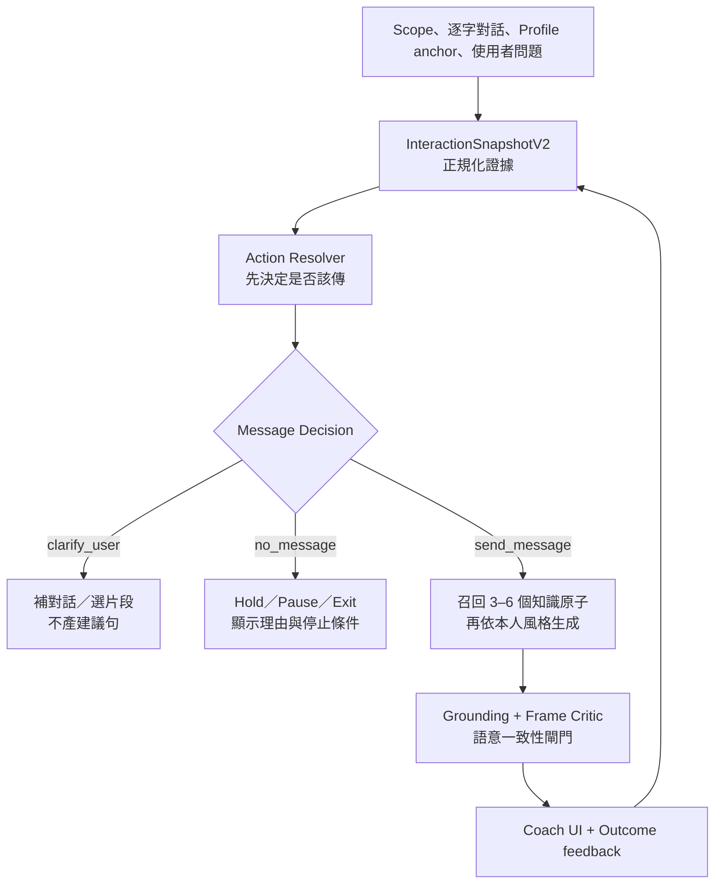

# VibeSync「問教練」魅力知識全面導入規格

> 研究基準：VibeSync `main`，commit `c7292848469c03f11eec378815c888a852490d4a`（2026-08-31）  
> 分析材料：7 張實際 Coach 回覆截圖、VibeSync 現行 Coach／Analyze Chat 程式、既有產品設計文件，以及《VibeSync 男性網路交友與魅力聊天核心知識庫》  
> 本文件只做架構與實作規格；未修改、commit 或 push GitHub。

---

## 0. 結論先行

目前「問教練」的問題不是單純語氣太溫柔，也不是在 Prompt 裡多寫幾次「有框架、不要 Beta」就能解決。

真正的錯誤鏈是：

1. **系統把「產生一則可傳訊息」當成預設成功。**
2. **Coach 在部分 scope 根本拿不到逐字對話，仍被允許做個案判斷。**
3. **模型同時負責判斷局勢、選戰術、寫文案，沒有伺服器端決策閘門。**
4. **輸出 Schema 與 UI 把 `suggestedLine` 放在視覺中心，即使正確答案應是「先別傳」。**
5. **現有驗證只擋格式、語言及少量幻覺，沒有擋討好、過度配合、空鉤子、查戶口、超階段與建議自相矛盾。**
6. **Analyze Chat 已有較完整的階段／投入／球／風險知識，但 Coach 使用另一套獨立 Prompt，知識沒有共用。**

因此，正確導入不是把整份教材塞進 system prompt，而是建立：

> **證據正規化 → 決定該不該傳 → 選一個動作 → 精準召回知識原子 → 生成 → 反 Beta／語意一致性審查 → 新回饋閉迴路**

最重要的產品改動只有一句：

> **讓「不傳訊息」和「先補上下文」成為正式、可展示、不可被文案生成覆蓋的成功結果。**

---

## 1. 本文怎麼使用 Alpha／Beta 等爭議詞

本文不把 Alpha、Beta 當成人格本質或道德評價，而把它們轉成可測量的輸出模式，方便工程判斷與回歸測試。

### 1.1 Beta 輸出模式

只要建議句出現下列一項或多項，即標記為 `betaPattern`：

| 內部標記 | 可觀察模式 | 目前截圖中的例型 |
|---|---|---|
| `approvalSeeking` | 把決定權、價值判定或互動正當性交給對方 | 一直問「可以嗎／要不要」但自己沒有立場 |
| `overAccommodation` | 還沒形成互惠，就把時間、選擇與節奏全部讓出 | 「時間我可以配合你」 |
| `selfPityHook` | 用可憐、自貶、孤單逼對方接住 | 「不然我自己去吃會很可憐」 |
| `interviewOnly` | 自己不出現，只索取對方資料 | 「自己去的還是跟朋友？」 |
| `emptyCuriosityBait` | 不提供內容，只製造懸念索取回覆 | 「你猜得到我在想什麼嗎？」 |
| `overInvestment` | 對方低投入時，男方仍持續開題、邀約、解釋 | 兩次邀約沒答後再發第三次 |
| `selfProof` | 說服、辯護或展示自己值得被選 | 長篇解釋自己不是某種人 |
| `indefiniteAvailability` | 沒有自己的時間與限制，隨時待命 | 「我都可以，看你方便」 |
| `conversationRescue` | 無論局勢都由男方負責救活對話 | 每個答案都叫使用者再丟一題 |
| `preferenceErasure` | 為了不冒犯而刪掉所有偏好、差異、篩選 | 只同意、只稱讚、只配合 |

### 1.2 高品質「有框架」輸出

不是刻意霸道、裝冷或到處吐槽，而是：

- 有逐字證據，不亂猜。
- 有自己的偏好、時間與選擇。
- 投入量跟著互惠走。
- 能領一小步，也能在沒有窗口時停。
- 訊息同時帶一點本人、情緒或互動感，而不是只採訪。
- 邀約清楚，但不需要說服、乞求或無限配合。

內部不要用單一 `alphaScore`。應拆成 `frameIntegrity`、`reciprocityFit`、`personalityPresence`、`stageFit` 等可診斷維度；前台若要保留「Alpha／Beta」用語，可作教學標籤，不應作生成器唯一指令。

---

## 2. 七張實際回覆的逐案診斷

### 2.1 總表

| 截圖 | Coach 建議的核心 | 主要失敗 | 正確產品行為 |
|---|---|---|---|
| IMG_5548 | 短回時再丟「下班怎麼放空？」 | 原則說看趨勢，行動卻預設再投資；新話題無來源、像查戶口 | 有對話才判斷三至五輪；沒有就只講原則或請使用者選對話，不產句子 |
| IMG_5557 | 用「我自己去吃會很可憐」暖場再邀 | 自貶求接住、`改天` 模糊、沒有具體安排，也沒有上下文證據 | 先驗證是否有活動種子與窗口；有才具體邀，沒有就先建立共同畫面 |
| IMG_5561 | 「突然想到一件蠢事，你猜…」 | 空懸念、零內容、要求她先投資 | 若沒有可用球，不傳；若有球，提供具體內容再留回口 |
| IMG_5563 | 從照片背景問「自己找的還朋友帶？」 | 空白 `___`、封閉式資料題、本人缺席 | 先取得真實 profile anchor；用觀察＋自己＋自然回口 |
| IMG_5564 | 「OO 拍的嗎？自己去還跟朋友？」 | `OO` 直接外洩、通用稱讚、查戶口 | Placeholder 必須硬擋；沒有具體 anchor 就不產可複製訊息 |
| IMG_5568 | 問照片中的手沖咖啡在哪拍 | 即使具體仍只是資訊索取；若來源未提供就是幻覺 | 每個實體詞都要能回指原訊息／Bio／照片標註；問句前至少有本人反應或立場 |
| IMG_5571 | 兩次邀約沒答後再發第三次，並「時間配合你」 | 決策超階段、過度配合；建議句與「不要再推」提醒互相矛盾 | 兩次未答且無替代方案＝`no_message/hold`；不顯示複製句 |

### 2.2 七案共同病灶

七個案例不是七種偶發文案問題，而是同一個系統 prior：

```text
使用者問問題
→ Coach 假定必須給一句可複製訊息
→ 沒有現成內容時，改用「好回答的小問題」
→ 為降低拒絕風險，又加入自嘲、模糊與全面配合
→ 最後自然產出 Beta 型訊息
```

所以只換模型、調 temperature、增加幾個高手示例，都無法穩定解決。只要「一定要給一句」的契約不變，模型最後仍會發明一個問題讓使用者繼續扛互動。

---

## 3. 現行 VibeSync 的根因追蹤

### 3.1 Coach 與 Analyze Chat 是兩座知識孤島

`Analyze Chat` 已存在較成熟的：

- 五階段狀態。
- 投入趨勢與燈號。
- 球盤點與選球。
- `stop / connect / extend / filter / invite / pause`。
- 一球一動作。
- Go／Slow／No-Go。
- 穩定框架、自證陷阱、真假窗口等規則。

但 `supabase/functions/coach-chat/prompts.ts` 仍有獨立的 `SYSTEM_PROMPT_BASE`。它只收到簡化的 `analysisSnapshot`：`heatScore`、`stage`、`summary`、`nextStep`、`coachActionType`、`keySignals`，沒有完整的投入、球、邀約歷史、證據、信心與停止條件。

結果是：Coach 知道「要溫暖、具體、好回」，卻不知道「現在是否值得回、由誰該投資、這一輪應把哪個變量往哪裡移」。

### 3.2 Partner scope 沒有逐字對話，卻可直接產個案戰術

`coach_chat_providers.dart` 的 partner scope 目前把「對象本身」當 scope，不依賴 conversation：

- `recentMessages = []`
- `conversationSummary = null`
- `analysisSnapshot = null`
- 只提供姓名、聚合 traits、自訂備註、少量 outcome／style context

因此，使用者在「問教練 Sydney」點「她回很短怎麼判斷」時，Coach 可能完全看不到她實際回了什麼，仍被要求給 headline、next step 和 suggested line。

這正是空鉤子、假造照片細節與查戶口句型的來源。

### 3.3 釐清政策只保護 global scope

`clarification_policy.ts` 的強制首輪釐清條件主要是：

```text
scope.type == global
且沒有 activeSessionTurns
且沒有 recentMessages
```

conversation／partner scope 即使資料不足，也不會被同等阻擋。Scope 名稱讓系統誤以為「已經有上下文」，但實際證據可能是零。

正確判斷不應看 scope 名稱，而應看 `evidenceQuality`。

### 3.4 輸出契約把「寫一句」放在決策之前

Coach 輸出含：`headline`、`answer`、`nextStep`、`suggestedLine`、`boundaryReminder` 等欄位。UI 又把 `suggestedLine` 做成顯眼的複製卡。

這造成兩個問題：

1. 模型即使判斷「不要追」，仍傾向填一個句子完成任務。
2. `suggestedLine` 與 `boundaryReminder` 分開驗證，於是會出現「再邀一次」和「不要再邀」同卡並存。

### 3.5 現有 generation validator 只驗證「可解析」，沒有驗證「值得傳」

`generation.ts` 目前的重點是：

- JSON Schema。
- 顯示語言。
- 少數沒有根據的時間／動機詞。
- 明確不要問句的請求。
- global scope 的首輪釐清。

它沒有完整阻擋：

- `OO`、`___`、`(店名)`。
- 自貶求接住。
- 全面配合。
- 空懸念。
- 純採訪句。
- 低投入時再度加碼。
- 邀約歷史與新邀約矛盾。
- 建議與 boundary reminder 矛盾。

而 fallback 本身仍是「接住，再丟一個好回答的小問題」，所以即使生成失敗，系統也會退回同一種 conversation-rescue prior。

### 3.6 使用者選定的真實聊天風格沒有完整進 Coach

`EffectiveStyle` 已有 `interactionStyle`、`secondaryStyle`，但 `buildForCoachFollowUp` 主要只放：

- stuck points
- practice goals
- notes／boundaries

因此 Coach 的句子缺少使用者本人的節奏、幽默、直接度與長度習慣，只能落回平均、安全、服務型文案。

另外，`findCompatiblePartner` 的現行語意偏向「保持開放、不要急著篩選」，如果沒有「雙向篩選、保留真實偏好」作平衡，會進一步抹掉框架與選擇性。

### 3.7 舊 Coach 建議會自我強化，但不是對方證據

`activeSessionTurns` 會帶回過去 Coach 的問題、答案、next step、suggested line。這些內容可幫助避免重複，但不能拿來推斷女方投入。

如果沒有明確 provenance，模型容易把自己上次說過的戰術當成既有事實，形成：

```text
Coach 建議先暖場
→ 下一輪看到「先暖場」
→ 認為前提已成立
→ 再往下一步推
```

過去建議必須標成 `priorAdvice`，永遠不能算入 `conversationEvidence`。

---

## 4. 目標架構：共享的 Social Decision Runtime



架構分六層：

| 層 | 責任 | 是否交給 LLM |
|---|---|---|
| 1. Evidence Normalizer | 把訊息、Profile、分析快照、邀約結果轉成有來源的結構 | 以程式為主；必要時 LLM 抽取但需保留原文 |
| 2. Action Resolver | 決定 `clarify_user / no_message / send_message` 與唯一動作 | 關鍵規則應 deterministic |
| 3. Knowledge Selector | 依階段、投入、失敗模式召回 3–6 個知識原子 | 小型規則索引優先 |
| 4. Generator | 把已決定的動作寫成使用者本人會說的話 | LLM |
| 5. Semantic Critic | 查 grounding、框架、互惠、階段、矛盾 | 規則＋第二次 LLM critic |
| 6. Outcome Loop | 新訊息更新投入與階段；記錄建議是否有效 | 程式與分析模型 |

核心原則：**LLM 可以決定怎麼寫，但不應在缺證據時自行決定仍要寫。**

---

## 5. 新資料契約：InteractionSnapshotV2

### 5.1 建議 TypeScript 型別

```ts
type EvidenceQuality =
  | "none"
  | "profile_only"
  | "partial_transcript"
  | "fresh_transcript"
  | "fresh_analysis_snapshot";

type MessageDecision = "clarify_user" | "no_message" | "send_message";

type CoachAction =
  | "clarify"
  | "hold"
  | "connect"
  | "extend"
  | "self_reveal"
  | "tease"
  | "qualify"
  | "seed_invite"
  | "invite"
  | "confirm"
  | "exit";

interface EvidenceRef {
  source: "latest_message" | "recent_message" | "profile" | "analysis" | "user_input";
  sourceId?: string;
  quote: string;
  interpretation: string;
}

interface InteractionSnapshotV2 {
  scopeType: "global" | "partner" | "conversation";
  evidenceQuality: EvidenceQuality;
  sourceConversationId?: string;
  lastMessageAt?: string;
  snapshotVersion: 2;

  userIntent:
    | "general_principle"
    | "diagnose"
    | "choose_next_action"
    | "craft_message"
    | "rewrite_message";

  funnelStage: "profile" | "opener" | "sustain" | "invite" | "show_up";
  interactionStage: "opening" | "premise" | "qualification" | "narrative" | "close";
  light: "green" | "yellow" | "red" | "unknown";
  investmentTrend: "rising" | "flat" | "falling" | "insufficient";
  riskState: "normal" | "guarded" | "crossed_line" | "explicit_no";

  balls: Array<{
    id: string;
    type: "info" | "emotion" | "disclosure" | "interaction" | "window" | "boundary";
    text: string;
    source: EvidenceRef;
  }>;
  selectedBallId?: string;

  inviteHistory: {
    attempts: number;
    unanswered: number;
    lastOutcome: "none" | "accepted" | "declined" | "ignored" | "vague";
    alternativeOffered: boolean;
  };

  targetVariable: "V" | "F" | "E" | "I" | "S";
  betaRisks: Array<
    | "approvalSeeking"
    | "overAccommodation"
    | "selfPityHook"
    | "interviewOnly"
    | "emptyCuriosityBait"
    | "overInvestment"
    | "selfProof"
    | "indefiniteAvailability"
    | "conversationRescue"
    | "preferenceErasure"
  >;

  messageDecision: MessageDecision;
  action: CoachAction;
  evidence: EvidenceRef[];
  confidence: "high" | "medium" | "low";
  stopCondition: string;
}
```

### 5.2 證據來源必須分級

優先序：

1. 明確拒絕／界線。
2. 最新逐字訊息。
3. 最近三至五輪的可觀察趨勢。
4. 有 freshness 與原文支持的 analysis snapshot。
5. Profile 的可見 anchor。
6. 使用者本人風格與目的。
7. 對象 traits、舊結果、一般模式。
8. 舊 Coach 建議與範例句。

低順位不可改寫高順位。特別是：

- partner traits 不能提高 `investmentTrend`。
- 舊 Coach 建議不能當成她已經接受某個前提。
- 回覆速度不能單獨判綠燈。
- Profile 照片的模型描述若未提供給 Coach，不得假裝看見。

### 5.3 Partner scope 要真正取得「最近一段互動」

建議 provider 行為：

1. 找此 partner 最近有有效訊息的 conversation。
2. 取最近 15–24 則，包含 speaker、timestamp、原文。
3. 同步取得最新有效 analysis snapshot。
4. 附 `sourceConversationId`、`lastMessageAt`、`analysisCreatedAt`。
5. 若沒有對話，明確設 `evidenceQuality=profile_only`，不能假裝是 conversation scope。

前台顯示：「教練本次參考：與 Sydney 的最近對話，最後更新 8/31 14:20」。這能讓使用者直接發現 Coach 是否看錯片段。

---

## 6. Action Resolver：先決定「該不該傳」

### 6.1 硬規則

```ts
function resolveCoachAction(s: InteractionSnapshotV2) {
  if (s.riskState === "explicit_no") {
    return decision("no_message", "exit", "對方已明確拒絕");
  }

  if (
    s.inviteHistory.unanswered >= 2 &&
    !s.inviteHistory.alternativeOffered
  ) {
    return decision("no_message", "hold", "連續邀約未被承接");
  }

  if (
    ["diagnose", "choose_next_action", "craft_message", "rewrite_message"]
      .includes(s.userIntent) &&
    ["none", "profile_only"].includes(s.evidenceQuality)
  ) {
    return decision("clarify_user", "clarify", "缺少個案逐字證據");
  }

  if (s.light === "red" && s.investmentTrend === "falling") {
    return decision("no_message", "hold", "投入趨勢不足以支撐加碼");
  }

  if (!s.selectedBallId && s.userIntent !== "general_principle") {
    return decision("clarify_user", "clarify", "沒有可落地的訊息球");
  }

  return resolveSingleBestMove(s);
}
```

### 6.2 一般原則問題與個案問題要分流

| 使用者意圖 | 沒有對話時可否回答 | 可否給建議句 |
|---|---|---|
| `general_principle` | 可以，講判斷框架 | 原則上不給；可給明確標示的「句型形狀」 |
| `diagnose` | 不可做個案結論 | 不可 |
| `choose_next_action` | 先請使用者選對話／貼訊息 | 不可 |
| `craft_message` | 先取得對方原句、目標、前後文 | 不可 |
| `rewrite_message` | 至少要有原草稿與上一輪 | 不可 |

釐清卡不應扣正式次數；若產品仍要計費，至少不可在完全沒有 case evidence 時扣除一次「個案建議」。

### 6.3 階段與投入的動作矩陣

| 狀態 | 允許的主要動作 | 禁止的主要動作 |
|---|---|---|
| Opening＋unknown | 具體開場、低成本連結 | 重吐槽、資格審核、直接邀約 |
| Premise＋yellow | 加本人、立場、輕互動感 | 連續問資料題、長篇自證 |
| Qualification＋green | 表達真實偏好、觀察互惠 | 用貶低逼她證明 |
| Narrative＋green | 回呼、共同畫面、活動種子 | 無限聊、不推進 |
| Close＋green | 小而具體的邀約 | 「改天約」與全面配合 |
| 任一階段＋falling | 降輸出、hold、必要時一次新材料 | 再邀、追問原因、救場 |
| 任一階段＋explicit_no | exit | 任何說服或重啟 |

---

## 7. 把知識庫導入 runtime：不要塞一個 50KB Prompt

目前核心知識庫已有 62 個左右的決策原子。數量很小，第一版不需要先上向量資料庫；可先做**可版本化的 typed registry＋確定性 selector**，品質會比自由 RAG 穩定。

### 7.1 三層知識

| 層 | 內容 | Runtime 用法 |
|---|---|---|
| L1 概念 | Alpha、Beta、框架、SMV、推拉、冷讀等術語與機制 | 只在教學／解釋時召回 |
| L2 決策 | 階段、投入、觸發、允許動作、停止條件 | 每次 Coach 必用 |
| L3 生成 | 一球一動作、句型形狀、五種風格、長度與標點 | Action 已決定後才用 |

執行順序固定為 `L2 → L3`；L1 不得繞過 L2 直接指定招式。

### 7.2 知識原子格式

```ts
const D10_REFUSED_WITHOUT_ALTERNATIVE = {
  id: "D-10",
  layer: "decision",
  selectors: {
    inviteOutcome: ["declined", "ignored", "vague"],
    alternativeOffered: false,
  },
  rule: "拒約或忽略且沒有替代，不足以繼續推邀約",
  allowedActions: ["hold", "connect", "exit"],
  blockedActions: ["invite", "confirm"],
  betaRisks: ["overInvestment", "conversationRescue"],
  stopCondition: "沒有新的可觀察投入，就不再提出安排",
  confidence: "A",
} as const;
```

### 7.3 Selector 的檢索鍵

- `userIntent`
- `evidenceQuality`
- `interactionStage`
- `light`
- `investmentTrend`
- `inviteHistory`
- `selectedBall.type`
- `targetVariable`
- `betaRisks`
- `style`

一次只召回 3–6 條：

1. 一條硬停止／邊界規則。
2. 一條階段與投入規則。
3. 一條選球／單一動作規則。
4. 一至兩條生成風格規則。
5. 必要時一條邀約或修復規則。

### 7.4 建議共享檔案

```text
supabase/functions/_shared/social/
  interaction_snapshot.ts
  evidence_policy.ts
  action_resolver.ts
  knowledge_atoms.ts
  knowledge_selector.ts
  reply_voice.ts
  semantic_critic.ts
```

第一步不是複製 Analyze Chat 程式，而是從：

- `analyze-chat/reasoning_core.ts`
- `analyze-chat/conversation_policy.ts`
- `analyze-chat/reply_voice.ts`

抽出 feature-neutral 的決策核心，讓 Analyze Chat、Coach、Follow-up、Keyboard 共用同一套 action vocabulary 與證據規則。各 feature 只保留不同 UI 目的與輸出格式。

---

## 8. Generator：只把已決定的動作寫好

### 8.1 新 Prompt 組成

```text
1. Coach role：短、直接、解釋可觀察證據
2. Deterministic verdict：messageDecision + action，不得改寫
3. InteractionSnapshotV2：只放必要證據
4. Retrieved atoms：3–6 條
5. User voice contract：本人風格、長度、幽默、直接度
6. Output schema
```

移除「無論如何都提供可執行一句」的暗示，改成：

```text
若 messageDecision != send_message：suggestedLine 必須為 null。
你不得用新話題、空鉤子或通用問題填滿 suggestedLine。
action 已由 resolver 決定；你只能解釋及表達，不可升級動作。
```

### 8.2 使用者 voice contract

Coach 應收到的不是抽象「高手風格」，而是：

```yaml
primaryStyle: stable_direct
secondaryStyle: dry_humor
messageLength: short
questionDensity: low
flirtTolerance: medium
emojiUsage: none
commonPunctuation: ["，", "哈哈"]
avoidPhrases: ["可以嗎", "都配合你"]
realIdentityAssets:
  - 使用者主動提供且可重複使用的興趣、工作片段、生活素材
```

Style 只能改寫法，不能改變 action。`playful` 不能把 `hold` 改成挑釁；`direct` 也不能把黃燈改成硬邀。

### 8.3 訊息生成的最低結構

若 action 是 `connect / extend / self_reveal`，建議句至少要有下列兩項：

- 對她訊息中一個具體球的回應。
- 使用者的一小片反應、立場、畫面或偏好。
- 一個自然回口；不一定是問號。

禁止把「觀察＋封閉式問句」當成所有情境的萬用模板。

---

## 9. Semantic Critic：反 Beta 與語意一致性閘門

### 9.1 Deterministic 硬擋

生成後先做便宜的程式檢查：

1. `suggestedLine` 只有在 `messageDecision=send_message` 時才可非 null。
2. 所有專有名詞、活動、店名、時間、照片物件都能回指 evidence。
3. 阻擋 placeholders：`___`、`OO`、`ＯＯ`、`(店名)`、`[地點]`、`<時間>`。
4. 問號不超過一個；若整句只有問題，必須有 action 與互惠證據支持。
5. 兩次未承接邀約後，不可再含邀約語意。
6. `boundaryReminder` 不可否定 `nextStep/suggestedLine`。
7. `explicit_no` 時 suggested line 必須為 null，或只允許一次乾淨確認後結束。
8. 低投入時阻擋自貶求接住與無限配合詞群。

Placeholder 可先用 regex：

```ts
const PLACEHOLDER_RE = /(?:_{2,}|\bOO+\b|ＯＯ+|[（(]?店名[）)]?|\[[^\]]+\]|<[^>]+>)/u;
```

### 9.2 Contextual Beta Critic

Regex 不足以判斷語境，再跑一個固定 rubric 的 critic：

```json
{
  "pass": false,
  "violations": [
    "overAccommodation",
    "stageOverreach",
    "boundaryContradiction"
  ],
  "scores": {
    "grounding": 2,
    "frameIntegrity": 1,
    "personalityPresence": 2,
    "reciprocityFit": 0,
    "stageFit": 0,
    "naturalness": 3
  },
  "rewriteInstruction": "不要再邀；將決策降為 no_message/hold"
}
```

注意：critic 不應自行改寫 deterministic action。若它發現 action 本身錯，代表 resolver 或 snapshot 有 bug，應記錄為 `decisionFailure`，停止輸出句子。

### 9.3 Fail closed

最多重寫兩次：

- 仍有 grounding／placeholder／矛盾錯誤 → 不展示建議句。
- 缺證據 → 轉 `clarify_user`。
- 階段或投入不支撐 → 轉 `no_message`。
- 只有風格不自然 → 顯示策略，不顯示複製卡，並請使用者補本人語氣。

Fallback 不得再是「丟一個好回答的小問題」。

---

## 10. 新 Coach 輸出 Schema

```ts
interface CoachAnswerV2 {
  responseType: "coach_answer" | "clarification";
  adviceLevel: "general" | "case_specific";

  messageDecision: "clarify_user" | "no_message" | "send_message";
  action: CoachAction;
  confidence: "high" | "medium" | "low";

  headline: string;
  answer: string;
  whyNow: string;
  evidence: EvidenceRef[];
  targetVariable: "V" | "F" | "E" | "I" | "S";

  nextStep: string;
  suggestedLine: string | null;
  stopCondition: string;

  lineAudit?: {
    selectedBallId: string;
    knowledgeAtomIds: string[];
    questionCount: number;
    groundedTerms: string[];
    betaRisksChecked: string[];
  };

  costDeducted: boolean;
}
```

用 Zod／JSON Schema 條件驗證：

```text
messageDecision = send_message  → suggestedLine 必填
messageDecision = no_message    → suggestedLine 必須 null
messageDecision = clarify_user  → suggestedLine 必須 null、costDeducted=false
```

---

## 11. UI：不要每次都展示「複製這句」

### 11.1 三種卡片狀態

#### A. `clarify_user`

顯示：

- 「我目前只看到 Sydney 的對象資料，沒有最近對話。」
- 主按鈕：`選擇最近對話`
- 次按鈕：`貼上她最後 3–5 則訊息`
- 第三選項：`只看通用原則`

不顯示建議句、不扣個案建議次數。

#### B. `no_message`

顯示：

- 判斷：`這輪先別傳`
- 證據：`最近兩次邀約都沒被承接，也沒有替代時間`
- 原因：`再邀會讓你的投入超過她目前提供的互惠`
- 下一步：`等她帶新材料；若沒有，就把注意力移開`
- 停止條件／重新開啟條件

不顯示空的 copy card。

#### C. `send_message`

顯示順序：

1. 當前判斷與證據。
2. 這輪唯一動作。
3. 可複製句。
4. 這句在移動哪個變量。
5. 她若怎麼回，下一步才成立。

### 11.2 Evidence chips

建議把證據變成短 chip：

- `她有反問`
- `近 3 輪內容變短`
- `拒約但給週日替代`
- `只有 Profile，無逐字對話`

使用者一眼就能判斷 Coach 是否讀對局勢，也能提升錯誤回報品質。

### 11.3 修正風格選擇

可提供：

- 穩定直球
- 玩味帶框架
- 溫暖有主見
- 冷面幽默
- 本人原聲

不建議只做「Alpha mode」開關。單一詞無法控制具體錯誤，容易讓模型把有框架誤寫成強勢、貶低或罐頭推拉。若產品要顯示 Alpha，可把它解釋成上述維度的組合，而不是一個人格面具。

---

## 12. Feedback 與評估：分清「判斷錯」和「句子醜」

### 12.1 新負評分類

現有 `too_direct / unnatural / too_long / wrong_style / other` 不足以診斷根因。增加：

| 內部 enum | 前台文字 |
|---|---|
| `too_beta` | 太討好／低姿態 |
| `interview_only` | 像查戶口 |
| `wrong_stage` | 階段判斷不對 |
| `should_not_send` | 這輪根本不該傳 |
| `ignored_context` | 沒讀懂前後文 |
| `hallucinated_detail` | 亂補了不存在的細節 |
| `over_investment` | 對方沒投入卻叫我加碼 |
| `boundary_contradiction` | 建議與提醒互相矛盾 |
| `empty_bait` | 空鉤子／刻意吊胃口 |
| `not_my_voice` | 不像我會說的話 |

### 12.2 每次生成記錄的診斷資料

不需儲存完整私密訊息，也能記錄：

- `evidenceQuality`
- `messageDecision`
- `interactionStage`
- `investmentTrend`
- `inviteHistory bucket`
- `selectedBall.type`
- `knowledgeAtomIds`
- `criticViolations`
- `generationAttemptCount`
- `userFeedbackCategory`
- 後續三輪 `investmentTrend` 是否上升／持平／下降

### 12.3 不要只優化回覆率或 Copy rate

空懸念、查戶口與自貶有時也能換到一次回覆，因此單看回覆率會獎勵錯誤模式。

應同時看：

- Decision accuracy：當下動作是否正確。
- Grounded entity rate：句中實體是否全有來源。
- Stage-overreach rate：是否超階段。
- Beta leakage rate：是否外洩上述 Beta pattern。
- No-message precision／recall：該停時有沒有停。
- 三輪後的對方主動投入變化。
- 邀約是否被接受或提供替代，而非只看「有回」。

---

## 13. 回歸測試集：先把這 7 張變成 Golden Cases

### 13.1 七張截圖的驗收結果

| Case | 輸入條件 | 必須輸出 | 絕對不可輸出 |
|---|---|---|---|
| G-01 | 問短回，但沒有逐字對話 | general principle 或 clarify | 自創新話題建議句 |
| G-02 | 想邀約，但沒有共同活動證據 | seed invite 或 clarify | 「改天約」＋自貶求接住 |
| G-03 | 沒有可用球 | no message／clarify | 「猜我在想什麼」 |
| G-04 | Profile 沒有可傳入的 anchor | 叫使用者選線索 | `___` template |
| G-05 | 句中存在 OO／店名 placeholder | validator reject | UI 顯示 copy card |
| G-06 | 使用到咖啡、地點、活動等實體 | 每個詞可回指 evidence | 無來源實體 |
| G-07 | 兩次邀約未答且無替代 | `no_message/hold` | 第三次邀約、`時間都配合妳` |

### 13.2 擴成狀態矩陣

至少做 72 個人工標註案例：

```text
6 種任務
× 4 種 evidence quality
× 3 種 investment trend
= 72 cases
```

六種任務：短回判斷、開場、續航、曖昧升溫、邀約、拒絕／消失。

不要用 exact sentence 當 golden answer，改驗證 invariants：

- action 是否正確。
- 是否有 evidence。
- 是否只做一個主要動作。
- 是否超階段。
- 是否出現 beta pattern。
- 是否有停止條件。
- suggested line 與 boundary 是否一致。

### 13.3 建議最低門檻

| 指標 | 上線門檻 |
|---|---|
| 7 張截圖 regression | 7/7 action 正確 |
| Placeholder leakage | 0% |
| 無來源實體 | 0% |
| 建議／提醒矛盾 | 0% |
| 兩次未承接後重複邀約 | 0% |
| Critical Beta patterns | 0% |
| 全測試 Beta leakage | < 5% |
| 人工 action accuracy | ≥ 90% |

Critical patterns 建議定義為：`selfPityHook`、`overAccommodation`、`overInvestment`、`boundaryContradiction`、`emptyCuriosityBait`。

---

## 14. 具體檔案級實作地圖

| 現行檔案／區域 | 建議改動 |
|---|---|
| `supabase/functions/coach-chat/schemas.ts` | 升級 `InteractionSnapshotV2`、`CoachAnswerV2`，加入條件式 suggestedLine |
| `coach-chat/clarification_policy.ts` | 從 scope-based 改 evidence-based；所有 scope 共用 |
| `coach-chat/prompts.ts` | 移除獨立戰術決策；只接 deterministic verdict＋精準知識原子＋voice contract |
| `coach-chat/generation.ts` | 先 resolver、後 generator、再 critic；fail closed；移除「永遠丟一題」fallback |
| `analyze-chat/reasoning_core.ts` 等 | 抽取 feature-neutral 核心到 `_shared/social/`，避免複製規則 |
| `coach_chat_providers.dart` | partner scope 補最近 conversation、analysis freshness、profile anchors 與 provenance |
| `effective_style_prompt_builder.dart` | 將 `interactionStyle`、`secondaryStyle`、長度、問句密度帶入 Coach |
| `global_coach_screen.dart` | 依三種 messageDecision 呈現；no-message 不顯示 copy card |
| Coach feedback DTO／儲存 | 增加 decision failure、Beta pattern、grounding、矛盾等分類 |
| `docs/plans/2026-07-08-social-knowledge-integration-design.md` | 以本規格補強；原文件「Coach 最後才做、只盤點生活素材」不足以修現況 |

---

## 15. 導入順序

### Batch A：先止血

範圍小、應先上：

- partner scope 沒逐字對話時強制 clarify。
- 新增 `no_message` 狀態與 UI。
- 擋 `OO / ___ / (店名)`。
- 兩次未承接邀約後禁止再邀。
- 擋 suggested line／boundary contradiction。
- 擋自貶求接住與無限配合的關鍵模式。
- 把 7 張截圖做成 regression。

### Batch B：統一資料與決策

- `InteractionSnapshotV2`。
- partner 最近對話與 snapshot freshness。
- deterministic Action Resolver。
- priorAdvice／conversationEvidence 分流。

### Batch C：共享知識核心

- 從 Analyze Chat 抽 `_shared/social/`。
- 將知識原子做成 typed registry。
- Coach／Analyze／Follow-up 使用同一 selector 與 action vocabulary。

### Batch D：風格與生成品質

- 完整 voice contract。
- semantic critic。
- 二次重寫與 fail-closed。
- UI evidence chips 與 target variable。

### Batch E：閉迴路優化

- 新 feedback categories。
- 72+ cases eval harness。
- 追蹤三輪後投入變化。
- A/B 測試，但不以單次回覆率作唯一成功指標。

正確順序是：**先修決策，再修文案；先讓系統會停，再讓句子更有魅力。**

---

## 16. 不要採用的修法

1. **不要把整份知識庫貼進 Coach system prompt。** 長 prompt 會稀釋硬規則，也無法處理資料缺失。
2. **不要只加「更 Alpha、更主導」一句。** 會把問題從討好推向強硬、油膩或無根據挑釁。
3. **不要強制每句推拉、吐槽或冷讀。** 這些只在有素材、有互惠、有關係餘裕時成立。
4. **不要把同理心全部移除。** 問題是同理沒有框架與選擇性，不是同理本身。
5. **不要只換模型或調 temperature。** 決策契約與 evidence 缺口不變，錯誤只會換寫法。
6. **不要把舊 Coach 建議當作她的反應。** 這會讓模型自我證明。
7. **不要為了 actionability 硬給一句。** 有時最有價值的教練輸出就是「這輪不要傳」。
8. **不要只靠黑名單。** Regex 負責硬錯，情境型 Beta pattern 仍需 snapshot＋critic。

---

## 17. 上線後，理想 Coach 應該怎麼工作

### 情境 A：沒有逐字對話，問「她回很短怎麼判斷？」

```yaml
adviceLevel: general
messageDecision: clarify_user
headline: 單次短回不能定案，但我目前看不到她的實際訊息
answer: 先看最近三至五輪：她有沒有補內容、反問、延伸或主動開新球。
nextStep: 選擇與她最近的對話，或貼上她最後三則回覆
suggestedLine: null
costDeducted: false
```

### 情境 B：兩次邀約未答、無替代

```yaml
messageDecision: no_message
action: hold
headline: 這輪不要再約
evidence:
  - 她連續兩次沒有承接邀約
  - 她沒有提供替代時間或活動
whyNow: 再發第三次會讓你的投入明顯高於她目前提供的互惠
nextStep: 等她帶新材料；沒有就停止安排
suggestedLine: null
stopCondition: 除非她主動延伸或提供窗口，否則不再提出邀約
```

### 情境 C：她主動提到那家店，並詢問你週末行程

```yaml
messageDecision: send_message
action: invite
targetVariable: S
suggestedLine: 週六下午去試那家，三點左右，妳一起？
stopCondition: 若她婉拒且不給替代，不再重複邀約
```

這句成立的原因不是它看起來「Alpha」，而是：

- 店名／活動有來源。
- 她已主動提供週末窗口。
- 時間具體。
- 男方有自己的安排。
- 對方可清楚答應、調整或拒絕。
- 系統知道沒接時要停。

---

## 18. 最終驗收定義

這次「知識全面導入」完成，不是指 Coach 會講 Alpha、框架、推拉等名詞，而是它在每個案例都能穩定做到：

1. 知道自己究竟看到了哪些證據。
2. 分清通用原則與個案判斷。
3. 先判斷這輪該不該傳。
4. 依最新互惠決定投入，不替對話無限續命。
5. 一次只做一個適合階段的動作。
6. 生成時有本人、有立場、有情緒或畫面，而不是純採訪。
7. 不自貶、不求認可、不無限配合、不用空鉤子。
8. 每個具體詞都有來源，不外洩 placeholder。
9. 建議句與風險提醒完全一致。
10. 對方沒有投入時，敢明確輸出 `no_message`。

一句話總結：

> **VibeSync 不該把 Coach 做成「更會替使用者想下一句的客服」，而要做成「先看懂互惠與階段，再決定是否值得出手的決策系統」。**

