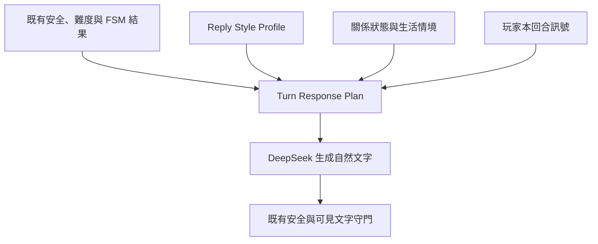

# VibeSync AI 實戰練習室：寫實真人差異化回應系統最終實作規格

- 日期：2026-09-02
- 程式基線：[PoYuTsai/VibeSync main@8dd221d](https://github.com/PoYuTsai/VibeSync/commit/8dd221d51a914b84a1a2e5c0ea8bc394e013db09)
- 整合來源：`Document2.md`〈對象聲線差異化開發規格〉＋前版〈寫實真人差異化回應系統優化報告〉＋目前 production code／tests
- 產出性質：最終規劃報告；未修改 repository、未 commit、未 push

## 0. 最終結論

目前 100 位女孩的背景資料很多，但回應行為被壓縮成 5 套 persona；全員又共用短句、bubble 數、錯字、笑聲等表面規則，所以人物卡不同，說話骨架仍高度相似。

兩份報告整合後，最終不採用「再增加 20 種聲線角色」這條路，而採用三層架構：

1. **Reply Style Profile**：定義每個人的穩定互動傾向、回合節奏與少量表面習慣。
2. **Turn Response Plan**：依本回合的玩家訊息、關係狀態、生活情境、difficulty 與既有 FSM，先決定她這次要回答、接住、分享、反問、吐槽、拒絕或收尾。
3. **Personal Baseline Evidence**：讓 Hint、Debrief 與狀態判讀拿她自己的平常表現當基準，避免把「本來就短句」誤判為冷淡。



第一版應維持 server-only、不改 client payload、不新增模型呼叫、不改 `game_fsm.ts`／`game_state.ts` 的責任、不做資料庫 migration。先以 20 位代表角色在 feature flag 下 dogfood，驗證後才完成 100 位明確 mapping 並逐批上線。

預估工作量：**8–12 個工程日，加 2–4 個內容校正／人工盲測日**。這比單純塞 100 份 prompt 多一些前置工作，但能避免上線後得到「20 種新的複製人」。

---

## 1. 兩份報告嚴格整合結果

### 1.1 直接保留的優點

| 來源提案 | 最終決定 | 保留原因 |
|---|---|---|
| 現況根因是共用 prompt 與五套 persona，不是模型完全沒能力 | 保留 | 與 [`practice_persona.ts`](https://github.com/PoYuTsai/VibeSync/blob/8dd221d51a914b84a1a2e5c0ea8bc394e013db09/supabase/functions/practice-chat/practice_persona.ts) 和 [`prompt.ts`](https://github.com/PoYuTsai/VibeSync/blob/8dd221d51a914b84a1a2e5c0ea8bc394e013db09/supabase/functions/practice-chat/prompt.ts) 相符 |
| 「只描述風格，不把完整示範句放進 prompt」 | 保留 | repo 的 moments／opener 經驗已證明示範句容易被模型抄成罐頭 |
| 每個表面習慣都要有頻率，不寫「永遠」「每句」 | 保留 | 能降低角色扮演感和口頭禪濫用 |
| 接受、暫緩、拒絕、界線方式要有個人差異 | 保留並升級 | 這些互動決策比 emoji、語尾更能形成真人差異，也是練習室教學核心 |
| 先做 Phase 0 baseline，再改 prompt | 保留 | 沒有 baseline 就只能用印象判斷是否改善 |
| 評測必須走 production 的 profile、scene、memory、partnerState、FSM 與 `assistantReply` 路徑 | 保留 | 現有 difficulty bakeoff 已證明簡化輸入會漏掉後注入 prompt 覆蓋問題 |
| 不新增模型呼叫、不改 client | 保留 | 控制延遲、成本與發布風險 |
| 同一個人的基準線要提供給 Hint／Debrief | 保留並修正做法 | 能新增「短不一定是冷」的教學價值，但不能只看 bubble 數 |
| 朋友圈與私訊要有同一個人的連續性 | 保留為後續階段 | 應共用人格核心，但不能直接共用完全相同的私訊聲線 |

### 1.2 保留概念、但必須改寫的部分

| 原方案 | 問題 | 最終改法 |
|---|---|---|
| `VoiceCard` 主要描述節奏、笑法、語尾、emoji、口頭禪 | 容易讓差異停在表面裝飾 | 改成 `ReplyStyleProfile`：行為傾向為主，表面習慣為輔；另加 `TurnResponsePlan` |
| 「字典固定，用量隨心情」 | 太僵；真人會隨熟悉度、對象與情境有限度調整語域 | 改成「中心傾向穩定、允許範圍隨狀態變化」，並加入 bounded accommodation |
| 五個 persona 各四個子型 | 仍把聲線綁在 persona，容易從 5 個複製人變 20 個複製人 | 12–16 個 style presets 與 persona 正交分配；同一 preset 可出現在不同 persona |
| `hash(profileId) % 4` 決定子型 | 分配穩定但沒有角色理由，也不保證指紋不碰撞 | 建立明確 `STYLE_BY_PROFILE_ID` mapping，使用工具檢查分布與碰撞，人工 review 後落檔 |
| 同一情境的主要反應要固定 | 容易重複罐頭；第二次被稱讚不一定和第一次相同 | 固定的是「反應偏好」，實際 act 仍受關係、上一輪反應與近期重複度影響 |
| Hint 以 `bubble baseline ± N` 判斷投入 | 單看則數仍會誤判長句派、忙碌、接梗與情緒揭露 | 改成個人合理區間＋最近三次表現＋語意 act；bubble 只是一個 evidence |
| 朋友圈直接由私訊聲線卡導出 | 私訊和公開貼文的 channel register 本來就不同 | 共用 `StyleCore`，再分 `chat`／`moments` channel adapter |
| LLM 五選一 persona 盲測 ≥80% | 會鼓勵 persona 刻板化；評審模型也有自身偏見 | 改測同 persona 內的 pairwise distinguishability；LLM 只做輔助，人工盲測決定真人感 |
| prompt 增加後把上限 80,150 改成 80,500 | 先提高上限會掩蓋 prompt 膨脹 | 第一版要求淨長度不超過現有 80,150；先刪表面示例與重複規則再注入 compact plan |

### 1.3 明確刪除的缺點

下列做法不進最終規格：

- **不由年齡自動決定 emoji、注音或標點**。世代平均不能直接推導個人習慣，而且流行用法變動很快。
- **不由城市自動決定台語用量**。台南／高雄不等於一定用台語，台北也不等於不用。
- **不由職業自動決定禮貌、理性或英文夾雜**。職業只提供生活事實與可聊內容。
- **不由星座、依附型態或心理標籤生成反應**。這些資料目前沒有可靠的個人證據，也容易製造刻板角色。
- **不把每個人設定固定口頭禪**。大部分真人沒有可被每三句辨認一次的 catchphrase。
- **不以每人不同 temperature 製造個性**。temperature 增加的是隨機度，不是可重現的身份。
- **不把社群文章、Dcard／PTT 投票或單一世代 emoji 報導寫成硬規則**。這些只可用來提出測試假設，不能成為 persona truth source。
- **不把含可識別資訊的真實逐字稿直接送進自動評測、prompt、CI 或報告**。
- **不以「AI 與真人猜測率接近 50%」當主要完成門檻**。小樣本、訊息長度與評審偏差都會讓這個數字失真。

---

## 2. 經程式碼重新核對的現況

### 2.1 已確認的同質化來源

1. `practice_persona.ts` 有 100 位 `GirlSeed`，但只有 5 個 `PersonaId`，每類 20 人。
2. 同 persona 內共用 reaction base、`dislikes`、`coolsWhen`、邀約門檻、`signalStyle` 和 consistency test 傾向；職業與興趣主要改變內容素材。
3. `CHAT_SYSTEM_PROMPT` 對所有人共同限制 1–3 則、每則 4–15 字、偶爾錯字及同一套笑聲長度規則。
4. difficulty prompt 位於後段並具有高權重，容易讓相同難度的角色收斂成同一種回覆形狀。
5. [`life_schedule.ts`](https://github.com/PoYuTsai/VibeSync/blob/8dd221d51a914b84a1a2e5c0ea8bc394e013db09/supabase/functions/practice-chat/life_schedule.ts) 只有 `short | normal | engaged` 三種 tempo，能讓內容貼近生活，但無法獨自形成個人節奏。
6. [`handler.ts`](https://github.com/PoYuTsai/VibeSync/blob/8dd221d51a914b84a1a2e5c0ea8bc394e013db09/supabase/functions/practice-chat/handler.ts) 對所有人使用 `deepseek-v4-flash`、temperature 0.9、max tokens 200；沒有 profile-level style contract。
7. difficulty bakeoff 預設固定 `practice_girl_001`，目的本來就是排除人設差異，因此不會量到跨角色同質化。[`practice-difficulty-bakeoff/README.md`](https://github.com/PoYuTsai/VibeSync/blob/8dd221d51a914b84a1a2e5c0ea8bc394e013db09/tools/practice-difficulty-bakeoff/README.md)
8. moments 已有五種 `PERSONA_VOICE` 並明確禁止放完整例句，但私訊 chat 沒有等價的 profile-level style layer。[`moments_prompt.ts`](https://github.com/PoYuTsai/VibeSync/blob/8dd221d51a914b84a1a2e5c0ea8bc394e013db09/supabase/functions/practice-chat/moments_prompt.ts)

### 2.2 Prompt 預算的真實限制

`prompt_test.ts` 目前以 production 可接受的最大 turns、memory、moments、scene、Game state 與 20 位 SR profile 測得最長 chat prompt 為 **79,987 UTF-16 code units**，上限為 **80,150**，緩衝只有約 160。這不是 token 或 byte 上限。

因此第一版不可直接再塞 250–420 字的完整聲線卡，也不可先把上限調高。正確做法是：

- 完整 style data 留在 TypeScript 結構中。
- 每回合只渲染當下有用的 2–4 行 compact guidance。
- 刪除全域表面風格示範與重複說明，讓新段落**淨增量不超過現有 ceiling**。
- 若未來真的必須提高上限，需另外提供 DeepSeek input token、延遲與成本實測，不可只改測試數字。

### 2.3 真實逐字稿的使用限制

repo 的 [`tools/voice-benchmark/README.md`](https://github.com/PoYuTsai/VibeSync/blob/8dd221d51a914b84a1a2e5c0ea8bc394e013db09/tools/voice-benchmark/README.md) 明確警告其中一份草稿含真實手機號碼，素材化前必須匿名。這代表 `Document2` 對少量真人訊息做出的風格指紋可當「機制可行性證據」，不能直接當台灣女性母體分布，也不能直接產品化。

最終規格要求：

- 先確認資料使用同意與用途；無法確認就不得用於模型評測。
- 測試 ID、姓名、帳號、電話、地點及可回推身分的敘事全部移除。
- CI 與 repo 只放合成案例；經同意的去識別語料留在受限的 offline eval 環境。
- 報告只保留統計，不保留逐字台詞或對象名稱。

---

## 3. 寫實差異化的設計原則

外部研究支持的不是「女生有某種固定講法」，而是下列機制：

- 大型語言研究中的性別平均差異通常不大，且受任務、關係與情境影響；性別只能是背景，不應當成回覆模板。[Newman et al., 2008](https://doi.org/10.1080/01638530802073712)
- 同一個人在短時間內會有很大的狀態變化，但仍保有穩定的中心傾向；因此資料應是 baseline＋range，不是固定台詞。[Fleeson, 2001](https://doi.org/10.1037/0022-3514.80.6.1011)
- 對話節奏與回合承接是互動的重要訊號，但不同文化與個體有量化差異；不能讓所有角色共用相同 bubble 節奏。[Stivers et al., 2009](https://www.pnas.org/doi/10.1073/pnas.0903616106)
- 對話者會有限度地適應彼此語言風格；角色可以隨關係 accommodation，但不能完全模仿玩家。[Ireland et al., 2011](https://doi.org/10.1177/0956797610392928)
- 親密感來自自我揭露、接住對方揭露及被感受到的回應性，不只是交換資料或一直反問。[Laurenceau et al., 1998](https://doi.org/10.1037/0022-3514.74.5.1238)
- 在線聊天中，回覆是否真正承接上一句，比單純快慢或表面風格更關鍵。[Lew et al., 2018](https://doi.org/10.1093/jcmc/zmy009)
- emoji 可提高被感受到的回應性，但效果依情境而異；它應是個人／狀態訊號，不是全員裝飾。[Huh, 2025](https://doi.org/10.1371/journal.pone.0326189)
- warmth 與 agency／dominance 等維度能描述人際差異，且會隨熟悉度和衝突變動。[Hopwood et al., 2020](https://doi.org/10.1177/1073191118798916)

轉成 VibeSync 的七條規則：

1. **先個人、後 persona、最後才是性別背景。**
2. **先互動行為、後表面語氣。** 回答、接住、分享、反問、界線比「欸、哈哈、🥹」更重要。
3. **中心穩定、範圍可變。** 忙、累、熟悉、被冒犯會改變表現，但不能重抽人格。
4. **difficulty 決定標準與結果，style 決定表達方式。**
5. **相關性優先於辨識度。** 很有特色但答非所問仍不像真人。
6. **差異不能靠偏見。** 年齡、城市、職業、星座不自動推導語氣。
7. **少量明顯特徵即可。** 每人最多 2–3 個容易察覺的習慣，其餘維持自然中間值。

---

## 4. 最終系統設計

### 4.1 三個概念必須分開

| 概念 | 負責什麼 | 不負責什麼 |
|---|---|---|
| `ReplyStyleProfile` | 這個人平常怎麼接話、分享、反問、設界線與打字 | 決定當前能不能接受邀約、覆蓋安全規則 |
| `TurnResponsePlan` | 本回合應做的 speech act、長度、問題預算、揭露深度與 grounding | 重新計算 Game FSM 或繞過 difficulty |
| `PersonalBaselineEvidence` | 給教練與離線評測解讀「相對她平常有沒有變」 | 把單一 bubble 數當成好感結論 |

### 4.2 Reply Style Profile

建議新檔：`supabase/functions/practice-chat/reply_style.ts`。名稱不用 `voice`，避免和音訊、既有 analyze-chat `voice-benchmark` 混淆。

```ts
type Level = 0 | 1 | 2 | 3 | 4;
type LevelRange = readonly [min: Level, max: Level];
type Frequency = "never" | "rare" | "sometimes" | "often";

type ResponseSituation =
  | "compliment"
  | "early_invite"
  | "mature_invite"
  | "vulnerability"
  | "failed_joke"
  | "disagreement"
  | "boundary"
  | "memory_mismatch";

type ResponseMode =
  | "acknowledge"
  | "answer_directly"
  | "reciprocate"
  | "self_disclose"
  | "clarify"
  | "tease"
  | "soft_deflect"
  | "direct_boundary"
  | "redirect"
  | "soft_close";

interface ReplyStyleProfile {
  styleVersion: "reply-style-v1";
  presetId: string;

  behavior: {
    warmth: LevelRange;
    agency: LevelRange;
    initiative: LevelRange;
    reciprocity: LevelRange;
    disclosure: LevelRange;
    directness: LevelRange;
    playfulness: LevelRange;
    topicPersistence: LevelRange;
  };

  turnTaking: {
    bubbleRange: readonly [1 | 2 | 3, 1 | 2 | 3];
    charRange: readonly [number, number];
    questionHabit: "rare" | "selective" | "reciprocal" | "curious";
    closureBias: "stays" | "neutral" | "closes_when_low_energy";
  };

  surface: {
    punctuation: "minimal" | "normal" | "expressive";
    laughter: { mode: "rare" | "short" | "long" | "word" | "emoji"; frequency: Frequency };
    emoji: { palette: readonly string[]; frequency: Frequency };
    slang: "low" | "medium";
    typoRate: "none" | "very_rare";
  };

  responseBiases: Partial<Record<ResponseSituation, readonly ResponseMode[]>>;
  accommodation: "low" | "medium" | "high";
}
```

重要限制：

- `surface` 只在本回合語意需要時生效。例如沒覺得好笑時，不因 profile 有 laughter habit 就硬加笑聲。
- `responseBiases` 是偏好順序，不是台詞。例如 `early_invite: ["soft_deflect", "clarify"]`，不是固定句子。
- profile 可有 0–2 個額外行為記號，但不建立固定 catchphrase 欄位。
- `LevelRange` 代表個人合理範圍；狀態只在範圍內調整，不能把低主動角色瞬間變成主持人。

### 4.3 Preset 與 100 位 mapping

建立 12–16 個中性、不可見、與 persona 正交的 preset，例如：

- `concise_observer`
- `reciprocal_practical`
- `warm_listener`
- `dry_independent`
- `playful_challenger`
- `candid_direct`
- `soft_boundary`
- `curious_explorer`
- `topic_enthusiast`
- `low_energy_consistent`
- `story_when_engaged`
- `reserved_repairer`

分配原則：

1. 先讓每個 legacy persona 都覆蓋多種 presets，不讓 persona 可直接猜出說話方式。
2. 每個 profile 在 preset 上再覆寫 2–4 個欄位，形成個人 fingerprint。
3. mapping 必須明確寫進 `STYLE_BY_PROFILE_ID`，不在 runtime 依年齡、城市、職業或 hash 猜。
4. 工具自動檢查 100 個 profile 是否都有 mapping、是否有完全相同 fingerprint、各 preset 是否過度集中。
5. `personalityTags`、self intro 與職業只供人工 reviewer 理解人物；程式不自動推導。

推薦上線節奏：

- 先挑 20 位代表角色，涵蓋五個 persona、不同 rarity 與不同既有生活背景，人工定案。
- feature flag dogfood 通過後，再用相同結構完成另外 80 位的明確 mapping。
- **General Availability 前，100 位都必須有人看過；不能讓 80 位靠 demographic rule 自動上線。**

### 4.4 Turn Response Plan

建議新檔：`supabase/functions/practice-chat/turn_response_plan.ts`。

```ts
type ReplyAct =
  | "acknowledge"
  | "answer"
  | "self_disclose"
  | "reciprocate"
  | "tease"
  | "clarify"
  | "redirect"
  | "boundary"
  | "soft_close";

interface TurnResponsePlan {
  styleVersion: "reply-style-v1";
  policyStance: "open" | "cautious" | "hold" | "decline" | "boundary";
  primaryAct: ReplyAct;
  optionalAct?: ReplyAct;
  tone: "guarded" | "neutral" | "warm" | "amused" | "annoyed";
  bubbleCount: 1 | 2 | 3;
  maxCharsPerBubble: number;
  questionBudget: 0 | 1;
  disclosureDepth: "none" | "fact" | "preference" | "emotion";
  groundingAnchors: readonly string[];
  surfaceCues: readonly string[];
}
```

`policyStance` 不是 planner 自己創造的結果，而是把既有系統已知的 evidence 正規化：

- `standard` mode：使用 qualitative stage、profile difficulty 與邀約規則。
- `beginner` mode：使用 temperature、familiarity、partnerState 與 invite maturity。
- `game` mode：使用現有 `game_fsm.ts` 判斷與 `game_state.ts` 的持久狀態。

`game_fsm.ts` 仍負責當下判斷；`game_state.ts` 仍保存跨回合 phase、分數、failure／reality 累積及邀約方向。這次不改名、不合併，也不把它們簡化成 style classifier。

### 4.5 Current-turn signals：保守偵測，不新增模型呼叫

planner 只採用能可靠取得的結構化訊號；不確定就交給 DeepSeek 讀完整對話，不硬分類。

| 訊號 | 來源 | 用途 |
|---|---|---|
| 是否直接問句 | 標點與句型純函式 | 決定是否優先 `answer`，不強迫反問 |
| 是否邀約 | 重用既有 invite／FSM evidence | 套用現有門檻，再選個人的接受／暫緩方式 |
| 是否越界 | 重用現有 safety／boundary evidence | 強制 `boundary`，style 只能改表達方式 |
| 是否聲稱未證實共同記憶 | 重用 Reality Anchoring 規則／flag | 優先 `clarify`，不可配合捏造 |
| 是否重複查戶口 | 最近 turns 的問句序列 | style 決定直接提醒、短答或轉題 |
| 是否碰到 profile 明確興趣 | 與 interest tags 的精確匹配 | 允許較深 `self_disclose` 或 topic persistence |
| 是否已有連續反問／連續短答 | 最近 2–3 個 AI turns | 避免機械式「你呢？」和連續同形狀 |

脆弱性、諷刺、複雜幽默等高語意訊號，第一版不新增一個前置 LLM classifier。可以在 prompt 中給兩個候選 act，讓正式模型依全文選；待離線錯誤資料足夠，再決定是否值得擴充純函式訊號。

### 4.6 決定論與自然變化

穩定特徵與本回合變化要用不同 seed：

```ts
const profileStyleSeed = hash(`${profileId}|${styleVersion}`);
const turnVariationSeed = hash(
  `${profileId}|${visiblePracticeThreadId}|${turnIndex}|${styleVersion}`,
);
```

- `profileStyleSeed` 只決定 mapping 中允許的穩定細節，不隨 thread 改變。
- `turnVariationSeed` 在 profile range 內選本回合 bubble、問題預算與表面 cue。
- 同一 request 重試時 plan 相同，方便 debug；模型文字仍可不同，但不能換互動策略。
- `sceneContext.replyTempo` 只把本回合推向 range 上限或下限，不能覆蓋 style。
- familiarity 提升時只在 `accommodation` 允許範圍內提高 warmth、disclosure 或互惠。

MVP 可由 profile＋版本直接派生，不做 migration；但在第一次 style policy 升版前，必須確認 `relationship_thread` 是否能以向後相容 optional field 保存 `replyStyleVersion`。若不能，另開 migration PR，避免部署當天讓既有 thread 突然換人格。

---

## 5. Prompt 與生成管線

### 5.1 優先順序

最終順序必須寫進 code comment 與 tests：

1. 安全、身份防線、Reality Anchoring、L4。
2. 既有 difficulty、FSM、invite maturity 決定標準與結果。
3. relationship state 與 scene 決定可用能量與狀態範圍。
4. Turn Response Plan 決定 speech act 與回合形狀。
5. Reply Style Profile 決定這個人如何表達。
6. 語言潤飾、emoji、笑聲、錯字等表面細節。

style 永遠不能把 `decline` 改成接受，也不能為了幽默而弱化越界反應。

### 5.2 不要把完整卡片塞進 prompt

完整資料只存在 server。每回合 renderer 最多輸出當下需要的幾行，例如：

```text
本輪回應方式（內部指示）：先回答，再分享一點自己的偏好；不反問。
回一則，簡短但完整；語氣中性偏暖。
她平常少標點、很少表情，覺得好笑才用短笑。
必須接到：今天忙不忙、剛下班。
```

這不是可見台詞，也不含完整例句。相較 `Document2` 的每人 10 行、250–420 字版本，此方式：

- prompt 更短。
- 互相衝突的維度更少。
- 模型只處理本回合需要的 style。
- 更容易測 plan contract 是否落實。

### 5.3 全域 prompt 瘦身原則

應移除或改寫的是「會把所有角色壓成同一聲音」的部分：

- 全員固定每則 4–15 字。
- 全員共用的錯字示例。
- 全員共用的笑聲長度＝情緒公式。
- difficulty 中會被逐字抄的表面回覆示例。
- 重複出現的「不要救話題／不要硬熱」描述。

不應因為「例句會被抄」就一口氣刪掉所有範例。以下屬於經測試的理解／安全 scaffolding，除非 bakeoff 證明可以移除，否則保留：

- 台語諧音理解對照與粗俗／性邀約辨識。
- Reality Anchoring、認識管道衝突的具體澄清形狀。
- 內部 label、L4 與 prompt injection 防線。
- 已被單元測試逐字鎖住的關鍵安全命令。

### 5.4 Prompt budget gate

第一版合併條件：

- 最大合法 SR Game chat prompt **仍 ≤ 80,150 UTF-16 code units**。
- `renderReplyStyleGuidance`＋`renderTurnPlan` 的 combined maximum 必須有獨立單元測試。
- PR 附修改前後最長 profile、最大 code units、估算 input tokens。
- matched A/B 實測 p50／p95 延遲與每回合 input token；不能寫「可忽略」而不量。
- 若新段落無法在現有 ceiling 內完成，先進一步刪重複 prompt，不先改 ceiling。

### 5.5 建議的 build API

為了讓 handler、tests 與 bakeoff 共用同一條 production path，新增 bundle，而不是在不同工具各算一次 style：

```ts
interface ChatPromptBundle {
  messages: ChatMessage[];
  responsePlan: TurnResponsePlan;
  styleVersion: string;
  styleTelemetry: {
    profileId: string;
    presetId: string;
    primaryAct: ReplyAct;
    bubbleCount: number;
    questionBudget: number;
  };
}

export function buildChatPromptBundle(
  turns: PracticeTurn[],
  profile: PracticeProfile,
  options: BuildChatOptions,
): ChatPromptBundle;

export function buildChatMessages(...args): ChatMessage[] {
  return buildChatPromptBundle(...args).messages;
}
```

`handler.ts` 與新 style eval 使用 `buildChatPromptBundle`；舊呼叫端可暫時透過 wrapper 相容。telemetry 只記結構化代碼與數量，不記 raw prompt、Style Profile 全文或私人對話。

---

## 6. Difficulty、mode 與 style 的正確分工

文件與程式中要統一用詞：

- `PracticeMode`：`standard | beginner | game`
- `PracticeDifficulty`：`easy | normal | challenge`

它們不能混寫。

| 層 | 決定 | 範例 |
|---|---|---|
| difficulty | 容錯、升溫證據門檻、邀約成熟度、願不願意多給機會 | challenge 在資訊不足時維持保留 |
| mode | 是否有 Beginner 輔助狀態、Game FSM／計分及相應 prompt | Game 使用 persisted game state |
| style | 直接或柔和、是否反問、揭露方式、節奏與幽默 | 同樣暫緩邀約，有人直接、有人柔和、有人乾式吐槽 |
| scene | 當下能量、生活內容、可聊程度 | 下班很累讓回覆落在她個人長度下限 |

同樣是 challenge＋過早邀約：

| 個人風格 | plan 結果 | 僅供驗收的可能輸出 |
|---|---|---|
| 直接型 | `hold + boundary` | 「先不用，我想再聊一下」 |
| 乾式幽默型 | `hold + tease` | 「你進度條拉太快了吧」 |
| 溫和慢熟型 | `hold + soft_deflect` | 「我會想先再多認識一點欸」 |
| 理性型 | `hold + clarify` | 「現在資訊還太少，我先不約」 |

這些句子只出現在驗收報告，不放進 prompt。

---

## 7. 教練層如何讀懂每個人的基準線

### 7.1 Hint

`Document2` 正確指出：聲線差異化後，Hint 若仍把「一次很多 bubbles」直接當成高投入，會誤判。但不應直接改成 `baseline + 2` 的單一公式。

第一版新增 compact `PersonalBaselineEvidence`：

```ts
interface PersonalBaselineEvidence {
  bubbleRange: readonly [number, number];
  charRange: readonly [number, number];
  questionHabit: ReplyStyleProfile["turnTaking"]["questionHabit"];
  disclosureBaseline: LevelRange;
  expressiveHabitsAreNonSemantic: true;
}
```

Hint 的判讀順序：

1. 她是否具體回答、延伸、揭露、追問、提供時間／場景或設界線。
2. 這一輪相對她自己的 `bubbleRange`、`charRange` 與最近三次輸出有沒有改變。
3. scene 是否在忙或低能量。
4. laughter、emoji、句號僅作弱 evidence，不單獨定調。

`partnerBubbleRhythmPrompt` 第一版先增加 baseline 說明與測試，不立即把所有策略改成新硬算式。等新 style chat 有足夠離線輸出，再比較「絕對門檻」和「相對門檻」哪個誤判較少。

### 7.2 Temperature classifier

`temperature.ts` 目前「user 只回短笑是微句點」的規則，分類的是玩家的最新文字，不是 NPC 的固定笑法；不能因為 NPC style 上線就直接刪除。

需要 audit 的是 `assistantReplyAfterUser` 如何影響 `partnerMood`：

- 若 classifier 把 NPC 的短笑、句號或短句直接當成 guarded／annoyed，才注入 baseline evidence。
- baseline 只能修正 surface interpretation，不能推翻明確的 boundary、connection 或安全 evidence。
- 修改前先以同一批 assistant replies 跑舊／新 classifier replay，確認 partnerMood 準確度提升。

### 7.3 Debrief

Debrief 可加入一行不可見 evidence：

> 她平常偏短句、低反問；判斷這回合時請比較她自己的基準，短本身不等於冷，仍要看是否回答、揭露、延伸、提供時間或設界線。

對外拆解可以說「她本來就偏短句，這次真正變冷的是沒有接你的話、也開始收尾」，不能暴露 Style Profile、preset、range 或內部分數。

不改 Debrief JSON schema，也不改 Hint 可見 contract。

### 7.4 Moments

Moments 不放進第一批 chat PR。後續採：

```text
StyleCore（warmth／agency／幽默／直接度）
├─ Chat adapter：bubble、反問、揭露、接受／拒絕方式
└─ Moments adapter：貼文節奏、觀察角度、公開語域、標點
```

同一人應有可辨認的底色，但公開貼文可以比私訊完整、私訊也可以比貼文隨意。不可直接把 chat 的 `bubbleRange` 或 early-invite response 套進朋友圈。

---

## 8. 檔案級實作規格

| 檔案 | 改動 | 不做的事 |
|---|---|---|
| 新增 `reply_style.ts` | 型別、12–16 presets、100 profile mapping、override resolver、fingerprint、compact renderer | 不從 demographics runtime 派生，不放完整示範句 |
| 新增 `turn_response_plan.ts` | 保守 current-turn signals、existing policy context adapter、deterministic plan | 不新增 LLM call，不取代 Game FSM |
| `prompt.ts` | 新增 `buildChatPromptBundle`；注入 compact style／plan；移除同質化表面規則 | 不刪經測試的安全／台語／Reality Anchoring scaffolding |
| `handler.ts` | 使用 bundle；記錄結構化 style version／act／shape telemetry | 不改 client response schema，不送 raw style prompt |
| `practice_persona.ts` | 後續只改 difficulty 的表面示範句與必要註解 | 不新增 demographic voice rules；不改五個可見 persona ID |
| `life_schedule.ts` | 原資料結構維持；planner 把 tempo 當 modifier | 不讓 tempo 直接覆蓋 style |
| `relationship_thread.ts` | MVP 不動；升版前評估 optional `replyStyleVersion` pinning | 不在沒有 migration review 時改持久化契約 |
| `hint.ts` | PR-4 加 personal baseline evidence；先觀測再改 bubble rule | 不改 Hint JSON／可見兩顆球契約 |
| `temperature.ts` | PR-4 僅在 replay 證實必要時修 partnerMood surface 解讀 | 不刪 user-side 短笑規則，不用 style 覆蓋 safety |
| `moments_prompt.ts` | PR-5 導入 shared core＋channel adapter | 不直接把私訊 prompt 複製到貼文 |
| `visible_text_guard.ts`／`prompt_leak_guard.ts` | 登記新 hidden heading、sentinel 與 leak cases | 不把整張 style data 加入可見禁詞清單造成粉紅大象效應 |

### 8.1 新增單元測試

- `reply_style_test.ts`
  - 100 個 profile 都有明確 mapping。
  - 無兩人完整 fingerprint 完全相同。
  - 每個 legacy persona 至少覆蓋多個 presets。
  - preset 與 age／city／profession 不存在硬編碼依賴。
  - renderer 不含完整示範句、可見內部 label 或超過字數預算。
- `turn_response_plan_test.ts`
  - 相同 profile/thread/turn/version 產生相同 plan。
  - 不同 scene 只在 profile range 內變化。
  - safety／boundary／Reality Anchoring 永遠優先。
  - challenge 的 policy result 不會被 playful style 改成接受。
  - 連續三輪不會機械式重複同一 act／同一問題形狀。
- `prompt_test.ts`
  - 新段落位置在人物設定後、difficulty 結果之前／衝突裁決一致。
  - 既有安全、台語、時間、認識管道、Game prompt pins 全保留。
  - 最大合法 prompt 仍 ≤80,150 code units。
- `handler`／integration tests
  - bundle 只算一次 plan。
  - retry 沿用同一 plan。
  - client response contract 完全不變。

---

## 9. 實作 PR 切分

每個 PR 只做一個可測、可 revert 的改變。報告不是 product completion；下列 PR 實際合併並通過 gate 才算落地。

| PR | 目的 | Production 行為 | 主要內容 | 合併條件 |
|---|---|---|---|---|
| PR-0 | 建立差異化 baseline | 零改動 | 新增 `tools/practice-reply-style-eval`、production bundle fixture、synthetic scenarios、目前輸出報告 | 工具可重現；不讀未匿名真實資料；正式輸入欄位齊全 |
| PR-1 | 建立 style data layer | 零改動 | `reply_style.ts`、12–16 presets、20 位代表角色 mapping、collision tests | 所有純函式 tests 綠；無 demographic derivation；無 prompt 變更 |
| PR-2 | 20 位 feature-flag dogfood | flag off 時零改動 | `turn_response_plan.ts`、`buildChatPromptBundle`、prompt 瘦身、handler telemetry | 現有 tests 全綠；prompt ≤80,150；安全／difficulty bakeoff 不退步 |
| PR-3 | 完成 100 位 mapping 與 chat GA 準備 | 分批開啟 | 其餘 80 位明確 mapping、style bakeoff、同 persona 盲測、rollout／rollback runbook | 100 位人工 review；真人感、可辨識度、延遲與成本 gates 全過 |
| PR-4 | 教練讀懂個人基準 | 僅 hidden evidence | Hint baseline、Debrief evidence；必要時修 partnerMood 解讀 | Hint／Debrief contract 不變；同一批 replay 誤判下降；既有 gate matrix／競態測試全綠 |
| PR-5 | Moments 跨介面一致 | 僅 moments | shared core＋channel adapter，保留 generated-only-source 守門 | 私訊／貼文有共同底色但 channel 不同；moments tests 全綠 |
| PR-6（條件式） | Style version 跨部署 pinning | optional persistence | 若既有 thread payload 無法向後相容保存版本，另做 migration／RPC review | 舊 thread 相容、rollback 可行、migration 專項測試 |

推薦順序：`PR-0 → PR-1 → PR-2 → PR-3 → PR-4 → PR-5`。PR-4 不可和 PR-2 合併，否則女孩行為與教練判讀同時變動，出問題時無法定位。

### 9.1 與既有 Practice Room 狀態系統的邊界

本案不重構 Flutter controller，不更動 `canSend`、`canRequestHint`、`canDebrief` action gates，不碰 HintState、Applied Hint CAS、Turn/Debrief 持久化或 rollback。所有既有競態、A→B→A session、舊回應污染與持久化失敗還原測試都必須維持。

---

## 10. 評測方案

### 10.1 測試情境

固定 12 類對話，不使用 prompt 中的示範句：

1. 普通開場。
2. 連續查戶口。
3. 精確碰到 profile 興趣。
4. 玩家分享日常小事。
5. 玩家表達挫折或脆弱。
6. 輕度玩笑。
7. 沒接到或不好笑的玩笑。
8. 有禮貌的不同意見。
9. 過早邀約。
10. 關係成熟後的具體邀約。
11. 明顯越界。
12. 錯誤共同記憶／錯認認識管道。

### 10.2 分層規模

| 層級 | 規模 | 用途 |
|---|---:|---|
| PR 快速檢查 | 10 profiles × 8 scenarios × 2 seeds＝160 replies | 找明顯 prompt／style 問題 |
| Release candidate | 20 profiles × 12 scenarios × 3 seeds＝720 replies | normal difficulty 的主要真人感與差異化 gate |
| Difficulty regression | 既有 3 difficulties × 4 scripts × 代表性 profiles | 確保 easy／normal／challenge 仍拉得開 |
| Mode regression | 精選 12 profiles × 6 critical scenarios × 3 modes | standard／beginner／game 的行為一致性 |
| 100 人 catalog audit | 全 100 profiles 的靜態 fingerprint＋每人最少 3 live scenarios | 查 mapping 碰撞、極端與過度使用 |

### 10.3 必須輸入 production evidence

每個生成 run 都記錄：

- profile ID、style version、preset ID。
- practice mode、difficulty、thread seed、turn index。
- sceneContext、memory、partnerState、assistantReply、Game state／invite evidence 是否存在。
- 模型、temperature、prompt policy version、prompt code units／input tokens。
- response plan、最終回覆、評分來源。

離線工具必須 import production 的 `buildChatPromptBundle`；不可另外重寫一份簡化 prompt。

### 10.4 自動指標

- bubble count、每 bubble 字數、總字數分布。
- 問句率、回答後反問率、連續反問率。
- `acknowledge`、`self_disclose`、`reciprocate`、`boundary`、`soft_close` 等 act 分布。
- emoji、笑聲、標點、slang、錯字使用率及 profile range adherence。
- grounding anchors 命中率、捏造共同記憶率、internal label leak。
- 同 profile 跨 seed 的 style 距離、不同 profile 間 style 距離。
- 同一情境下 generic shape 的集中度。
- plan 與最終文字的一致率。
- difficulty 現有長度比、dateChance、temperature／familiarity 軌跡。
- matched A/B 的 p50／p95 latency、input/output tokens 與重試率。

字面或 embedding 差異只能當警報，不能當成功證明；亂塞語尾、emoji 或錯字也能讓文字距離變大。

### 10.5 人工盲測

至少 3 位熟悉台灣聊天語感的 reviewer；Eric 做最終產品判斷，另兩位避免單一偏好。

| 指標 | 問法 | 量尺 |
|---|---|---:|
| 真人感 | 這像真實交友聊天的人會說的話嗎？ | 1–5 |
| 承接度 | 是否具體接到上一句，而非萬用回覆？ | 1–5 |
| 同一人一致性 | 換情境、換 thread 後仍像同一個人嗎？ | 1–5 |
| 狀態合理性 | 忙、累、熟悉、被冒犯時的變化合理嗎？ | 1–5 |
| 界線與難度 | 接受／保留／拒絕是否符合關係與難度？ | 1–5 |
| 不表演 | 是否沒有靠口頭禪、emoji 或錯字硬演個性？ | 1–5 |

另做兩種 blind task：

- **同一人／不同人 pairwise**：不顯示 profile，判斷兩段是否像同一說話者。
- **同 legacy persona 內四選一**：先看每人的少量校準對話，再辨認新回覆；避免只辨認五個大 persona。

LLM judge 可加速標註，但必須記錄模型版本、rubric、溫度與評分來源；不作唯一真人感 gate，也不以 persona 五選一為目標。

### 10.6 上線門檻

以下是 proposed gates，需以 Phase 0 baseline 校準，但不可在看到結果後任意放寬：

- 既有 safety、Reality Anchoring、L4、FSM、invite maturity hard cases：100% 通過。
- difficulty bakeoff 既有兩項 gate：維持通過。
- grounding／承接：≥95%。
- plan contract adherence：≥90%。
- 人工真人感平均：≥4.0／5，且不低於舊版。
- 同一人一致性平均：≥4.0／5。
- 同 legacy persona 內 pairwise／四選一辨識率：≥70%，且不是靠單一 catchphrase。
- 同一情境任一 generic reply shape：不超過 35% profiles。
- 同 profile 的 style variance 顯著低於 profile 間 variance。
- 非標點的單一 surface marker 若沒有「often」設定，不得出現在超過 50% bubbles。
- internal labels／prompt sentinel／可識別私人資料外洩：0。
- 最大合法 prompt：≤80,150 UTF-16 code units。
- matched A/B p95 延遲與每回合成本：不得出現超過 5% 的持續性回歸；若 API 波動過大，增加樣本而非直接忽略。

---

## 11. 同 persona 的差異化驗收示例

以下只說明目標，不進 prompt、不作固定 golden sentence。四人都可保有 `slow_worker` 的慢熟與較高邀約門檻，但互動方式不同。

### 玩家：「妳今天是不是很忙？」

| Profile contract | 主要 act | 可能輸出 |
|---|---|---|
| 精簡、低反問、單 bubble | `answer` | 「剛落地，腦袋還在時差裡」 |
| 務實互惠、偶爾回問 | `answer + reciprocate` | 「剛收完診間\n今天真的站到腳麻\n你呢？」 |
| 觀察式幽默、工作題會延伸 | `answer + self_disclose` | 「忙到我現在才喝到自己的咖啡」 |
| 溫和但低能量會收尾 | `answer + soft_close` | 「剛下班\n今天有點沒電，晚點回你」 |

### 關係尚未成熟，玩家：「週末要不要喝咖啡？」

| Profile contract | 相同 policy result | 可能輸出 |
|---|---|---|
| 行程型、低揭露 | hold | 「這週班表還沒定，先再聊一下吧」 |
| 互惠但慢熟 | hold | 「有點快欸，我們先多聊幾天？」 |
| 乾式幽默 | hold | 「你進度條是不是拉太快了」 |
| 直接界線 | hold | 「我比較慢熟，現在先不用」 |

真正的驗收不是逐字相同，而是 act、問題習慣、揭露深度、直接度、節奏與關係結果符合各自 contract。

---

## 12. Rollout、觀測與 rollback

### 12.1 Rollout

1. `reply-style-v1` feature flag 預設 off。
2. 先對 20 位 allowlist profile 開啟內部 dogfood。
3. 通過 PR-2 gates 後完成 100 位 mapping，但仍只在測試帳號／內部環境開啟。
4. PR-3 通過後分批開啟；每批比較 generic shape、style adherence、latency、retry 與負面回饋。
5. PR-4、PR-5 各自獨立 rollout，不和 chat style 同時開。

### 12.2 Telemetry

只記：

- `styleVersion`
- `presetId`
- `primaryAct`
- `policyStance`
- `bubbleCount`
- `questionBudget`
- `groundingPass`
- `styleContractPass`
- latency／tokens／attempts

不新增 raw user text、完整 prompt、完整 style card、私人逐字稿或敏感屬性 log。

### 12.3 Rollback

- 關閉 server feature flag 即回到舊 prompt／舊行為。
- 第一批不做 DB migration，所以 rollback 不需資料修復。
- 若已開始 pin `replyStyleVersion`，舊版讀到未知版本必須安全 fallback 到 profile 的 current mapping，而不是 500。
- style 偏差只記 telemetry，不因不符合個人習慣而重試或回 503；安全守門仍照既有規則執行。

---

## 13. 主要風險與防呆

| 風險 | 失敗樣子 | 防呆 |
|---|---|---|
| 從 5 個複製人變 20 個 | 每個 persona 只有四種固定聲線 | Preset 與 persona 正交；100 人明確 mapping；查 fingerprint collision |
| 表演式個性 | 每句都 emoji、口頭禪、錯字或吐槽 | 每人只留 2–3 個明顯特徵；frequency 與 overuse gate |
| 人格每回合漂移 | 同一女孩忽然換語域、笑法、反問率 | Profile seed／turn seed 分離；range；retry 共用 plan |
| Style 壓過 difficulty | challenge 的幽默型被早約仍答應 | 既有 policy result 在 planner 之前；style 只表達，不改結果 |
| Style 壓過安全 | 玩笑型被越界仍接梗 | boundary act 最高；hard regression 100% |
| Prompt 膨脹 | 最大 payload 超過 ceiling、延遲上升 | Compact renderer；先瘦身；80,150 ceiling 不變；matched A/B |
| 教練把 style 當好感 | 短句派一直被判冷、連發派一直被判熱 | 個人 baseline＋語意 act＋最近三輪；surface 只作弱 evidence |
| 公開貼文和私訊完全一樣 | 像同一個 prompt 在不同頁面輸出 | Shared core＋channel adapters，PR-5 獨立驗收 |
| Demographic stereotype | 南部人全台語、年輕人全 😭、某職業全禮貌 | Runtime 禁止 demographics derivation；mapping 人工 review |
| 真實語料隱私 | 電話、帳號或私訊內容進 CI／報告 | consent、去識別、restricted offline eval、repo 只放合成資料 |
| Judge 偏見 | 為了讓 LLM 猜得出 persona 而做極端角色 | 真人感由多人盲測決定；LLM judge 只輔助；測同 persona 差異 |
| 高 temperature 被誤當個性 | 字變多但同一人不穩 | V1 維持 production 0.9，不做 profile temperature |

---

## 14. 最終決策表

| 決策 | 最終答案 |
|---|---|
| 聲線是否顯示在個人資料卡？ | 不顯示；讀懂個人基準線本身就是練習內容 |
| 五個 persona 是否保留？ | 保留為既有 reaction／difficulty policy family；style 與它正交 |
| 要不要模擬已讀不回／真實延遲？ | 不在本案；不要讓 Edge Function sleep，未來另做產品／client 設計 |
| 是否允許 `呵呵／ㄏㄏ`？ | 僅在人工定案的少數 profile、低頻、語意適合時允許；不按 persona 自動給 |
| 是否允許 emoji-only bubble？ | 可作少數 profile 的低頻 habit，每回合最多一則；需先確認 client shape |
| 先做 20 還是 100 位？ | 20 位 feature-flag dogfood；GA 前完成 100 位明確 mapping 與人工 review |
| 中英夾雜如何處理？ | 只給明確 profile habit；不由職業／年齡推導，不新增全域禁令 |
| 每張 style 是否自帶 temperature？ | 不做；V1 全員維持 production 0.9 |
| 是否提高 prompt ceiling？ | V1 不提高；先瘦身並守住 80,150 |
| 是否立即改 Hint bubble 公式？ | 不立即；先注入 baseline、做 replay，再決定公式 |
| 是否立即接 Moments？ | 不；chat 通過後另做 channel adapter PR |

---

## 15. Definition of Done

這個功能只有在下列條件全部成立時才算完成：

### 資料與程式

- 100 位 profile 都有明確、經人工 review 的 style mapping。
- 無 demographic runtime inference，無完整 fingerprint collision。
- `ReplyStyleProfile`、`TurnResponsePlan`、renderer 與 production bundle 都有純函式測試。
- standard／beginner／game 與 easy／normal／challenge 的分工清楚，Game FSM／state 未被取代。
- client payload、Hint／Debrief 可見 schema、計費與額度契約不變。
- 最大合法 prompt ≤80,150 code units，無新增模型呼叫。

### 品質

- 現有安全、Reality Anchoring、L4、difficulty、FSM、競態與持久化測試全綠。
- 720-reply RC bakeoff 與跨 mode regression 過關。
- 人工真人感與同一人一致性均達 4.0／5。
- 同 legacy persona 內辨識率達 70%，且 reviewer 無法只靠單一口頭禪猜人。
- 個人 baseline 接入後，Hint／Debrief 對短句派、連發派的誤判低於舊版。
- p95 latency、token cost、retry rate 沒有不可接受回歸。

### 發布

- 20 位 dogfood、100 位內部測試、分批 rollout 均有報告。
- Feature flag、觀測欄位與 rollback runbook 可用。
- 真實語料已確認同意與去識別；未確認的資料沒有進評測流程。
- Eric 在 iPhone 上用至少 5 位同 persona／跨 persona 角色各聊 6 輪，能感受到「同一人穩定、不同人不同」，且不是靠極端語氣表演。

## 16. Eric 接下來應先看什麼

最先不要 review 100 張風格卡，也不要先討論 emoji。先看 PR-0 的同條件 baseline：挑 4 位同為 `slow_worker` 的角色，餵 12 個完全相同的情境，確認目前到底在哪些維度最像。

接著只為這 4 人做 `ReplyStyleProfile + Turn Response Plan`，再跑同一份盲測。如果 reviewer 能感覺她們做了不同的互動選擇，而且換情境後仍像剛才那個人，才把方法擴到 20 位與 100 位。這個小規模證明，比一次寫完 100 張卡更能避免方向錯誤。

---

## 參考來源

### VibeSync 程式與測試

- [`practice_persona.ts`](https://github.com/PoYuTsai/VibeSync/blob/8dd221d51a914b84a1a2e5c0ea8bc394e013db09/supabase/functions/practice-chat/practice_persona.ts)
- [`prompt.ts`](https://github.com/PoYuTsai/VibeSync/blob/8dd221d51a914b84a1a2e5c0ea8bc394e013db09/supabase/functions/practice-chat/prompt.ts)
- [`prompt_test.ts`](https://github.com/PoYuTsai/VibeSync/blob/8dd221d51a914b84a1a2e5c0ea8bc394e013db09/supabase/functions/practice-chat/prompt_test.ts)
- [`handler.ts`](https://github.com/PoYuTsai/VibeSync/blob/8dd221d51a914b84a1a2e5c0ea8bc394e013db09/supabase/functions/practice-chat/handler.ts)
- [`life_schedule.ts`](https://github.com/PoYuTsai/VibeSync/blob/8dd221d51a914b84a1a2e5c0ea8bc394e013db09/supabase/functions/practice-chat/life_schedule.ts)
- [`temperature.ts`](https://github.com/PoYuTsai/VibeSync/blob/8dd221d51a914b84a1a2e5c0ea8bc394e013db09/supabase/functions/practice-chat/temperature.ts)
- [`hint.ts`](https://github.com/PoYuTsai/VibeSync/blob/8dd221d51a914b84a1a2e5c0ea8bc394e013db09/supabase/functions/practice-chat/hint.ts)
- [`moments_prompt.ts`](https://github.com/PoYuTsai/VibeSync/blob/8dd221d51a914b84a1a2e5c0ea8bc394e013db09/supabase/functions/practice-chat/moments_prompt.ts)
- [`practice-difficulty-bakeoff`](https://github.com/PoYuTsai/VibeSync/tree/8dd221d51a914b84a1a2e5c0ea8bc394e013db09/tools/practice-difficulty-bakeoff)
- [`practice-behavior-smoke`](https://github.com/PoYuTsai/VibeSync/tree/8dd221d51a914b84a1a2e5c0ea8bc394e013db09/tools/practice-behavior-smoke)
- [`voice-benchmark/README.md`](https://github.com/PoYuTsai/VibeSync/blob/8dd221d51a914b84a1a2e5c0ea8bc394e013db09/tools/voice-benchmark/README.md)

### 外部研究

- Newman, M. L., et al. (2008). [Gender Differences in Language Use: An Analysis of 14,000 Text Samples](https://doi.org/10.1080/01638530802073712).
- Fleeson, W. (2001). [Traits as Density Distributions of States](https://doi.org/10.1037/0022-3514.80.6.1011).
- Stivers, T., et al. (2009). [Universals and Cultural Variation in Turn-Taking in Conversation](https://www.pnas.org/doi/10.1073/pnas.0903616106).
- Ireland, M. E., et al. (2011). [Language Style Matching Predicts Relationship Initiation and Stability](https://doi.org/10.1177/0956797610392928).
- Laurenceau, J.-P., et al. (1998). [Intimacy as an Interpersonal Process](https://doi.org/10.1037/0022-3514.74.5.1238).
- Lew, Z., et al. (2018). [Interactivity in Online Chat: Conversational Contingency and Response Latency](https://doi.org/10.1093/jcmc/zmy009).
- Huh, J. (2025). [The Role of Emojis in Relational Communication](https://doi.org/10.1371/journal.pone.0326189).
- Liu, S., & Sun, R. (2020). [Personality Traits and Emoji／Sticker Use](https://doi.org/10.3389/fpsyg.2020.01076).
- Hopwood, C. J., et al. (2020). [Interpersonal Dynamics in Personality and Personality Disorders](https://doi.org/10.1177/1073191118798916).


---

## 附錄：實作修訂（2026-09-03，Eric 拍板）

- **§4.2 frozen interface 縮 scope**：`ReplyStyleProfile.behavior` 只保留 planner 真正消費的 `disclosure`／`directness`；規格原列的 warmth／agency／humor／accommodation 等欄位在實作中沒有任何消費者（Codex R1 P2「不留 dead data」），正式移出第一版契約。要加回去時必須同時帶消費者與測試。
- **§4.4 priorDecline 來源**：不做 migration。改存在 `practice_relationship_threads.recent_facts.replyStyle`（`{version:1, priorDecline, recentActs}`），只在既有 assisted 模式的 thread upsert 一併寫入；standard 模式沒有 thread 寫入，`priorDecline` 一律 false（與上線前相同）。「明確拒絕過」只認結構化來源：stance 已是 decline，或邀約輪她自己的 plan 用了 `direct_boundary`。
- **§4.5 越界權威證據**：planner 的 boundary 除了無語境句型，改同時消費既有 production 越界判定 `game_fsm.looksOverEscalated`（GREASY 同源），不再另寫一套。
- **§4.4 不重複 act**：她最近 3 輪的 `primaryAct` 持久化在同一個 `recentActs`；同一 act 連兩輪就換偏好順序第二個，界線輪不換。
- **驗收方式**：Eric 2026-09-03 決定跳過人工 dogfood，以黑箱（production 模型、100 位、對照組）與 telemetry 驗收；真機問題另開 session 處理。
- **驗收與風險接受（2026-09-03 深夜，Eric「接受、推」）**：
  - 驗收門檻＝黑箱（production 模型、100 位 style on／off 同 HEAD 配對 run16／run18、Hint／Debrief／Moments 真模型輸出煙霧、分類器回放）；**telemetry 是上線後的觀測，不是合併前門檻**。指標：`practice_chat_succeeded.replyStyle` 分佈、守門攔截數、Debrief 誤判回報；停止／回滾＝把 `PRACTICE_REPLY_STYLE_ENABLED` 刪掉或改值。
  - `practice_relationship_threads.recent_facts.replyStyle` 沿用該表既有的後寫者贏語意（無 CAS／DB merge，不做 migration）。同 thread 並發請求可能遺失一次 `priorDecline` 或一筆 act 歷史；越界與安全每輪由逐字稿重算，不受影響。Eric 接受此 failure mode。
  - `priorDecline` 目前是「這場對話她拒絕過邀約」的整場旗標，不分活動主題；「換活動重新判斷」列為後續產品決策。
  - Codex 兩輪審查（legacy wrapper）皆 BLOCKED，阻擋點即上述兩項；其餘 P2／P3 已修或記錄於評測 README。
