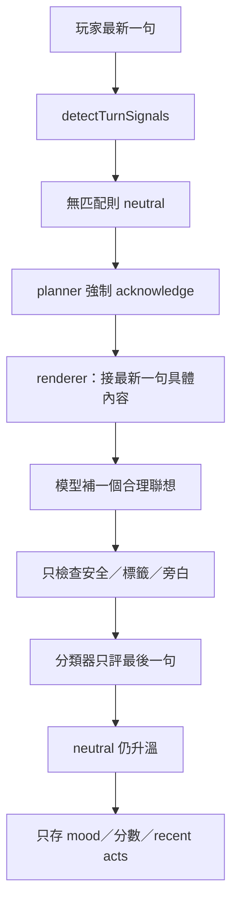
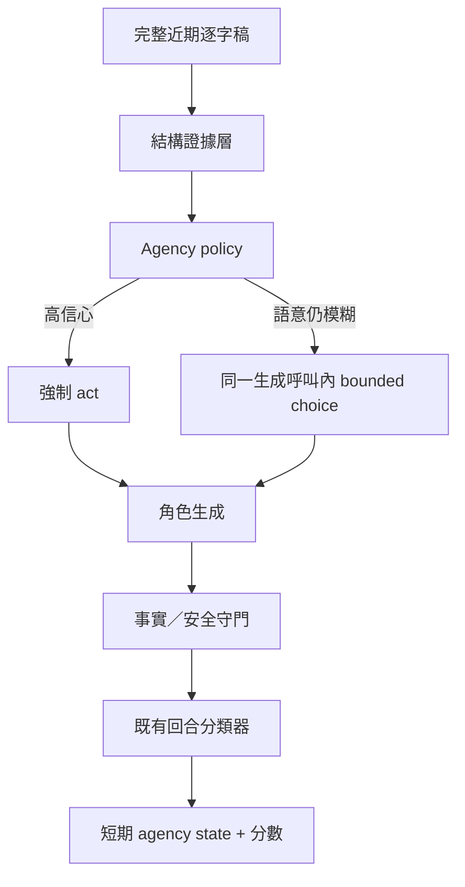

# VibeSync AI 實戰練習室：Chatbot 擬真度與「對話主體意識」優化實作報告

**報告日期：** 2026-09-03  
**檢視基準：** `PoYuTsai/VibeSync` `main`，commit `10ccb124c1fe6f789910a630e4ece2fb8cf47a27`  
**證據範圍：** 使用者提供的 10 張真機截圖（`IMG_5672.png`–`IMG_5681.png`）、目前 production chat/prompt/planner/state/scoring/eval 程式碼、相關 git 歷史、對話與角色扮演研究  
**本輪範圍：** 研究與實作設計報告；未修改 repository、未 commit、未 push  
**主要讀者：** VibeSync 產品、Prompt、Backend 與 QA 團隊

---

## 1. 結論先行

目前問題不只是「prompt 沒寫要有主見」，也不只是模型溫度太高。系統在五個層次共同把角色推成了「針對最新一句產生一個看似相關的句子」：

1. **本輪規劃器不理解對話連貫性。** 無法辨識的輸入一律落到 `neutral`，而 `neutral` 又被硬排成 `acknowledge`。
2. **最高權重指示互相衝突。** 一邊要求有情緒、不必配合，一邊又明寫「不主導節奏」，本輪 renderer 還要求「接到最新一句的具體內容」。
3. **角色有說話風格，沒有談話立場。** 現行 Reply Style 能控制長短、反問頻率、直接度，卻沒有真正被 planner 消費的 `agency`、`topicPersistence`、`ambiguityTolerance` 或 `strangerCuriosity`。
4. **狀態與評分會把錯誤放大。** 系統沒有保存「目前在聊什麼、這句是否解決上一個疑問、對方已連續幾次亂跳」；同時 `neutral` 預設仍會升溫 `+1/+2`，因此無意義片段也可能被 UI 顯示成升溫。
5. **輸出守門只攔安全與格式，不攔憑空經歷。** 角色能把「清邁」補成「我上個月才去過」，把「壽司郎」補成「我下午吃過東西」，即使 profile、scene、moments 與前文都沒有這些事。

一句話總結：**現有系統建模的是「她要怎麼回」，還沒有建模「她是否接受這個前提、是否願意跟著換題、她此刻想知道什麼」。**

建議新增一層 `conversation-agency-v1`：以高信心結構訊號、完整逐字稿和既有同一個生成呼叫共同決策，讓角色可以選擇接話、問清楚、質疑關聯、拉回話題、了解對方或結束低品質迴圈。正常路徑不需要增加一個 LLM call。

---

## 2. 截圖重建：使用者實際感受到什麼

### 2.1 Alice：有察覺，但總是太晚，而且下一輪立刻失憶

附件中的 Alice 對話大致為：

| 玩家輸入 | Alice 回覆 | 問題 |
|---|---|---|
| `東東` | `東東是誰` | 第一次澄清合理 |
| `阿布打比` | `阿布達比？你有去那邊玩喔？` | 沒有回答「東東是誰」，角色卻自行改成旅遊題 |
| `清邁` | `清邁很讚欸 我上個月才去過` | 再次接受跳題，且新增設定外的具體經歷 |
| `好市多` | `你怎麼突然跳去好市多` | 終於偵測異常 |
| `曼谷` | `所以你是想聊你飛過的地方嗎` | 替玩家補意圖 |
| `馬尼拉` | `你是在報地名嗎／我以為我們在聊天` | 到這裡才形成合理的主體反應 |
| `漢漢`、`好市多`、`護駕`、`全球經濟增長放緩` | 各自逐詞回覆 | 已指出模式，下一輪仍重新服從最新 token |

這不是「完全不會吐槽」。Alice 的確說過「你話題也跳太快」和「我以為我們在聊天」。真正問題是：

- **異常辨識太晚；**
- **辨識結果沒有跨輪持續；**
- **每個新名詞仍被視為新的對話 agenda；**
- **模型用想像補齊玩家沒有提供的意圖與自己的生活經歷。**

### 2.2 Joyce：把名詞硬套進最容易聯想到的槽位

Joyce 的片段更清楚呈現「關鍵字聯想」：

| 玩家輸入 | Joyce 回覆 | 錯誤推論 |
|---|---|---|
| `韓國` | `嗯 看韓劇` | 國家被自動補成娛樂偏好 |
| `東京` | `喔 我看不懂日文` | 城市被自動補成語言能力問題 |
| `壽司郎` | `我下午吃過東西了` | 品牌被自動補成邀吃飯，且虛構當日行程 |
| `紅豆泥` | `蛤？` | 單輪合理，但沒有建立持續的「我不知道你在幹嘛」狀態 |
| `淺草` | `你怎麼一直丟地名` | 第二次以上才看見模式 |
| `王力宏` | `我不太熟他欸` | 又退回逐詞應答 |
| `hyrox` | `你是想約我去比賽嗎？` | 在亂跳序列中仍擅自補成邀約意圖 |

### 2.3 直接可驗證的 planner 重現

把截圖逐字稿餵進目前的純函式 `detectTurnSignals → classifySituation → planTurnResponse`，不用呼叫模型就能重現：

- Alice 最後一句 `好市多`：`situation=neutral`、`primaryAct=acknowledge`、`questionBudget=0`。
- Joyce 最後一句 `紅豆泥`：同樣是 `neutral → acknowledge → questionBudget=0`。

因此這不是單次 sampling 運氣差，而是 planner 結構性地沒有其他選項。

### 2.4 不能從兩位角色直接推論「每一位都一樣」，但程式根因是共用的

截圖只有 Alice 與 Joyce，不能拿兩個樣本估算 100 位角色的實際失敗率。不過兩者共用相同的 `classifySituation`、`neutral` fallback、renderer、溫度分類器與狀態格式，所以**失敗機制可合理外推到全部角色；各角色只會在口氣與發生頻率上不同**。正式上線前仍需跑全角色回歸與真人盲測。

---

## 3. 現行資料流如何製造「無主體感」



每一層單看都有合理初衷，但串起來的行為是：**即使玩家只丟一個沒有上下文的名詞，模型也會被引導去替它找意義；找到了就被視為有回覆，下一輪沒有任何狀態提醒它「剛才其實沒講通」。**

---

## 4. 程式碼根因

### P0-1：`neutral` 被硬編成 `acknowledge`

[`turn_response_plan.ts`](https://github.com/PoYuTsai/VibeSync/blob/10ccb124c1fe6f789910a630e4ece2fb8cf47a27/supabase/functions/practice-chat/turn_response_plan.ts#L249-L287) 目前只認得邀約、越界、記憶衝突、連續提問、稱讚、不同意、問題與 `我…` 型分享；其餘全部是 `neutral`。接著：

```ts
situation === "neutral" ? ["acknowledge"] : ...
```

這使「普通陳述」、「無法判斷意圖的名詞」、「突然換題」、「亂碼」、「上一題的合理短答」全部擠在同一類，且只能接住。

此外，`userShared` 只用 `^(我|今天我|剛剛我|我剛|最近我)` 判斷；像「在台中做設計」、「最近忙到爆」這些自然自我揭露會掉回 `neutral`。這也是玩家資訊始終建不起來的原因之一。

### P0-2：問題預算把「不查戶口」誤寫成「不要好奇」

[`turn_response_plan.ts`](https://github.com/PoYuTsai/VibeSync/blob/10ccb124c1fe6f789910a630e4ece2fb8cf47a27/supabase/functions/practice-chat/turn_response_plan.ts#L388-L409) 會在上一輪 AI 問過問題時把本輪問題預算歸零；一般／挑戰難度第一輪也歸零。Alice 的 `questionHabit=rare`，Joyce 是 `selective`，所以除非 planner 先選到 `clarify`，角色通常沒有權限追問。

產品原意是避免採訪感，實際效果卻把三件不同的事混在一起：

- 連續查戶口；
- 對模糊內容做必要澄清；
- 因為自己真的感興趣而問一個問題。

後兩者是主體感來源，不應被前者一起封鎖。

### P0-3：prompt 一邊說有個性，一邊禁止掌握議程

[`prompt.ts`](https://github.com/PoYuTsai/VibeSync/blob/10ccb124c1fe6f789910a630e4ece2fb8cf47a27/supabase/functions/practice-chat/prompt.ts#L318-L342) 同時存在：

- 「不要一味熱情配合或有問必答」；
- 「如果對方很無聊……不必勉強延續話題」；
- 「不主導節奏」。

最後注入、權重更高的 [`renderTurnPlan`](https://github.com/PoYuTsai/VibeSync/blob/10ccb124c1fe6f789910a630e4ece2fb8cf47a27/supabase/functions/practice-chat/turn_response_plan.ts#L531-L536) 又要求「內容要接到對方最新一句的具體內容」。模型最容易執行的是最後、最具體的命令，因此「有自己生活」停在角色文案，`最新一句 → 必須接` 才是實際政策。

台語諧音規則也過度偏向解碼：它要求先盡量唸、並幾乎禁止說看不懂。這對真正的台語諧音有幫助，卻也增加把奇怪字串硬解成合理意圖的傾向。

### P0-4：難度把「選擇性」錯等同於「被動」

[`practice_persona.ts`](https://github.com/PoYuTsai/VibeSync/blob/10ccb124c1fe6f789910a630e4ece2fb8cf47a27/supabase/functions/practice-chat/practice_persona.ts#L299-L340) 對一般難度規定首輪不反問、不救場；挑戰難度更寫「絕不主動開新話題」。

真人的高標準通常代表她**更早判斷、質疑、打斷或離開**，不是更被動地回答每個突兀名詞。應把兩個軸拆開：

- **投入度／友善度：** 願意回多少；
- **agency／議程所有權：** 是否接受對方的前提和換題。

挑戰難度可以低投入，但 agency 應至少與一般難度相同，甚至更高。

### P0-5：風格層有聲音，沒有真正的 agency 維度

現行 [`ReplyStyleProfile`](https://github.com/PoYuTsai/VibeSync/blob/10ccb124c1fe6f789910a630e4ece2fb8cf47a27/supabase/functions/practice-chat/reply_style.ts#L17-L75) 真正被消費的 behavior 只有 `disclosure`、`directness`，其餘是句數、字數、反問習慣、標點、笑聲和 response bias。Alice 與 Joyce 的 mapping 也都以 `acknowledge/answer` 為主。

更關鍵的是，既有規格附錄已明載：原本的 `warmth/agency/...` 因為沒有 consumer 與測試而從 v1 移除；要加回時必須同時帶 consumer 與測試（[`2026-09-02 reply-style spec`](https://github.com/PoYuTsai/VibeSync/blob/10ccb124c1fe6f789910a630e4ece2fb8cf47a27/docs/plans/2026-09-02-practice-reply-style-diversity-spec.md#L840-L846)）。本次問題正是把 agency 以可執行契約加回的充分理由。

### P0-6：關係狀態沒有 discourse state

[`PracticeRelationshipThreadState`](https://github.com/PoYuTsai/VibeSync/blob/10ccb124c1fe6f789910a630e4ece2fb8cf47a27/supabase/functions/practice-chat/relationship_thread.ts#L34-L44) 有 memory summary、mood、溫度、熟悉度、角色、模式與邀約階段；[`ReplyStyleState`](https://github.com/PoYuTsai/VibeSync/blob/10ccb124c1fe6f789910a630e4ece2fb8cf47a27/supabase/functions/practice-chat/reply_style_state.ts#L1-L72) 只記是否拒絕過和最近三個 act。

缺少的不是更多長期記憶，而是非常短期的談話工作記憶：

- 目前問題／話題是否仍未解；
- 最新片段是回答候選、明示換題，還是沒有關聯；
- 連續幾輪沒有建立共同理解；
- 角色剛才是否已指出玩家很跳；
- 玩家已自然透露哪些基本資訊類別。

沒有這層，角色剛質疑完，下一個 token 就會重新歸零。

### P0-7：評分把低品質中性輪誤當關係成長

[`temperature.ts`](https://github.com/PoYuTsai/VibeSync/blob/10ccb124c1fe6f789910a630e4ece2fb8cf47a27/supabase/functions/practice-chat/temperature.ts#L96-L102) 的 `neutral` 是 `heat +1 / familiarity +2`。分類器又明寫「只分類最後一句 user 訊息」、「不要用話題分類」，並允許參考 AI 回覆判斷她是否被接住（[`buildTurnClassifierMessages`](https://github.com/PoYuTsai/VibeSync/blob/10ccb124c1fe6f789910a630e4ece2fb8cf47a27/supabase/functions/practice-chat/temperature.ts#L642-L691)）。

這會產生循環偏差：角色先把無關詞補成合理話題，分類器再從角色的合理回覆推回「玩家有接住」，最後 UI 顯示升溫。**角色替玩家做的 repair 不能反過來算成玩家的互動品質。**

### P1-1：現實錨定只防共同記憶，沒有完整保護角色自己的具體經歷

目前 prompt 對共同朋友、見過面、位置和行程聲稱有很好的防線，但對一般生活細節仍有缺口。Profile 只說 Alice 喜歡旅行，不代表她上個月去過清邁；Joyce 是健身教練，也不代表她今天下午吃過東西。

[`handler.ts`](https://github.com/PoYuTsai/VibeSync/blob/10ccb124c1fe6f789910a630e4ece2fb8cf47a27/supabase/functions/practice-chat/handler.ts#L4221-L4303) 生成後只檢查內部標籤外洩、L4 安全與括號旁白。只要一句話安全、像聊天，憑空經歷就會通過。

### P1-2：目前 eval 測得出「不同」，測不出「像有自己的人」

現有 reply-style 場景覆蓋開場、連續問答、興趣、日常分享、脆弱、玩笑、不同意、邀約、界線、記憶矛盾；沒有：

- 單一裸名詞；
- 合理短答 vs. 突兀換題；
- 連續隨機專有名詞；
- 玩家不回答上一個澄清；
- 不成立的前提；
- 角色主動了解對方；
- 設定外自傳事實；
- 指出怪異後是否保持立場。

所以現有 style 指標可以變好，而截圖中的問題仍完整存在。

---

## 5. 研究如何支持這個診斷

這些研究不是拿來直接決定台灣交友聊天台詞，而是用來確認應建模的能力：

1. **對話擬真依賴跨輪語意關聯，不只是單句看似相關。** Lew 等人把 conversational contingency 定義為回覆與先前訊息之間的語意關聯；在 2×2 實驗中，較高 contingency 顯著提高 task/social attraction 與聊天滿意度。這支持我們應評估整段 thread，而不是只找最新關鍵字（[Lew et al., 2018, Journal of Computer-Mediated Communication](https://academic.oup.com/jcmc/article/23/4/201/5033037)）。
2. **LLM 的已知弱點正是少澄清、過度回覆與過度 acknowledge。** Shaikh 等人分析 WildChat、Bing Chat 與人類對話資料，發現 LLM 發起澄清的機率約為人的三分之一，follow-up 約少 16 倍；論文也指出 LLM 常以過度回覆自行消歧，並過度產生 acknowledgment，造成假的「已理解」感（[Shaikh et al., 2025, ACL](https://aclanthology.org/2025.acl-long.1016/)）。這與 VibeSync 的 `neutral → acknowledge` 和截圖高度吻合。
3. **共同基礎要同時追蹤「已接受的事實、證據、仍在討論的問題」。** Common Ground Tracking 研究把 shared beliefs、evidence bank 與 questions under discussion 分開建模（[Khebour et al., 2024, LREC-COLING](https://aclanthology.org/2024.lrec-main.318/)）。直接套用其 task-oriented 模型並不合適，但「證據層級 + 未決問題」是本案短期 discourse state 的合理設計依據。
4. **只給角色 persona 不夠，對話者資訊也影響角色辨識與一致性。** 角色對話研究顯示，提供 interlocutor persona 能改善目標說話者辨識；模型對陌生對話者較弱（[Occhipinti et al., 2025, ACL](https://aclanthology.org/2025.acl-long.879/)）。這支持建立玩家資訊覆蓋度，但不支持把聊天變成資料表問卷。
5. **角色扮演模型會直接回答超出角色知識邊界的問題，傷害一致性與沉浸。** RoleRef 研究把「應拒絕／應表明不知道」和「不可過度拒絕」同時納入評估（[Liu et al., 2025, Findings of ACL](https://aclanthology.org/2025.findings-acl.311/)）。本案應採同樣雙邊指標：既降低盲目接話，也守住 false challenge。
6. **關係感不是收集越多履歷越好。** 人際研究中，自我揭露、對方揭露與被理解／回應感共同預測親密感，情緒性揭露比純事實更重要（[Laurenceau, Barrett & Pietromonaco, 1998](https://doi.org/10.1037/0022-3514.74.5.1238)）。因此產品不應追求「問到名字、工作、城市就算擬真」，而應追求有脈絡的雙向理解。

**適用限制：** 上述研究多為英語、任務型聊天或一般人際互動，不等同台灣交友情境；其中親密感研究樣本也不是本產品族群。因此它們只支持能力設計，最終口氣、門檻與效益仍需本地繁中真機盲測。

---

## 6. 產品定義：什麼叫「有主體意識」

建議把模糊的「更像真人」拆成五個可測能力：

| 能力 | 行為定義 | 反例 |
|---|---|---|
| 議程所有權 | 最新訊息不是命令；角色可接受、拉回、換題或不跟 | 每個名詞都立刻成為新話題 |
| 認知邊界 | 不知道意圖或沒有事實依據時，不替雙方補設定 | `清邁` → `我上個月去過` |
| 連貫監控 | 判斷一句話是否回答前問、明示轉場、或讓共同理解破裂 | 只看最後一句的字面類別 |
| 選擇性好奇 | 依 persona、認識管道、當下興趣了解對方一件有用的事 | 完全不問，或連續查戶口 |
| 跨輪立場 | 指出怪異後，在對方解釋前維持觀望／挑戰，不每輪重置 | `你在報地名嗎` 之後又照接下一地名 |

「有主體」不等於每次都回「為什麼突然問」。預期政策應是：

| 情境 | 合理反應範圍 |
|---|---|
| AI 剛問「最想去哪？」玩家答「韓國」 | 當作有效短答，接續或追問 |
| 玩家說「對了，講到韓國…」 | 接受明示換題 |
| 沒有前文突然說「韓國」 | 第一次可問意圖／關聯，不先假定韓劇或旅行 |
| 澄清後玩家用另一個不相干詞回答 | 指出沒有回答、請他說清楚，或回到原題 |
| 第二到第三次未解片段 | 點出模式；不再每個詞都供應解讀 |
| 玩家解釋「我在列下個月可能去的地方」 | 接受 repair，清掉 oddity debt，正常聊 |
| 玩家繼續亂丟詞 | 短回、質疑目的、保持沉默感或結束，不必救場 |

---

## 7. 建議架構：`conversation-agency-v1`



### 7.1 結構證據層只做「可安全確定」的事

新增 `conversation_agency.ts`，產生 evidence，不直接用短字數判定玩家在亂聊：

```ts
type UtteranceShape =
  | "question"
  | "self_share"
  | "answer_candidate"
  | "bare_fragment"
  | "reaction"
  | "explicit_pivot"
  | "unknown";

interface AgencyEvidence {
  utteranceShape: UtteranceShape;
  previousAiAskedQuestion: boolean;
  explicitPivot: boolean;
  repeatedExactToken: boolean;
  unresolvedCount: 0 | 1 | 2 | 3;
  priorChallengeIssued: boolean;
  knownUserSlots: readonly UserFactSlot[]; // 只存類別，不存原文
}
```

高信心規則可以辨識：明示換題詞、完全相同 token 重複、上一則是否為 AI 問句、連續低資訊形狀。**它不應用 regex 斷言「東京一定與韓國無關」或「四個字以下一定是亂碼」。**

這點必須吸取 commit [`d1b3dc5`](https://github.com/PoYuTsai/VibeSync/commit/d1b3dc513cffeb5941b78f1e39405c01c6e2bbe3) 的教訓：當時已因 bigram／regex 對記憶、拒絕、界線產生 false positive，而移除啟發式硬判。新方案只把 heuristic 當 evidence；涉及語意關聯時交給看到完整前文的模型，在受限選項中判斷。

### 7.2 擴充 situation 與 act，取消 `neutral → acknowledge`

新增 situations：

- `ambiguous_fragment`
- `abrupt_topic_shift`
- `unsupported_premise`
- `repeated_low_coherence`
- `identity_gap`

新增 acts：

- `ask_intent`
- `challenge_relevance`
- `return_to_topic`
- `ask_about_user`
- `hold_position`
- `end_low_value_loop`

`neutral` 不再有唯一 primary act，改成 bounded choice：

```ts
allowedActs = [
  "acknowledge",       // 真的是連貫陳述時
  "ask_intent",        // 意圖不完整時
  "challenge_relevance", // 與前文不連時
  "return_to_topic",   // 上一題仍未回答時
  "ask_about_user",    // 有自然好奇點時
  "soft_close",        // 沒有值得延續時
];
```

生成模型已經看到完整逐字稿，讓它在**同一個 chat generation call** 裡做這個小範圍語意選擇即可。不要為每一輪另加一個前置 LLM classifier；只有高信心安全／邀約／重複亂跳等情境才由 planner 強制 act。

### 7.3 把 agency 變成真正有 consumer 的角色屬性

在 `ReplyStyleProfile` 或獨立 `ConversationAgencyProfile` 增加：

```ts
interface ConversationAgencyProfile {
  initiative: 0 | 1 | 2 | 3 | 4;
  topicPersistence: 0 | 1 | 2 | 3 | 4;
  ambiguityTolerance: 0 | 1 | 2 | 3 | 4;
  skepticism: 0 | 1 | 2 | 3 | 4;
  strangerCuriosity: "rare" | "selective" | "reciprocal" | "curious";
  preferredCuriosityTargets: readonly UserFactSlot[];
}
```

每個欄位都要有 planner consumer 和單元測試：

- `ambiguityTolerance` 決定第一次模糊時澄清還是短接一次；
- `topicPersistence` 決定角色何時拉回未完話題；
- `skepticism` 決定何時指出前提不成立；
- `initiative` 只在有自身興趣或對話停滯時允許開自己的題，不等於替玩家救場；
- `strangerCuriosity` 與認識管道共同決定問對方什麼。

Mapping 應繼續人工明確配置，不用年齡、城市、職業或星座在 runtime 推導。

### 7.4 難度只調門檻與口氣，不關掉 agency

| 難度 | 第一次模糊 | 反覆模糊 | 主動了解對方 |
|---|---|---|---|
| 輕鬆 | 溫和澄清，可提供一次可能解讀 | 第二至三次指出模式 | 較願意問一個低壓問題 |
| 一般 | 直接問「你是指？」或問關聯 | 第二次就點出跳題 | 有具體興趣才問，不救空話 |
| 挑戰 | 可只回疑問或直接質疑 | 更早中止供應解讀 | 問的是篩選性問題，不是幫對方續聊 |

把「首輪不反問」改成：**首輪不做萬用採訪式反問；澄清、確認陌生人目的、維護界線不受此限。**

### 7.5 短期狀態：記「對話是否講通」，不用先蓋大型記憶系統

既有 `recent_facts` 是 JSONB，可在不 migration 的前提下新增 optional key：

```ts
interface ConversationAgencyState {
  version: 1;
  lastCoherence: "connected" | "ambiguous" | "disconnected" | "repetitive";
  unresolvedCount: 0 | 1 | 2 | 3;
  priorChallengeIssued: boolean;
  lastAgencyAct: AgencyAct | null;
  knownUserSlots: readonly UserFactSlot[];
}
```

設計約束：

- 不存玩家原句、專有名詞或完整 topic，只存 allowlisted enum／布林／小整數；
- 當玩家成功解釋時把 `unresolvedCount` 清零；
- 新 `sessionId` 不沿用上一場的 oddity debt；
- `standard` 模式先從近期逐字稿推導，assisted 模式再沿用既有 thread upsert；
- 寫入時保留 `replyStyle` 與其他既有 key，不能因 whole-object overwrite 互相清掉；
- 現有 last-write-wins 的同 thread 並發風險應列為已知限制，不在此案順手擴成 DB CAS 專案。

### 7.6 自然建立玩家資訊，不做 onboarding 問卷

建議只追蹤六種「有助於聊天」的覆蓋度：

```ts
type UserFactSlot =
  | "name_or_nickname"
  | "city_or_base"
  | "work_or_study"
  | "interest"
  | "current_life_context"
  | "reason_for_contact";
```

原則：

1. 未知欄位不代表必須問；角色只挑此刻最自然的一個。
2. 每輪最多一問；不得連續兩輪查基本資料，除非第二輪是在 repair 前一句歧義。
3. 目標是前 6 個有效來回中自然知道 1–2 件有意義的事，不是集滿六格。
4. 玩家已經說「在台中做設計」時，同時標記城市與工作，不再重問。
5. 先存 slot presence；值直接由本場逐字稿提供給模型。是否跨場永久保存值，應走既有 memory／隱私產品決策，不在 v1 偷加新的個人資料庫。

認識管道可決定最自然的第一個好奇點：

- 交友軟體：自介裡哪一點讓他配對、他平常是什麼樣的人；
- IG／街頭陌生接觸：為什麼找她、當時是哪個人；
- 朋友介紹：和介紹人的關係，但不憑空補介紹人姓名；
- 興趣課／工作／旅行：先接共同場景，再問一個具體偏好。

這能沿用現有 [`acquaintance_origin.ts`](https://github.com/PoYuTsai/VibeSync/blob/10ccb124c1fe6f789910a630e4ece2fb8cf47a27/supabase/functions/practice-chat/acquaintance_origin.ts#L22-L52) 的十種 origin 與 guard level，不需新增客戶端欄位。

### 7.7 認知／自傳事實邊界

角色可以有情緒與偏好，但具體自傳事件必須有來源。建議明定來源順序：

1. `profile`
2. `sceneContext`
3. `herRecentMoments`
4. `memorySummary`
5. 本段對話中角色自己已確認的事
6. 以上皆無：未知，不可新增具體事件

prompt 應區分：

- 可自然說：「我滿喜歡旅行的。」（profile 有興趣）
- 不可憑空說：「我上個月才去清邁。」（具體時間＋地點事件無證據）
- 可自然說：「你怎麼突然講清邁？」（對玩家意圖保持未知）

新增高精度 post-generation guard，只攔「具體時間／地點／人物 + 自己做過某事」且允許來源中找不到支持的情況。Guard 不確定就放行，避免把所有創意都壓成罐頭。若命中，利用現有兩次 attempt 的第二次重寫，不增加第三次呼叫；repair cue 只說「不要新增設定外的具體經歷」，不把錯誤輸出重新餵回模型。

### 7.8 改寫 prompt：替換，不是繼續疊字

目前最大 prompt 測試只留約 160 UTF-16 code units 緩衝（[`prompt_test.ts`](https://github.com/PoYuTsai/VibeSync/blob/10ccb124c1fe6f789910a630e4ece2fb8cf47a27/supabase/functions/practice-chat/prompt_test.ts#L878-L936)）。因此不能只追加一大段。

建議把重複規則合併，淨長度保持不增：

**現行概念：**

> 不主導節奏。  
> 內容要接到對方最新一句的具體內容。

**替換為：**

> 你不負責救場，但你有自己的話題、好奇心與界線；對方最新一句不是命令。看整段脈絡決定要接、問清楚、指出跳題、拉回、換到你想聊的，或收掉。不要替對方補意圖。

台語規則替換為：

> 怪字先嘗試台語諧音；若讀法或在這段對話中的用意仍不確定，就自然問清楚，不要硬湊成一個故事。

`renderTurnPlan` 改成：

> 回應依整段脈絡，不必服從最新名詞；「接住」也可以是指出聽不懂、不相關或前一題未回答。

這些是 decision rule，不應塞多組固定台詞；否則 100 位角色又會長得一樣。

---

## 8. 分數與分類器修正

### 8.1 新增獨立 `coherence`

不要把內容類別與連貫性混在一起：

```ts
type TurnCoherence =
  | "connected"
  | "ambiguous"
  | "disconnected"
  | "repetitive";
```

分類器仍然不因「旅遊、經濟、名人」這種 topic 類別給分，但必須判斷它和上一個未決問題／對話 thread 是否相連。

### 8.2 `assistantReplyAfterUser` 不得替玩家升級

把規則改成：

- `connection` 與 `coherence` 只評玩家相對於先前對話的貢獻；
- `assistantReplyAfterUser` 只可決定 partner mood 或角色是否成功 repair；
- 角色自己把亂詞圓成旅行話題，不得因此把玩家判成 `caught`。

### 8.3 建議 delta cap

| coherence | 玩家分數處理 | 角色狀態 |
|---|---|---|
| `connected` | 依既有 caught/neutral/missed | 正常 |
| `ambiguous` 首次 | 正向 delta 上限 `0/0`，不懲罰 | curious 或 cautious |
| `disconnected` 首次 | `0/0` 或最多輕微 `-1/0` | guarded |
| `repetitive`／連續未解 | 至少 `-2/-1` | guarded/annoyed |
| 玩家成功解釋／repair | 可恢復為 connected，正常給分 | curious/neutral |

若要保留現行 `neutral +1/+2`，至少必須套 coherence cap；否則建議再把 neutral 拆成「coherent but low-pressure」與「low-value」，避免所有無傷句都自動成長關係。

UI 原因也要一致：不該對 `好市多` 這類未解片段顯示「這輪有升溫」，而應是「這句跟前文沒連上，她先觀望」。

---

## 9. 檔案級實作清單

| 優先 | 檔案 | 改動 |
|---|---|---|
| P0 | `conversation_agency.ts`（新增） | 結構 evidence、bounded policy、狀態 parse/next、無文字 telemetry enums |
| P0 | `reply_style.ts` | 新 situations/acts；新增真正被消費的 agency profile；先人工 mapping 20 位代表角色，再擴至 100 位 |
| P0 | `turn_response_plan.ts` | 移除 `neutral → acknowledge`；加入 allowed acts；澄清／身份問題不受一般 question budget 誤殺 |
| P0 | `prompt.ts` | 用淨長度不增加的方式改寫 autonomy、台語歧義、epistemic contract 與 renderer |
| P0 | `temperature.ts` | 加 `coherence`；禁止 assistant reply 升級玩家 connection；套 delta cap |
| P0 | `*_test.ts` | 加截圖轉寫 fixtures、有效短答反例、prompt ceiling 與所有 persona deterministic tests |
| P1 | `relationship_thread.ts` | `recent_facts.conversationAgency`；保留其他 JSON keys；新場 reset oddity debt |
| P1 | `handler.ts` | 新 feature flag、狀態 plumbing、enum-only telemetry、既有 attempt 上的 semantic repair |
| P1 | `practice_chat_semantic_guard.ts`（新增） | 高精度設定外自傳事件 guard；不確定即放行 |
| P1 | `acquaintance_origin.ts` | 每種 origin 的 curiosity target／首要未決問題，不新增固定台詞 |
| P1 | `tools/practice-agency-eval/`（新增） | 生產模型黑箱、行為 judge、pairwise 與報表；不要塞進純 style 指標 |
| P2 | Hint／Debrief | 教練能指出玩家「沒有回答她、連續丟詞、逼她補意圖」，且不把角色的 repair 當玩家得分 |

第一版不需要資料庫 migration，也不需要客戶端 request schema 新增玩家 profile。若之後要跨 session 保存玩家事實值，另開隱私、刪除、修正與 retention 設計。

---

## 10. 回歸測試矩陣

### 10.1 必測對話對

| ID | 前文／玩家輸入 | 必須允許 | 必須禁止 |
|---|---|---|---|
| A01 | AI：「最想去哪？」→ 玩家：「韓國」 | 當有效短答接續 | 說玩家突然跳題 |
| A02 | 無前文 → `韓國` | 問意圖、短接但保留未知 | 自動假定韓劇／旅行 |
| A03 | `對了，講到韓國…` | 接受明示 pivot | 機械式質疑所有換題 |
| A04 | `東東` → AI 問誰 → 玩家 `阿布達比` | 指出沒回答／再澄清 | 自動變成旅遊話題 |
| A05 | 玩家說明「我在列想去的地方」後連續地名 | 接受 repair 並清狀態 | 繼續把他當亂聊 |
| A06 | 無說明連丟 3 個地名 | 第二個前後指出模式，第三個可收掉 | 每個地名都補一段旅遊資訊 |
| A07 | `紅豆泥` 有諧音上下文 | 可解讀諧音 | 一律當亂碼 |
| A08 | `紅豆泥` 無上下文 | 問清楚／疑問反應 | 硬補成邀約或食物故事 |
| A09 | 健身前文 → `hyrox` | 視為高度相關 | 因字短而誤判亂聊 |
| A10 | 亂詞序列 → `hyrox` | 問關聯／指出模式 | 直接假定玩家約比賽 |
| A11 | 玩家：「在台中做設計」 | 識別兩個已知 slot、自然接一點 | 重問住哪、做什麼 |
| A12 | profile 只有「喜歡旅行」→ `清邁` | 表偏好或問玩家 | 聲稱某月去過清邁 |
| A13 | scene 明載下午剛吃過 → `壽司郎` | 可說剛吃過 | semantic guard 誤擋有證據事件 |
| A14 | 指出亂跳後玩家再丟無關詞 | 維持立場、提高 unresolved count | 下一輪完全重置 |
| A15 | 玩家澄清／道歉並回原題 | 恢復正常，不記仇 | 永久冷處理 |

### 10.2 四層測試

1. **純函式單元測試：** 全 100 profiles × 3 難度，驗證 evidence、policy、question budget、狀態遞進與 reset；不花模型費用。
2. **Prompt/guard 測試：** 保留現行 `≤80,150` 上限；第二 attempt repair；flag off 必須 byte-compatible 或明確更新 golden。
3. **Production model 黑箱：** 至少涵蓋五 persona、20 位代表角色、三難度、十種 origin 的分層樣本；每個關鍵場景多 seed，避免把一次好運當修好。
4. **繁中真人盲測：** 看不到 on/off 標籤，評「像真人、有沒有自己的立場、是否誤會玩家、是否查戶口、角色是否一致」。研究文獻與 LLM judge 不能取代這層。

---

## 11. 驗收門檻

建議上線 gate：

| 指標 | 門檻 |
|---|---:|
| 高信心無關片段的盲目跟題率 | `≤5%` |
| 連續未解片段在第二輪前被辨識 | `≥95%` |
| 合理短答被誤質疑（false challenge） | `≤3%`，最高不得超過 `5%` |
| 截圖 fixture 中設定外具體自傳事件 | `0` |
| 大樣本設定外具體事件率 | `<1%`，目標 `0` |
| 指出怪異後、玩家未解釋前的立場延續 | `≥95%` |
| disconnected/repetitive 仍得到正 heat delta | `0%` |
| 連續兩輪查基本資料 | `≤5%`；golden cases 為 `0` |
| 有自然機會且 persona 允許時，前 6 個有效來回至少了解一項玩家資訊 | `≥80%` |
| safety／邀約成熟度既有 golden regressions | `0` |
| Prompt 最大長度 | `≤80,150 UTF-16 code units` |
| 正常路徑新增 LLM call | `0` |
| p95 latency 增幅 | `<10%` |
| semantic repair 觸發率 | `<2%`；超過先查 false positive |

真人盲測建議至少 3 位評審、120 組配對對話；主要 gate 是 agency 與 coherence 勝率顯著優於對照，同時「過度質疑／像審問」不得惡化。樣本量可依先導效應量再調整，不應把 120 當統計保證。

---

## 12. 遙測、灰度發布與回滾

### Feature flag

新增獨立旗標：

```text
PRACTICE_CONVERSATIONAL_AGENCY_ENABLED=off|shadow|test|true
```

不要綁在 `PRACTICE_REPLY_STYLE_ENABLED`，因為前者是談話決策正確性，後者是表達差異化；兩者要能獨立回滾。

### 不記逐字稿的 telemetry

只記：

- `agencyVersion`
- `utteranceShape`
- `evidenceConfidence`
- `coherenceBefore/After`
- `agencyPolicyMode=forced|bounded`
- `forcedAct` 或 `allowedActSetId`
- `unresolvedCount`
- `priorChallengeIssued`
- `knownUserSlotCount`／本輪是否詢問某個 allowlisted slot
- `semanticRepairCount`
- 分數 cap 是否觸發

不要記玩家原文、抽出的值、專有名詞、topic、模型回覆或完整 prompt。`shadow` 只能驗證分佈與 plumbing；因線上 log 不含文字，真正的輸出品質仍要靠離線 fixture 與員工 dogfood。

### 發布順序

1. **Phase 0 — Baseline：** 先把 15 組 fixture 與指標跑在現行 main，留下 blind-follow／false-challenge 基準。
2. **Phase 1 — Core：** 先修 `neutral`、prompt 衝突與 coherence scoring；以 Alice/Joyce 加 18 位代表角色開 `test`。
3. **Phase 2 — State/guard：** 加跨輪狀態、玩家資訊覆蓋與自傳 guard；跑 100 位純函式回歸和分層黑箱。
4. **Phase 3 — Dogfood：** 真機繁中盲測，特別看「太愛質疑」與「全部角色都說同一句」。
5. **Phase 4 — Production：** 小比例 stable hash rollout，達 gate 再放大。

立即回滾條件：合理短答 false challenge >5%、safety/invite regression、repair >2% 且多為誤攔、p95 latency >10%、或真人回報角色明顯變成審問者。回滾只需關新旗標；parser 對未知／缺少的 state key 回到初始值。

---

## 13. 不建議的修法

1. **只加一句「你要有主見」。** 會被更晚、更具體的 `acknowledge`／最新一句指示蓋掉。
2. **每遇到短詞都問「為什麼突然問」。** 會誤傷 `韓國` 這類對上一題的有效答案。
3. **以字數、地名表或 regex 直接判亂聊。** 已有 git 歷史證明廣泛 heuristic 容易 false positive。
4. **每輪先多打一個 LLM 分類器。** 能解問題，但不必先付出全量延遲與成本；現有生成模型已看到完整脈絡，應先用 evidence + bounded choice。
5. **把所有角色都改得很愛反問。** 會毀掉 Alice/Joyce 的差異，並造成採訪感。
6. **只把 temperature 從 `0.9` 降低。** 可能減少聯想，但不會修正 `neutral → acknowledge` 的錯誤政策。建議在核心改完後 A/B `0.9` 與 `0.75–0.85`，把 decoding 當二級調參。
7. **每次換題都扣分。** 真人會自然換題；要判的是是否有轉場、是否回答未決問題，以及對方能否 repair。
8. **大量固定「真人吐槽」範例。** 短期看似有效，長期會讓 100 位角色共用同一句口頭禪。

---

## 14. 建議拆票與時程

| Ticket | 內容 | 估時 |
|---|---|---:|
| AGENCY-01 | Baseline fixtures、純函式 reproduction、指標 runner | 1–1.5 天 |
| AGENCY-02 | Evidence + situations/acts + bounded planner | 2–3 天 |
| AGENCY-03 | Prompt 衝突消解、question budget、prompt budget tests | 1–1.5 天 |
| AGENCY-04 | Coherence classifier、delta cap、UI reason | 1.5–2 天 |
| AGENCY-05 | State plumbing、origin curiosity、user slot coverage | 2–3 天 |
| AGENCY-06 | Self-fact guard、existing retry integration | 1–2 天 |
| AGENCY-07 | 黑箱 eval、20→100 位擴展、真人 dogfood | 2–4 天 |

單一熟悉此模組的工程師約 **8–13 個工程日**，另加 **2–3 天 dogfood／觀測**。若先做最小 P0（planner + prompt + score + fixtures），可在 **4–6 天**內得到可真機比較的版本。

---

## 15. Definition of Done

本案完成不應以「Alice 有說一次你很跳」為準，而應同時滿足：

- 她能區分有效短答、自然換題、模糊片段與反覆不連貫；
- 她不必接受玩家每個前提，也不必替玩家補意圖；
- 她會依自己 persona 與認識管道，選擇性了解玩家，而不是完全不問或連續查戶口；
- 她指出問題後會保持立場，玩家解釋後也能恢復；
- 她的具體自傳事實有來源；
- 玩家低品質輸入不再因角色替他圓場而升溫；
- 100 位角色保留差異，安全、邀約、prompt size、延遲與成本不退步；
- 真人盲測證明「更有主體、更連貫」，而不只是自動 judge 分數變高。

---

## 16. 最終建議

優先順序應是：

1. **先拿掉 planner 的 `neutral → acknowledge` 單一路徑；**
2. **讓模型在同一個生成呼叫內，依完整逐字稿從有限 act 中判斷；**
3. **用 coherence 與短期 unresolved state 讓判斷跨輪延續；**
4. **修正 `neutral` 升溫與 assistant-reply 反向洗分；**
5. **補上設定外自傳事實守門；**
6. **最後才調 temperature 與每位角色的 agency 強弱。**

這條路能直接處理截圖中的失敗，又避免另一個極端：所有角色看到短句都制式反問、過度拒絕，或多出一個昂貴的全量分類呼叫。

---

## 研究限制與停止條件

- 本次沒有 production telemetry 原始分佈，也沒有 100 位角色的新一輪真模型輸出，所以不宣稱目前 blind-follow 的母體發生率。
- 截圖可確認 Alice/Joyce 的真機行為；共用程式碼可確認根因具有全域性，但角色別嚴重度仍待跑測。
- 沒有修改或部署程式，因此時程為依現有模組與測試規模估算，不是完成後工時。
- 研究已在「截圖行為、純函式重現、共用資料流、git 反例歷史、外部原始研究」五條證據收斂後停止；再增加泛用 chatbot 文獻不太可能改變 P0 技術決策，下一個高價值步驟是建立 fixture baseline 與實作驗證。

## 來源紀錄

- VibeSync repository，`main` commit `10ccb124c1fe6f789910a630e4ece2fb8cf47a27`，存取日 2026-09-03。本文各節使用 immutable GitHub blob/commit links 指向對應程式。
- Shaikh, O., Mozannar, H., Bansal, G., Fourney, A., & Horvitz, E. (2025). *Navigating Rifts in Human-LLM Grounding: Study and Benchmark*. ACL 2025. [ACL Anthology](https://aclanthology.org/2025.acl-long.1016/)
- Khebour, I. et al. (2024). *Common Ground Tracking in Multimodal Dialogue*. LREC-COLING 2024. [ACL Anthology](https://aclanthology.org/2024.lrec-main.318/)
- Occhipinti, D., Guerini, M., & Nissim, M. (2025). *When Harry Meets Superman: The Role of The Interlocutor in Persona-Based Dialogue Generation*. ACL 2025. [ACL Anthology](https://aclanthology.org/2025.acl-long.879/)
- Liu, W. et al. (2025). *Tell Me What You Don’t Know: Enhancing Refusal Capabilities of Role-Playing Agents via Representation Space Analysis and Editing*. Findings of ACL 2025. [ACL Anthology](https://aclanthology.org/2025.findings-acl.311/)
- Lew, Z., Walther, J. B., Pang, A., & Shin, W. (2018). *Interactivity in Online Chat: Conversational Contingency and Response Latency in Computer-mediated Communication*. Journal of Computer-Mediated Communication, 23(4), 201–221. [Publisher page](https://academic.oup.com/jcmc/article/23/4/201/5033037)
- Laurenceau, J.-P., Barrett, L. F., & Pietromonaco, P. R. (1998). *Intimacy as an Interpersonal Process: The Importance of Self-Disclosure, Partner Disclosure, and Perceived Partner Responsiveness in Interpersonal Exchanges*. Journal of Personality and Social Psychology, 74(5), 1238–1251. [DOI](https://doi.org/10.1037/0022-3514.74.5.1238)
