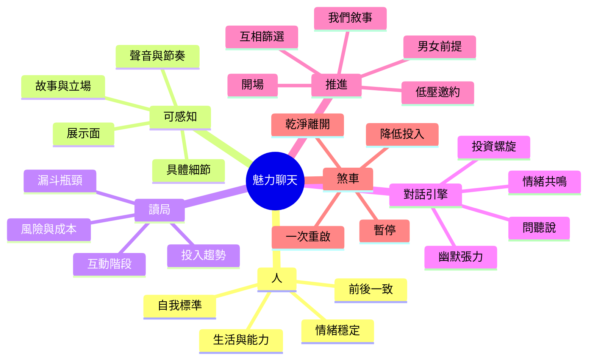
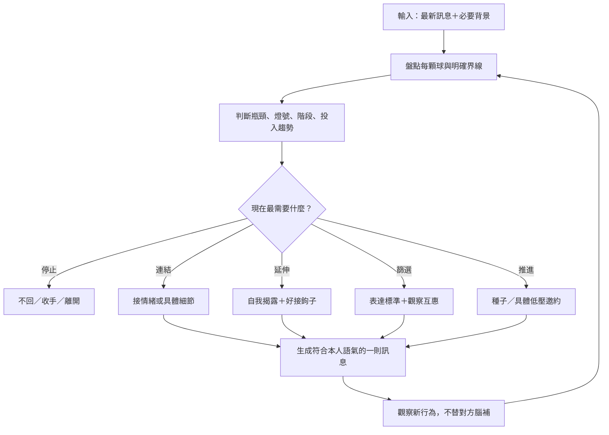

# VibeSync 男性網路交友與魅力聊天核心知識庫

> 版本：1.0  
> 整理日期：2026-08-31  
> 適用情境：交友軟體、IG／限動、通訊軟體、現實認識後的線上延續  
> 主要目標：把零散的兩性世界觀、Game 術語、聊天技巧與 VibeSync 現行決策架構，重組成可查詢、可訓練、可供 AI 檢索的操作系統。

---

## 0\. 先說結論

魅力聊天不是「找到一句能控制結果的話」，而是：

> **有值得傳遞的生活與人格，能用具體訊息讓人感覺到；同時讀得懂對方目前投入多少，只做當下最合適的一個動作。**

可把整套系統壓縮成三個概念式公式：

**魅力可感知度 ≈ 真實價值 × 具體展示 × 前後一致**

**對話進展 ≈ 對方當下投入 × 階段適配 × 情緒品質**

**下一步 = 最新證據 → 判斷燈號與階段 → 選一顆球 → 做最小有效動作 → 看新回饋**

這些不是精確數學；用途是提醒：任何一項接近零，靠「神回覆」都很難補回來。

整合後的最高優先級只有六條：

1. **先找真正瓶頸。** 沒配對先修展示面；開場沒回才修開場；聊得動但約不出來才修邀約。
2. **判斷大於話術。** 先決定該不該回、值得投入多少、要推進或收手，再寫句子。
3. **讀趨勢，不讀單點。** 回覆速度是弱訊號；內容、加碼、反問、回呼、自我揭露、主動窗口才是強訊號。
4. **一次只做一件事。** 一顆球、一個主要動作；不要一則訊息同時逗、證明、安慰、查戶口、邀約。
5. **張力來自內容，不來自折磨時間。** 玩笑、反差、立場、曖昧畫面能製造起伏；故意已讀、忽冷忽熱、製造嫉妒只會污染訊號。
6. **系統必須能輸出「不回、暫停、離開」。** 如果永遠能把冷淡解讀成考驗，這套模型就不可證偽，也不能用。

---

## 1\. 本報告怎麼處理爭議觀點

本報告不把 Alpha、Beta、SMV、Hypergamy、廢物測試、情人／供養者、紅藥丸、轉盤理論等詞刪掉，也不先替它們做價值裁判。

但為了讓知識庫真正可用，所有主張都分成四層：

|層級     |定義          |使用方式              |
|-------|------------|------------------|
|原始主張   |教材或流派原本怎麼說  |保留術語與邏輯，方便理解來源    |
|可觀察假說  |現實中要看到什麼才算支持|不把性別敘事直接當事實       |
|操作規則   |在當下聊天中做什麼   |必須能說明觸發條件與目標      |
|失效／停止條件|何時不適用、何時應撤  |防止任何結果都被硬解釋成「技巧有效」|

因此：

- 「她在測你」可以是一個假說，但必須與普通提問、降溫、拒絕三種可能競爭。
- 「高價值」可以作為展示模型，但不能只靠自稱、炫耀或抽象條件。
- 「框架」可以用來保持自我與標準，但不等於控制另一個人。
- 「不完全揭露」可以是節奏與神祕感；假造身分、共同點、意圖則是不同類型的訊息。
- 明確拒絕、撤回、封鎖或持續不回，是系統中的硬停止訊號；這是可預測性與風險控制，不是道德說教。

知識可信度標記：

|標記|含義                             |
|--|-------------------------------|
|A |多份材料與 VibeSync 現行架構一致，且可直接觀察、測試|
|B |有用的實戰捷徑，但高度依賴情境                |
|C |流派世界觀或群體平均假說，不能直接推定眼前個體        |
|D |僅保留於歷史／爭議詞庫，不應成為即時行動依據         |

---

## 2\. 來源盤點與版本血緣

本次共收到 9 份 Markdown；實際為 8 份獨立內容：

|來源                         |定位                        |整合方式             |
|---------------------------|--------------------------|-----------------|
|男性交友核心課程：魅力原理.md           |價值、能量、外顯訊號、心動／心疼、Alpha 心法 |抽取「人本身」與「價值如何被感覺」|
|男性交友核心課程：高階技術聊天實戰(1).md    |前提、評估、敘事、收尾、阻礙處理          |重構為五階段與邀約決策      |
|男性聊天魅力核心教材.md              |六份材料第一版整合                 |與第二版比對，不重複收錄     |
|男性聊天魅力核心教材_v2(1).md        |擴充版世界觀、術語、線上 Game、關係策略、風險章|保留完整爭議詞典；操作層以證據校準|
|聊天魅力完全教材-去作者化版.md          |問、聽、說、幽默、燈號、張力、線上見面       |視為實戰教材基底         |
|聊天魅力完全教材-優化版.md            |去作者化版的增補與修訂               |作為此支線主版本         |
|聊天魅力完全教材-優化版 2.md          |與上一份 SHA-256 完全相同         |去重，不重複計權         |
|社交高手的通關密語：七步聊天法核心概念解析_md.md|She／Me／Us、側面價值、篩選、推拉、鎖定、邀約|提煉成短流程           |
|chatwinner 架構分析.md         |對整套聊天架構的機制、閉環與盲點分析        |作為統一控制模型         |

版本比對結果：

- 兩份「優化版」完全相同。
- 「優化版」比「去作者化版」增加約 793 行、僅刪 9 行，是增補版而非另一套理論。
- 「男性聊天魅力核心教材 v2」比第一版增加約 2,116 行、刪改約 334 行，是大幅擴寫版。

GitHub VibeSync 現行架構的主要仲裁來源：

- PRODUCT\.md：產品受眾、語氣與定位。
- CONTEXT\.md：互動階段、投入度、記憶證據規則。
- supabase/functions/analyze\-chat/analyze\_prompt/：判斷核心、對話政策、回覆語氣、報告契約。
- supabase/functions/analyze\-chat/opener\_prompt\.ts：開場判準與五風格生成。
- supabase/functions/coach\-chat/prompts\.ts：1:1 教練決策。
- supabase/functions/practice\-chat/：實戰模擬、對話訊號、五階段 FSM 與講評。
- assets/learning/ebooks/book\_\*\.json：瓶頸、續航、避雷、邀約、內核、框架、進階聊天課程。

重要差異：舊材料常把互動描述成「男人輸出技術、女人產生反應」；VibeSync 現行產品已轉成**互惠式閉迴路**：目前訊息證據 → 對方投入 → 階段 → 一個微動作 → 新回饋。這是本知識庫採用的主架構。

---

## 3\. 總心智圖



閉迴路決策：



---

## 4\. 核心架構：六層操作系統

### 4\.1 第一層：人——魅力的源頭

聊天只能傳遞你已有的東西，不能永久替代它。

**真實價值**不是單一財富排名，而是可被生活證明的組合：

- 身體與外觀管理：體態、衛生、髮型、服裝合身度。
- 能力與方向：工作能力、長期投入、做成事情的紀錄。
- 情緒能力：不因一則冷回就崩潰，不需要對方即時安撫。
- 社交與生活：朋友、興趣、場所、日常經驗。
- 性格質地：喜歡／討厭、審美、幽默、原則、怪癖。
- 關係能力：能聽、能表達、能協調，也能離開不適合的局。

**價值感**是你如何感覺與呈現自己的價值。條件不差卻一直自證、求認可、怕得罪，會讓可感知價值被折價。

可操作結論：

- 每週增加生活樣本，比每週多背十句開場更有長期回報。
- 「上進」不要宣告，要從你正在做的事、付出的成本、具體細節漏出來。
- 自嘲是展示從容；自貶是請對方替你修復自尊。兩者要分開。
- 脆弱感適合用來增加立體感，不適合當成換取照顧的手段。

### 4\.2 第二層：框架——你如何站在互動裡

框架不是「誰壓過誰」，而是：誰在定義這段互動的意義、節奏與標準。

穩定框架的可觀察行為：

- 有自己的看法，不全面附和，也不為反對而反對。
- 被質疑時先判斷是玩笑、資訊題還是界線，不立刻寫辯護書。
- 喜歡她，但不把「她選我」當自我價值判決。
- 能帶領下一步，也能接受對方不跟。
- 能說想要什麼，不用假冷淡掩飾需求。
- 不把可得性無限供應；投入跟著互惠走。

**Mental Point of Origin／心理原點**的實用翻譯：

> 先從「這是否符合我的生活、標準與目的」出發，再考慮「怎麼讓她喜歡我」。

**豐盛心態**不是同時吊很多人，而是知道選項可以重新創造，所以不需要從單一對象榨出結果。

### 4\.3 第三層：診斷——先知道卡在哪

#### A\. 整體漏斗

|階段   |症狀        |真正槓桿          |
|-----|----------|--------------|
|0 展示面|滑很久幾乎沒配對  |照片、Bio、受眾與平台適配|
|1 開場 |有配對但開場常沒回 |具體引用、低成本回口、非罐頭|
|2 續航 |聊幾輪就死     |停止查戶口、加入自我、回情緒|
|3 轉線下|聊很順但一直約不出來|讀窗口、種子、具體小提案  |
|4 到場 |答應後常消失    |降低摩擦、細節清楚、適度確認|

先修最前面的瓶頸。後段話術不能修前段流量問題。

#### B\. 當前片段的五階段

|階段              |核心問題           |成功訊號             |下一步      |
|----------------|---------------|-----------------|---------|
|Opening 開場      |她為什麼要回？        |願意接球、補充、反問       |找共同語境    |
|Premise 前提      |這是一般友善，還是有男女火花？|接玩笑、個人好奇、輕微張力    |建立個人／男女語境|
|Qualification 篩選|我們是否互相適合？      |她自願談價值觀、偏好、生活方式  |觀察互惠與差異  |
|Narrative 敘事    |兩人有沒有共同故事感？    |回呼、內梗、「我們」畫面、情緒揭露|加深連結或播種  |
|Close 收尾        |現在是否有具體窗口？     |主動空檔、接受活動想像、配合細節 |小而清楚的邀約  |

這些是**當前對話片段**的狀態，不是永久關係標籤。下一輪可以前進，也可以退回。

### 4\.4 第四層：投入——真正的儀表板

投入是對方可觀察的努力，不是你希望她有的感覺。

強訊號：

- 回覆有實質內容，不只是禮貌詞。
- 主動反問或把球丟回來。
- 延伸你提出的話題，而不是只回答最低限度。
- 回呼前文、記得細節、使用內梗。
- 自我揭露變得更具體或帶情緒。
- 主動提供時間、地點、活動或替代方案。
- 你降低輸出後，她會重新把互動拉回來。

弱訊號：

- 回得快。
- 單一 emoji。
- 客套稱讚。
- 平台顯示上線。
- 你覺得她的照片或語氣「看起來有意思」。

#### 三色燈號

|燈號|可觀察定義                   |你的策略          |
|--|------------------------|--------------|
|綠燈|她加碼內容，而且把球丟回來；趨勢升溫      |接住後推一小階，別暴增輸出 |
|黃燈|有回，但主要在回應你，主動投入有限       |給一片有趣材料，降低問句密度|
|紅燈|明確拒絕、連續最低回覆、重複消失、拒約且不給替代|收回投入；視情況不回或結束 |

一則短回不等於紅燈；一則長回也不必然是綠燈。看三至五輪趨勢與方向。

### 4\.5 第五層：對話引擎

#### 引擎一：問、聽、說

**問**

- 好問題有方向、能喚回畫面或感覺，也容易答。
- 問之前可先給一點自己的材料，降低被盤問感。
- 開放 → 深入 → 再開放；不要連發三個資料題。
- 可用假設或評論取代直接問句，但假設必須好反駁。

**聽**

- 不只重述事實，要回應她在意、困擾、興奮或矛盾的部分。
- 記住三則前的細節，比當下華麗反應更能建立被理解感。
- 共鳴不是搶故事；先接她，再放自己的相似片段。

**說**

- 抽象標籤沒有畫面：「我很上進」弱於「最近每週二下班都去上課，已經後悔選晚班但還是去了」。
- 故事不必長，要有場景、選擇、感受與一個轉折。
- 一次給一片，保留她追問的空間。

#### 引擎二：張力震盪

張力是「還沒完全確定」所產生的注意力；好的聊天會在靠近與留白之間震盪。

可用材料：

- 反差：她說自己很隨和，但行程排得像專案。
- 輕吐槽：針對情境或選擇，不攻擊外貌與脆弱點。
- 假設畫面：把她放進一個好反駁的小場景。
- 角色扮演／共同封號：從本輪素材長出來，後續可回呼。
- 推拉：先接住再輕輕拉開，或先挑戰再給溫度。
- 立場：有偏好、有判斷，但不是硬唱反調。

張力失效的常見原因：

- 她尚未投入就連續挑戰。
- 玩笑需要解釋。
- 你站在她的對立面，讓她只能防衛。
- 她已經喜歡你，仍用高密度吐槽，變成壓抑溫度。
- 用故意消失與不安取代內容。

#### 引擎三：投資螺旋

小投資可增加注意與關係感，但只能逐級要求：

1. 回一個低成本細節。
2. 補充一個故事或觀點。
3. 接受內梗、封號、假想場景。
4. 自願揭露偏好、價值觀或空檔。
5. 一起完成具體安排。

你不能從 1 跳到 5，再把她的退縮解釋成「考驗」。

#### 引擎四：情緒傳遞

文字內容只是載體。你的焦躁、自證、急著成交會從密度、解釋、追問與節奏漏出來。

最小調整：

- 先刪掉一句解釋。
- 把抽象建議換成一個具體感受。
- 把兩個問號減成一個。
- 把討好稱讚換成真實觀察。
- 只回最高價值的一顆球。

#### 引擎五：閉迴路

每次輸出後都重新判斷，不預設技巧會成功：

- 她變暖：加碼一小階。
- 她持平：換材料，不加壓。
- 她變冷：降檔或停。
- 她澄清／反駁：把她的新材料當下一顆球。
- 她主動開窗口：從聊天轉到具體行動。

#### 三套座標不要混在一起

同一句話可以同時從三套座標觀察：

**座標一：這句在移動哪個變量？**

|變量                |問題               |正向例型           |過量風險      |
|------------------|-----------------|---------------|----------|
|V — Value 價值      |她能否感覺你是怎樣的人？     |具體生活樣本、選擇、能力、品味|履歷式炫耀、自我推銷|
|F — Frame 框架      |誰在定義意義、標準與節奏？    |有立場、不自證、能帶也能停  |把互動變成支配競賽 |
|E — Emotion 情緒    |這句帶來什麼感受？        |被懂、好奇、好笑、張力、溫度 |只求刺激、忽視內容 |
|I — Investment 投入 |她是否有自然貢獻的位置？     |好回鉤子、共同創作、具體選擇 |叫她交作業或自我證明|
|S — Safety／Clarity|下一步是否清楚、可退出、成本可控？|邀約具體、邊界清楚、意圖一致 |模糊到無法判斷或拒絕|

每輪先選一個主變量。若同時想拉 V、守 F、升 E、要 I、做 Close，通常會寫成話術味很重的長訊息。

**座標二：你正在做哪一種對話動作？**

- 問 Ask：打開一個她想進入的位置。
- 聽 Listen：證明你接到了她真正給的東西。
- 說 Tell：讓她能感覺你，不只被你採訪。

**座標三：內容目前在哪個深度？**

- 事件 Event：發生什麼。
- 個人 Personal：這對你／她代表什麼。
- 曖昧 Flirt：你與她之間正在發生什麼。

三軸的 3×3 基本盤：

| |事件層        |個人層       |曖昧層         |
|-|-----------|----------|------------|
|問|問場景與具體經過   |問偏好、選擇與感受 |丟可反駁的你我假設   |
|聽|抓住事實中最有畫面的點|命名情緒、價值或矛盾|接她的回拉、吐槽與潛台詞|
|說|分享一個短事件    |放一個真實立場或故事|建立內梗、角色或共同畫面|

「沒話聊」通常不是沒有題目，而是卡在同一格：一直在事件層問問題。換動作或換深度，對話就會重新流動。

### 4\.6 第六層：推進與煞車

推進不是一路加大力度，而是根據當下窗口換檔。

|狀態     |最小動作        |
|-------|------------|
|尚未建立回應 |具體低成本開口     |
|有互動但偏表面|自我揭露＋個人題    |
|個人層有來有往|玩笑、反差、輕曖昧   |
|有明顯共同畫面|種子或假想活動     |
|有當下窗口  |具體、低壓、可拒絕的邀約|
|回覆下降   |降低份量、換球或暫停  |
|明確拒絕   |接受資訊，停止該方向  |
|長期單向   |安靜收回時間      |

---

## 5\. 網路聊天作戰系統

### 5\.1 展示面：她讀到文字以前

六張照片可各做一個工作：

1. 主照：臉清楚、光線好、有表情。
2. 全身：體型與穿著可見。
3. 社交：有朋友與社交生活，且看得出誰是你。
4. 興趣／活動：你正在做具體事情。
5. 生活感：旅行、寵物、日常場景；照片裡要有你。
6. 故事位：有趣、可被問、能成為開場素材。

Bio 的有效結構：

> 一個具體生活細節 ＋ 一點性格／自嘲 ＋ 一個容易接的鉤子

弱：

> 熱愛生活、旅行、美食，希望遇到聊得來的人。

強的「形狀」：

> 正在學一件具體技能，說出一個小成果或翻車，再留一個她容易推薦／反駁的位置。

不要照抄例句。判準是：

- 有沒有只有你才會有的細節？
- 她能不能從中挑一件事問？
- 文字與照片是不是同一個人？
- 內容是展示生活，還是在列條件求審核？

### 5\.2 開場：具體、低壓、可回、像真人

開場北極星：

> 讓她覺得「你真的看過我的資料」，同時給一個她想澄清、補充、反駁或選擇的入口。

She／Me／Us：

- **She**：抓她資料中具體、正向、可回的線索。
- **Me**：放一小片自己的反應、立場或畫面。
- **Us**：建立一個兩人可共同玩的語境。

不必每句機械地三項齊全；它是檢查方向，不是填空。

開場四問：

1. 拿掉她的資料，這句還適用任何人嗎？若是，太通用。
2. 她能否自然反駁、補充或選邊？
3. 有沒有畫面或記憶點？
4. 站到她那邊看，像真人還是像面試／交作業？

資料的讀取順序：

1. 明確禁忌或界線只當背景避雷，不拿來證明自己有讀。
2. 找正向線索：興趣、地點、寵物、活動、剛做過的事。
3. 找一個反差、細節或旁路推測。
4. 資訊不足就誠實使用低風險開場，不假造共同點。

五種可見風格：

|風格          |核心動作        |適合時機          |
|------------|------------|--------------|
|延展 extend   |把她的線索變得更具體  |資料有明確興趣或事件    |
|共鳴 resonate |接住其中的情緒或偏好  |她展現價值觀、感受、反差  |
|調情 tease    |輕挑戰、輕拉開，留好退路|有足夠素材，不碰敏感點   |
|幽默 humor    |誇張、誤讀、反差、假想 |她的資料有畫面或矛盾    |
|冷讀 cold read|做可反駁的輕推測    |線索可推到生活習慣或性格表現|

雙球上限：

- 可以留兩個可接點，但不要變成兩個問題。
- 第一球可用觀察／畫面，第二球可用可反駁推測。
- 若一句已足夠，不為了技巧硬塞雙球。

### 5\.3 續航：一顆球、一個主要動作

先把對方本輪訊息拆成「球」：

- 資訊球：事實、地點、活動、時間。
- 情緒球：開心、煩、期待、失望、矛盾。
- 自我揭露球：個人故事、偏好、弱點、價值觀。
- 互動球：吐槽、稱讚、測試、內梗。
- 窗口球：空檔、想去的地方、主動問行程。
- 界線球：不要、沒興趣、不方便、已有安排／關係。

選球優先級：

1. 界線與安全。
2. 情緒與互動球。
3. 當下窗口。
4. 個人揭露。
5. 純資訊。

一則好回覆的常見骨架：

> **接住她的具體點 ＋ 放一小片自己 ＋ 留一個自然鉤子**

這不是每次都要三段。訊息短時，一個精準觀察也可能已經完整。

### 5\.4 三層話題深度

|深度 |內容                |換檔訊號             |
|---|------------------|-----------------|
|事件層|做了什麼、哪裡、什麼東西      |她開始問你、補充感受、主動延伸  |
|個人層|為什麼喜歡、成長、選擇、價值觀   |她接玩笑、稱讚、談你們的差異或相似|
|曖昧層|男女前提、互相想像、輕張力、我們畫面|她回拉、反撩、配合角色、主動開窗口|

不要把「更深」理解成問更私密。深度來自情緒與個人意義，不是資料敏感度。

### 5\.5 非同步媒介的特殊規則

- 回覆速度權重低；工作、通知、平台習慣都會干擾。
- 看內容是否加碼、回球、主動重啟，而非盯分鐘數。
- 不按字數做 1\.8 倍計算；只把它當「別長期輸出遠超過對方」的護欄。
- 一段訊息可以分泡泡，但每個泡泡要有獨立功能；不要把同一焦慮切成四則。
- 表情符號只能微調語氣，不能替代內容。
- 高熱度不等於繼續文字拉扯；有窗口時應邀約，沒窗口時可在高點收。

### 5\.6 幽默、冷讀與廢物測試

#### 幽默的七種材料

1. 誇張解讀。
2. 故意誤讀。
3. 反差。
4. 類比。
5. 文字遊戲。
6. 假想情境。
7. 用一個短故事回答。

品質判準：

- 她不必犧牲尊嚴才能讓你顯得好笑。
- 她容易接、反駁或加碼。
- 不需要你補一句「我開玩笑的」。
- 她沒接就撤，不連續追打。

#### 冷讀

冷讀不是人格診斷，而是：

> 根據她給過的素材，做一個輕、具體、可反駁的推測。

例如從「行程排很滿」旁路到「妳大概很難真的耍廢一整天」，而不是宣布她是控制型人格。

#### 廢物測試／Shit Test

原教材定義：對方用挑戰、貼標籤或模糊問題，觀察你的情緒穩定、選項感與一致性。

先做三分流：

|類型      |例子形狀          |回法             |
|--------|--------------|---------------|
|真資訊題    |她真的需要知道你的意圖、狀況|清楚回答，不玩技巧      |
|玩笑／一致性測試|語境輕、有回拉空間     |接受一半、放大、誤讀或幽默轉向|
|降溫／拒絕   |內容與趨勢都在退出     |不把它包裝成測試，降檔或停  |

典型自證陷阱：

> 她：「你是不是都這樣跟女生說？」  
> 弱回法：長篇解釋自己不是花心、列證據。  
> 穩定回法的形狀：接住她的懷疑，輕鬆給一個本局限定的反差，再把注意力放回兩人的互動。

重點不是「答贏」，而是保持自然與一致。

### 5\.7 邀約：從聊天到現實

邀約前看四項：

- 本輪是否有接球與加碼？
- 是否已有具體共同興趣或活動種子？
- 她是否提供空檔、地點、想做的事？
- 她目前是舒服、好奇，還是防衛／疲累？

兩段式：

1. **種子**：先讓某個活動或場景出現在對話裡。
2. **提案**：把它變成小而具體、可拒絕的安排。

好的提案具備：

- 活動或地點清楚，時間可協調。
- 成本小、時長可控、交通合理。
- 與前文有關，不像突然交作業。
- 不把同意預寫進句子。

常用順序：

> 共同興趣／場景 → 活動或地點 → 大致時間 → 確認細節

被拒後的診斷：

|回應              |判讀      |下一步       |
|----------------|--------|----------|
|不能那天，但主動給另一天    |真實窗口    |接替代方案     |
|最近忙，沒有替代，之後仍主動聊天|不確定／時機未到|降回聊天，暫不重複邀|
|連續拒絕且不給替代       |低可得或低興趣 |停止投入邀約    |
|明確說不想見面         |硬邊界     |結束該方向     |

答應之後：

- 把時間、地點、集合方式講清楚。
- 中間可維持輕互動，不需全天報到。
- 確認一次即可；不要反覆問「妳真的會來嗎」。

### 5\.8 停損與重啟

|情況          |規則                 |
|------------|-------------------|
|一次短回／慢回     |不足以判死；正常接一球        |
|連續最低回覆      |降低投入，不再扛整場         |
|沉默          |最多一次有新材料的重啟；不要用「在嗎」|
|重啟仍無回       |關閉循環               |
|委婉拒絕        |不辯論、不追原因，讓行動回到她    |
|明確拒絕        |停止該方向              |
|聊很久但拒絕見面且無替代|把它視為她選擇線上關係；你決定是否接受|
|封鎖／要求別聯絡    |不再聯絡               |

停損不是懲罰或冷暴力，而是停止把資源投入沒有互惠的通道。

---

## 6\. 五階段實戰手冊

### 6\.1 Opening：讓她願意回

目標：建立一個低成本但有辨識度的入口。

做：

- 具體引用她的資料或共同場景。
- 給觀察、反差、畫面或可反駁推測。
- 讓她容易補充，不必寫作文。

不做：

- 嗨、在幹嘛、可以認識嗎。
- 外貌稱讚後要求她生產內容。
- 宣告「我有看完妳自介」。
- 假造共同點。

畢業訊號：她不只回答，還加碼或回球。

### 6\.2 Premise：從一般友善到男女語境

目標：避免永遠停在客服、工具人或純資訊交換。

做：

- 有一點個人立場、玩笑與反差。
- 回應她如何與你互動，而不只回主題。
- 建立「你和我」的微型語境。

不做：

- 一開場就高強度性暗示。
- 用大量稱讚強行宣布浪漫意圖。
- 把任何禮貌都當好感。

畢業訊號：她接玩笑、對你本人好奇、願意留在帶張力的語境裡。

### 6\.3 Qualification：互相篩選

舊材料常寫「讓她自我賦格」。可操作版本是：

> 表達一個真實偏好或小標準，觀察她是否自願說明自己的選擇與價值；同時你也回答她的標準。

做：

- 談偏好、生活方式、界線與相容性。
- 小門檻可以是玩笑，但不要製造屈辱。
- 她說明自己時，先接內容，不要立刻頒發及格證。

不做：

- 憑空要求她證明價值。
- 用貶低讓她競爭認可。
- 把所有不同意都說成她在測你。

畢業訊號：雙方都更具體地展示自己，且差異不會立刻破局。

### 6\.4 Narrative：建立「我們」的故事

目標：讓互動不只是很多孤立話題，而是有記憶與連續性。

工具：

- Callback：回呼早先的細節。
- 封號／內梗：從真實素材長出。
- 假想場景：把兩人放進一個輕量共同畫面。
- 情緒揭露：說這件事對你有什麼感覺。
- 小故事：場景、選擇、感受、轉折。

失敗模式：

- 「我們」說得太快，像替對方決定關係。
- 角色扮演越來越私密，但她只被動配合。
- 為了神祕只說半句，導致無法觀察她是否理解。

畢業訊號：她主動回呼、共創內梗、補上自己的版本或延伸共同畫面。

### 6\.5 Close：把窗口變成安排

目標：在動能存在時，讓線上互動有現實下一步。

做：

- 用前文活動作種子。
- 提小而具體的選項。
- 帶方向，但留真實拒絕空間。
- 對方給替代方案時迅速具體化。

不做：

- 沒有窗口時反覆問「要不要出來」。
- 用否定或撤回逼她反向證明。
- 把曖昧想像當成她已同意實際安排。
- 一次從聊天跳到高成本、長時間、私密場景。

畢業訊號：時間、地點、活動與確認都完成。

---

## 7\. 爭議詞彙保留區：原義、可用內核與錯用方式

|詞彙                    |原框架主張          |可操作翻譯                |常見錯用／失效條件        |狀態|
|----------------------|---------------|---------------------|-----------------|--|
|Alpha                 |勇敢、主導、選項多、情緒穩  |有方向、有標準、能承受不確定       |當成支配他人的階級或人設     |B |
|Beta                  |討好、被審核、供養者模式   |把認可外包、用服務換喜歡的行為模式    |把人永久貼標籤，忽略情境     |C |
|SMV                   |性／擇偶市場價值       |特定受眾與情境下的可感知吸引力      |當成人的總價值或固定分數     |C |
|SMP                   |性／擇偶市場         |平台、城市、年齡、目的不同，供需與偏好不同|用單一規則解釋所有場域      |C |
|Hypergamy             |女性偏好向上擇偶       |部分人會依地位、能力、選項感篩選     |從一個人性別直接推定動機     |C |
|The Wall              |女性年齡與 SMV 曲線敘事 |年齡與受眾會改變市場反應         |當成即時聊天判斷或羞辱工具    |D |
|Red／Blue Pill         |看見性策略 vs 理想化腳本 |檢查自己的期待是否與行為證據一致     |變成敵我、憤怒或不可證偽信仰   |C |
|Lover／Provider        |情人帶慾望，供養者帶資源與安全|同時有吸引、溫度、能力與界線       |把體貼一律視為掉價        |C |
|Mental Point of Origin|男人以自己為心理原點     |先看是否符合自己的生活、標準與目的    |只顧自己、拒絕互惠        |A |
|ONEitis               |把單一對象神化        |單點成敗綁架自我與決策          |用「豐盛」逃避真正親密      |B |
|Abundance             |選項充足、不怕失去      |相信選項能重新創造，願意停損       |用多人操作證明自己高價值     |B |
|Frame                 |誰定義互動現實        |保持立場、節奏、標準與一致        |把所有對話變權力戰        |A |
|DHV                   |展示高價值          |用細節、故事、選擇與成本讓價值可見    |自誇、列履歷、刻意炫富      |A |
|DLV                   |展示低價值          |自證、求批准、失控、前後不一等折價行為  |把正常脆弱都視為低價值      |B |
|IOI／IOD               |興趣／無興趣指標       |觀察加碼、回球、窗口、撤退的趨勢     |從單一 emoji 或肢體動作定案|B |
|Shit Test／廢物測試        |對穩定、選項、框架的一致性測試|在輕挑戰中不急著自證           |把資訊題、拒絕、界線全叫測試   |B |
|Push-Pull／推拉          |靠近與拉開製造張力      |內容上的溫度＋反差／挑戰         |故意消失、製造不安、忽冷忽熱   |B |
|Qualification／賦格      |讓她證明自己符合你的標準   |公開偏好，觀察雙方是否自願展示相容性   |要她競逐認可、用羞辱逼投資    |B |
|Disqualification／使失格  |輕輕取消她的資格       |玩笑式表達差異，且她可不接        |真的貶低、在低投入期硬挑戰    |C |
|自我失格                  |暴露無傷小缺點降低距離    |可愛自嘲，不求對方修復          |自我厭惡、求安慰         |B |
|Amused Mastery        |愉悅地駕馭情境        |不慌、不硬碰，能把摩擦轉為輕鬆      |裝冷淡、嘲諷任何情緒       |B |
|Preselection          |被其他人認可可提升吸引    |自然可見的社交生活與可信任度       |假造追求者、刻意激起嫉妒     |C |
|Kino                  |肢體接觸與升級        |現實互動中讀取並尊重即時回饋       |把僵住、後退、口頭拒絕當矜持   |D |
|ASD                   |對性表達的社會防衛假說    |有些人會在意社會評價與節奏        |用來否定對方說出口的拒絕     |D |
|Dread                 |不安／可失去感維持慾望    |自己有完整生活，自然不是無限可得     |主動製造嫉妒、焦慮或依附     |D |
|Plate Theory          |多線認識以降低匱乏      |在未承諾階段保有選擇與風險意識      |欺瞞排他狀態、把人當庫存     |C |
|AMOG                  |團體中的主導男性       |在自己擅長場域自然貢獻、穩定社交     |正面權力鬥爭、貶低其他男人    |C |
|7-38-55               |語言／聲音／表情比例     |訊息一致性與非語言線索重要        |當成所有溝通的固定占比      |D |
|1.8x 原則               |輸出不要長期遠超對方     |看方向與力道是否互惠           |精算字數、故意少回        |B |

### 「失格」必須拆成兩個鍵

舊材料與 VibeSync 現行開場 Prompt 對「失格」用法不同，若不拆鍵，AI 會混亂：

- **DISQUALIFY\_OTHER**：玩笑式表示她某點可能不符合你的偏好。
- **SELF\_DISQUALIFY**：自曝一個無傷小缺點，降低開場壓力。

知識庫與 Prompt 不應再只寫「失格」，必須指明是哪一種。

---

## 8\. 對話失敗模式與修復

|失敗模式    |表面樣子          |真正機制         |最小修復           |
|--------|--------------|-------------|---------------|
|查戶口     |工作、住哪、興趣連發    |只索取、不提供材料    |問前先放自己的反應或假設   |
|只回事實    |她說累，你回「早點睡」   |沒接到情緒與人      |命名她的狀態，再給一小片自己 |
|只安撫     |每件事都「辛苦了」     |關係變客服／照顧者    |加入具體觀察、立場或輕鬆感  |
|只解法     |她分享，你開始教      |把情緒球錯分成問題球   |先問她想吐槽、想被懂或想找解法|
|自我缺席    |全程問她，自己很安全    |她無法感覺你是誰     |每兩三輪加入一片真實自己   |
|全面附和    |什麼都「我也是」      |零資訊、零質地      |說出差異或限定條件      |
|自證      |被質疑就長篇辯護      |把她變評審、你變被告   |回答必要資訊，其餘用簡短立場 |
|過度展示    |履歷、收入、成就堆疊    |企圖直接購買高價值判決  |換成一個有成本與感受的細節  |
|工具人     |只幫忙、接送、解題     |價值輸出沒有男女前提   |加入個人互動，停止無限服務  |
|油／Greasy|性暗示過早、外貌／身體攻擊 |階段錯配，對方沒有回拉空間|收手、道歉一次、換安全話題  |
|框架崩塌    |她一冷你立刻改人格     |結果焦慮接管       |回到自己的正常語氣，降低投入 |
|框架過度    |每句都要壓、測、否定    |把互動當權力戰      |直接接住，不必每輪都做技巧  |
|引擎空轉    |聊很久但沒有個人、張力或行動|只在事件層交換資料    |換到個人意義或播種      |
|人工時間波動  |故意拖、已讀、忽冷忽熱   |用不安掩蓋內容不足    |用內容反差與高點收尾     |
|多球轟炸    |一次回所有點、四個問號   |焦慮與缺乏取捨      |只選最高價值球        |
|話術味     |句子完美但不像本人     |風格與真實身份斷裂    |用本人詞彙、縮短、保留瑕疵  |
|過度分析    |每個字都解碼        |模型不可證偽、行動延遲  |只記錄可觀察行為與下一個小測試|
|聊天囤積    |高熱度仍不停聊       |不敢承擔邀約結果     |有窗口就提出小而具體的下一步 |

---

## 9\. 可直接供 AI／產品使用的知識庫設計

### 9\.1 三層知識架構

|層     |內容              |用途           |
|------|----------------|-------------|
|L1 概念層|原術語、世界觀、機制、爭議主張 |解釋與教學，不直接決定回覆|
|L2 決策層|證據、燈號、階段、觸發、停止條件|決定該不該回與做什麼   |
|L3 生成層|五風格、句型、長度、本人語氣  |把已選動作寫成自然文字  |

檢索與執行順序必須是 L2 → L3；L1 只在需要解釋或補充時召回。若先從術語庫找技巧，模型會為了用招而扭曲局勢。

### 9\.2 證據優先級

1. 明確界線與安全資訊。
2. 最新逐字訊息。
3. 當前片段的三至五輪趨勢。
4. 已被逐字證據支持的關係記憶。
5. 使用者本人語氣與目的。
6. 一般模式與流派假說。
7. 罐頭範例。

衝突時，高順位覆蓋低順位。記憶只能是弱先驗，不能替最新訊息加分。

### 9\.3 建議資料結構

```yaml
id: KB-ONLINE-OPEN-001
title: 具體開場
layer: decision
confidence: A
raw_terms: [She-Me-Us, positive_hook]
applies_to: [dating_app, instagram, reconnect]
stage: opening
trigger:
  required:
    - 至少一個對方可見或共同場景線索
  excludes:
    - 明確要求停止聯絡
evidence_required:
  - 原始資料中的具體字詞、物件、活動或場景
goal: 讓她低成本地補充、反駁或選邊
action:
  - 引用一個具體線索
  - 加入一小片自己的反應
  - 留一個自然回口
avoid:
  - 通用稱讚
  - 假造共同點
  - 連續兩個問題
stop_condition:
  - 一次重啟後仍無回
positive_example_shape: 觀察 + 可反駁推測
negative_example_shape: 嗨美女 + 在幹嘛
source_refs:
  - VibeSync/opener_prompt.ts
  - 七步聊天法
```

### 9\.4 回覆決策偽代碼

```text
INPUT = 最新訊息 + 必要近期上下文 + 使用者風格

1. inventory_balls(INPUT.latest_message)
2. if explicit_boundary:
       choose STOP or ACKNOWLEDGE
3. diagnose funnel_bottleneck
4. estimate current_stage and investment_trend
5. choose one action from:
       STOP, CONNECT, EXTEND, FILTER, INVITE, PAUSE
6. select one highest-value ball
7. generate 5 style variants from the same ball and same action
8. reject outputs that:
       invent facts
       exceed current stage
       contain multiple competing moves
       sound unlike the user
9. send one
10. update only from new observable behavior
```

---

## 10\. 知識原子庫

以下知識原子可直接拆成 RAG 文件、Prompt rules 或教練卡。每條都含觸發與動作，不只是口號。

### A\. 人與框架

|ID  |觸發／問題    |決策規則          |動作            |信心|
|----|---------|--------------|--------------|--|
|P-01|一直找神句    |話術不能永久補生活空洞   |建立每週生活樣本與故事清單 |A |
|P-02|條件好但聊天卑微 |真實價值未轉成價值感    |減少自證，用選擇與細節展示 |A |
|P-03|害怕暴露喜歡   |無需求是假面；失控需求才掉價|清楚表達興趣，不要求保證  |B |
|P-04|一冷回就焦慮   |單則訊息不足以定案     |看三至五輪趨勢，再調投入  |A |
|P-05|全面配合她    |零差異等於零資訊      |說出一個真實偏好或限定   |A |
|P-06|為了高價值裝冷  |前後不一致會在後續破功   |保持本人可長期維持的語氣  |A |
|P-07|把她當唯一選項  |匱乏會造成過量投入     |把注意力放回生活與其他社交 |B |
|P-08|被貼標籤     |先分辨資訊題或玩笑測試   |必要資訊直答；其餘簡短、輕鬆|A |
|P-09|想證明 Alpha|想證明本身暴露外部認可依賴 |不宣告身分，只做穩定行為  |B |
|P-10|想展示上進／資源 |宣告會被折價        |給一個付出成本的具體片段  |A |

### B\. 診斷與投入

|ID  |觸發／問題   |決策規則            |動作           |信心|
|----|--------|----------------|-------------|--|
|D-01|配對少     |最前瓶頸在展示面        |修照片、Bio、平台與受眾|A |
|D-02|開場沒回    |先查是否通用、索取型      |改成具體線索＋低成本回口 |A |
|D-03|幾輪就死    |常見是查戶口、自我缺席     |加入自我與情緒回應    |A |
|D-04|聊很久約不出  |可能沒播種或窗口不足      |種子後提小而具體安排   |A |
|D-05|回得很快    |速度是弱訊號          |不加分；看內容與回球   |A |
|D-06|回得短     |單則短回可能只是情境      |看是否仍接球與後續趨勢  |A |
|D-07|她反問     |反問通常是可見投入       |回答時讓自己可被感覺   |A |
|D-08|她分享糗事／感受|自我揭露是較強投入       |接情緒，再給相稱的一片自己|A |
|D-09|她拒約但給替代 |是可操作窗口          |快速具體化替代方案    |A |
|D-10|她拒約無替代  |不足以繼續推邀約        |降回聊天或停止投入    |A |
|D-11|明確說不／別聯絡|硬停止訊號           |停止該方向或停止聯絡   |A |
|D-12|好像在測你   |至少保留資訊題、玩笑、退出三假說|用最少風險的小回覆驗證  |A |

### C\. 開場與續航

|ID  |觸發／問題    |決策規則           |動作              |信心|
|----|---------|---------------|----------------|--|
|C-01|不知道怎麼開   |找只屬於她的線索       |觀察＋一小片自己＋回口     |A |
|C-02|她資料很長且規則多|規則是背景，不是入口     |找正向線索或反差        |A |
|C-03|她資料很少    |不硬分析人格         |用唯一線索或平台語境做低風險開口|A |
|C-04|想稱讚外貌    |通用稱讚訊息量低       |優先觀察場景、選擇、風格細節  |A |
|C-05|腦袋空白     |不必新開題，可延續她的最後一點|接住＋「然後呢」的具體版本   |A |
|C-06|問句太多     |問題只索取資料        |問前先自我揭露或評論      |A |
|C-07|想聊深      |深度是個人意義，不是隱私   |從事件問到感受、選擇、原因   |A |
|C-08|她說一件普通日常 |普通事件也可有情緒入口    |找最反常、最在意或最有畫面的點 |A |
|C-09|她問你問題    |是低成本展示本人機會     |不只答事實，加感受或小故事   |A |
|C-10|訊息有很多球   |全接會稀釋重點        |只選最高價值球，必要時分獨立段 |A |
|C-11|想展示價值    |直接解釋會折價        |讓價值從細節、選擇、他人反應漏出|A |
|C-12|想共鳴      |搶故事會讓她消失       |先接她，再放短而相稱的自己   |A |

### D\. 張力與幽默

|ID  |觸發／問題    |決策規則         |動作             |信心|
|----|---------|-------------|---------------|--|
|T-01|對話太平     |需要內容起伏，不是時間波動|加反差、立場或假想畫面    |A |
|T-02|想吐槽      |吐槽需有關係餘裕與回拉空間|針對情境／選擇，不碰弱點   |B |
|T-03|她沒接玩笑    |這是資料，不是障礙    |撤回幽默，換正常連結     |A |
|T-04|她嘴上否認但加碼 |行為仍在玩        |接她新材料，不爭字面勝負   |B |
|T-05|她已明顯投入   |吐槽密度應下降      |增加真實溫度與推進      |B |
|T-06|想冷讀      |必須有素材且可反駁    |用「感覺妳可能…」的輕推測  |A |
|T-07|被挑戰      |解釋、憤怒、僵住都容易失衡|接受一半、放大或誤讀，再回主線|B |
|T-08|她是真的問重要資訊|技巧會降低可信度     |直接、清楚回答        |A |
|T-09|想用推拉     |推拉應存在於內容     |接住＋輕拉開；不用故意消失  |A |
|T-10|玩笑越來越重   |可能階段錯配       |看她是否回拉；沒有就降檔   |A |

### E\. 階段與邀約

|ID  |觸發／問題    |決策規則      |動作             |信心|
|----|---------|----------|---------------|--|
|S-01|開場有回     |不急著連發技巧   |接她真正選的球        |A |
|S-02|只剩友善交換   |缺男女／個人前提  |加一點本人立場、玩笑、互動觀察|B |
|S-03|想篩選      |標準必須真實且雙向 |表達偏好，觀察她是否自願展示 |A |
|S-04|有共同內梗    |可進敘事層     |回呼並建立一個共同畫面    |A |
|S-05|她主動說想去某處 |可能是窗口，不是保證|接活動種子，再看是否願意具體化|A |
|S-06|熱度高      |繼續聊可能消耗動能 |邀約或在高點收尾       |A |
|S-07|想邀但毫無共同點 |提案會突兀     |先播種一個符合她興趣的活動  |A |
|S-08|她答應      |不再重新賣一次   |確定時間、地點、集合方式   |A |
|S-09|她臨時取消且給替代|仍有投入      |接替代，不懲罰或翻舊帳    |A |
|S-10|多次取消無替代  |行為趨勢低投入   |停止安排，讓下一步回到她   |A |

### F\. 停損與品質

|ID  |觸發／問題       |決策規則       |動作            |信心|
|----|------------|-----------|--------------|--|
|Q-01|她消失         |一次沉默不需追問原因 |有新材料才重啟一次     |A |
|Q-02|重啟仍無回       |閉環已給出結果    |停止聯絡          |A |
|Q-03|長期你單向供料     |互惠不足       |降輸出，觀察她是否補位   |A |
|Q-04|每次都想挽回      |匱乏讓失敗局延長   |把時間收回，不寫告別作文  |A |
|Q-05|AI 生成很漂亮但不像你|風格不一致會在後續破功|用你的常用詞、長度、標點重寫|A |
|Q-06|回覆同時有多個目的   |多目標讓對方不知接哪裡|只留一個主要動作      |A |
|Q-07|建議依賴猜測人格    |證據不足       |改寫成可觀察行為與低風險測試|A |
|Q-08|技巧無論結果都能解釋  |模型不可證偽     |明列成功、失敗、停止條件  |A |

---

## 11\. 實戰訊息配方：學形狀，不背句子

### 11\.1 接住＋自己＋鉤子

她分享一件日常：

> 接她最有畫面的細節 → 說你對那個細節的真實反應 → 留一個她容易補充的位置。

避免：

> 重述她整句 → 無條件稱讚 → 再問一個通用問題。

### 11\.2 承認一半＋畫面＋回球

她輕挑戰你：

> 承認其中一小部分 → 誇張成無傷畫面 → 把本局素材丟回去。

避免：

> 否認全部 → 解釋人品 → 要她相信你。

### 11\.3 情緒命名＋站邊＋微延伸

她吐槽或抱怨：

> 說出真正煩的點 → 讓她知道你理解她站哪邊 → 用一個小問題或自己的短片段延伸。

避免：

> 辛苦了 → 早點休息 → 話題終止。

### 11\.4 觀察＋可反駁冷讀

她資料有明確行為：

> 從行為旁路到一個生活樣子 → 保留「我可能猜錯」的空間。

避免：

> 從照片或一句 Bio 診斷人格、收入、關係史。

### 11\.5 種子＋具體提案

兩人聊到共同興趣：

> 先讓活動進入共同畫面 → 她接住後，提出小而清楚的時間／地點範圍。

避免：

> 聊得不錯 → 突然問「所以妳要不要跟我約會？」

### 11\.6 乾淨處理拒絕

她說不方便或不想：

> 接受資訊；若她給替代就接替代，若沒有就不再推。

避免：

> 論證為什麼她其實可以、用激將逼她挽回、追問是不是不喜歡你。

---

## 12\. VibeSync 產品／Prompt 的建議映射

### 12\.1 現行模組與知識層對照

|VibeSync 模組 |應召回的知識                |不應先召回               |
|------------|----------------------|--------------------|
|Opener      |展示面、正向鉤子、She／Me／Us、五風格|Hypergamy、Dread、轉盤理論|
|Analyze Chat|球盤點、五階段、投入趨勢、風險、最小動作  |長篇世界觀與固定話術          |
|Coach 1:1   |瓶頸、使用者目的、成本、風格、結果回饋   |只針對一句做文案潤色          |
|Practice    |階段 FSM、可診斷反應、失敗狀態、提示  |不可觀察的人格推定           |
|Learning    |概念、術語、反例、練習、畢業標準      |沒有停止條件的格言           |
|Memory      |被逐字證據支持的偏好、回呼、結果      |由 emoji／照片推斷的特質     |

### 12\.2 建議的統一決策欄位

|欄位              |型別／值                                                         |
|----------------|-------------------------------------------------------------|
|funnelStage     |profile / opener / sustain / invite / show_up                |
|interactionStage|opening / premise / qualification / narrative / close        |
|light           |green / yellow / red / unknown                               |
|investmentTrend |rising / flat / falling / insufficient                       |
|balls           |info / emotion / disclosure / interaction / window / boundary|
|selectedBall    |一個主要球；必要時才多球                                                 |
|action          |stop / connect / extend / filter / invite / pause            |
|topicDepth      |event / personal / flirt                                     |
|riskState       |normal / guarded / crossed_line / explicit_no                |
|style           |extend / resonate / tease / humor / coldRead                 |
|evidence        |對方原句或可見行為                                                    |
|confidence      |high / medium / low                                          |
|stopCondition   |本動作何時撤回                                                      |

### 12\.3 生成前後的品質閘門

生成前：

- 是否有逐字證據支持判斷？
- 這一輪真正要做的只有哪一件事？
- 對方投入足以支撐這個階段嗎？
- 使用者是否真的有這個經驗、興趣或身份？

生成後：

- 拿掉對方資料仍適用嗎？
- 是否同時塞了兩個以上目的？
- 是否有無根據的人格診斷？
- 是否像使用者本人能持續的語氣？
- 對方要如何自然接？
- 若她不接，系統是否知道怎麼停？

### 12\.4 衝突規則

當舊教材與現行架構衝突：

1. 明確文字界線勝過「肢體／潛台詞才是真相」。
2. 當前投入勝過性別普遍化推論。
3. 多輪趨勢勝過單一 IOI／IOD。
4. 互相篩選勝過單向讓她自證。
5. 內容張力勝過故意延遲與製造焦慮。
6. 自然社交證明勝過刻意嫉妒。
7. 可拒絕的具體邀約勝過假定同意。
8. 使用者真實風格勝過「高手應該怎麼說」。

---

## 13\. 八週訓練計畫

|週|唯一主題    |每日練習           |畢業標準            |
|-|--------|---------------|----------------|
|1|展示面與生活樣本|修六張照片功能；記一個生活片段|Bio 有具體鉤子，照片各有工作|
|2|自我出現    |每次對話至少放一片真實自己  |不再只問不說          |
|3|讀球與燈號   |每輪標一顆主球與燈號     |能區分事實、情緒、窗口、界線  |
|4|問聽說     |問前先給料；接情緒不急解法  |查戶口密度明顯下降       |
|5|故事與價值   |每天把一個抽象優點改寫成場景 |不用自誇也能感覺到你是誰    |
|6|幽默與張力   |只練一種：反差或假想畫面   |她不接時能立刻撤，不追打    |
|7|深度換檔    |事件 → 個人；有回拉才到曖昧|不跳階，也不永遠停在事件    |
|8|邀約與停損   |練種子、具體提案、拒絕處理  |能在窗口邀，也能在無窗口停   |

每週只改一個變量。否則無法知道結果是哪個改動造成的。

建議記錄六個漏斗數字：

- A 配對數。
- B 開場有回覆。
- C 撐過五輪。
- D 你實際提出邀約。
- E 對方答應。
- F 實際到場。

再記三個質性欄位：

- 本輪最高價值球。
- 你的主要動作。
- 對方之後投入上升、持平或下降。

---

## 14\. 一頁速查

### 發訊前

- 我是在回哪一顆球？
- 她現在是綠、黃、紅，還是資料不足？
- 目前是開場、前提、篩選、敘事還是收尾？
- 我這句只做哪一件事？
- 這是我的真實語氣嗎？

### 好回覆的最低配

- 有接到她的具體內容。
- 有一點你自己的反應、立場或畫面。
- 有自然可接的位置。
- 份量沒有長期遠超過她。
- 沒有假造共同點或替她下診斷。

### 推進條件

- 她在加碼。
- 她有回球。
- 她開始談你們、接內梗或開窗口。
- 推一小階，而不是跳三階。

### 停止條件

- 明確拒絕。
- 連續低投入且不回球。
- 多次拒約無替代。
- 一次重啟後仍沉默。
- 要求不要再聯絡。

### 最終口訣

> **先讀局，再選球；先做人，再出招。給一片、看回饋；有窗口就帶，沒互惠就收。**

---

## 15\. 最終蒸餾：整套架構真正有用的部分

把所有紅藥丸、Game、聊天課程、七步法與 VibeSync Prompt 疊在一起，剩下的不是「怎麼讓女人照你的劇本走」，而是五種能力：

1. **建造自己**：讓生活、能力、情緒與標準本身具有吸引力。
2. **讓價值可見**：用具體選擇、細節、故事與氣質展示，不靠宣告。
3. **準確感知**：分清對方的內容、情緒、投入、窗口與退出。
4. **調節互動**：在連結、張力、篩選、敘事、邀約之間逐階換檔。
5. **接受回饋**：結果好就前進，持平就換法，變冷就降檔，明確不行就離開。

爭議術語可以幫人看見某些模式，但不能取代眼前證據。最強的系統不是解釋力無限大，而是能清楚說出：

- 我現在看到了什麼；
- 這支持哪個假說；
- 下一個最小測試是什麼；
- 什麼結果會證明我判錯；
- 判錯後何時收手。

這也是「有魅力的網路聊天」與一般話術庫最大的差別：**前者是一套感知與調節系統；後者只是一堆輸出。**

---

## 附錄：來源索引

### 附件

1. 社交高手的通關密語：七步聊天法核心概念解析\_md\.md
2. 男性交友核心課程：魅力原理\.md
3. 聊天魅力完全教材\-優化版 2\.md
4. 男性聊天魅力核心教材\_v2&#40;1&#41;\.md
5. 男性聊天魅力核心教材\.md
6. 男性交友核心課程：高階技術聊天實戰&#40;1&#41;\.md
7. 聊天魅力完全教材\-去作者化版\.md
8. chatwinner 架構分析\.md
9. 聊天魅力完全教材\-優化版\.md

### GitHub VibeSync（PoYuTsai/VibeSync，main）

- AGENTS\.md
- PRODUCT\.md
- CONTEXT\.md
- README\.md
- supabase/functions/analyze\-chat/analyze\_prompt/reasoning\_core\.ts
- supabase/functions/analyze\-chat/analyze\_prompt/conversation\_policy\.ts
- supabase/functions/analyze\-chat/analyze\_prompt/reply\_voice\.ts
- supabase/functions/analyze\-chat/analyze\_prompt/report\_contract\.ts
- supabase/functions/analyze\-chat/opener\_prompt\.ts
- supabase/functions/coach\-chat/prompts\.ts
- supabase/functions/practice\-chat/coaching\_rubric\.ts
- supabase/functions/practice\-chat/conversation\_signals\.ts
- supabase/functions/practice\-chat/game\_fsm\.ts
- supabase/functions/practice\-chat/prompt\.ts
- assets/learning/ebooks/book\_1\_bottleneck\.json
- assets/learning/ebooks/book\_2\_conversation\.json
- assets/learning/ebooks/book\_3\_rescue\.json
- assets/learning/ebooks/book\_4\_meeting\.json
- assets/learning/ebooks/book\_5\_core\.json
- assets/learning/ebooks/book\_6\_frames\.json
- assets/learning/ebooks/book\_7\_chat\.json